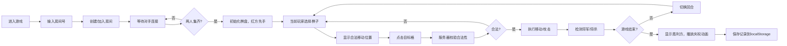

## 1. 产品概述
幻影棋局是一款基于中国象棋规则的网络回合制策略对战游戏，支持两名玩家通过Socket.IO实时联机对战，在8x8棋盘上控制不同兵种进行智力博弈。
- 核心目标：提供流畅、精美的象棋对战体验，支持网络匹配、动画反馈、历史记录回放
- 目标用户：象棋爱好者、策略游戏玩家
- 产品价值：将传统象棋游戏现代化，结合精美的视觉效果和流畅的网络对战体验

## 2. 核心特性

### 2.1 用户角色
| 角色 | 注册方式 | 核心权限 |
|------|----------|----------|
| 玩家 | 自动分配（无需注册） | 创建/加入房间、对战、查看历史记录、回放对局 |

### 2.2 功能模块
1. **对战核心模块**：8x8棋盘渲染、棋子移动、攻击判定、特殊技能、胜负判定
2. **网络对战模块**：房间创建/加入、玩家匹配、实时状态同步
3. **动画反馈模块**：棋子选中高亮、合法移动指示、移动滑行动画、吃子特效、胜利庆祝
4. **历史记录模块**：走棋记录保存、历史对局列表、自动回放功能
5. **信息面板模块**：回合显示、走棋方指示、历史走棋列表、操作按钮

### 2.3 页面详情
| 页面名称 | 模块名称 | 功能描述 |
|----------|----------|----------|
| 主游戏页 | 棋盘组件 | 8x8仿木质棋盘，64x64px格子，奇偶格不同颜色，棋子圆形渐变显示 |
| 主游戏页 | 信息面板 | 300px宽，显示回合数、走棋方、历史走棋列表、新游戏/回放按钮 |
| 主游戏页 | 房间匹配 | 玩家输入房间号创建或加入房间，等待对手连接 |
| 主游戏页 | 历史回放 | 从localStorage加载历史对局，按1秒间隔自动重放走棋 |

## 3. 核心流程
玩家进入游戏 → 输入房间号 → 创建/加入房间 → 等待对手 → 匹配成功开始对战 → 红方先手 → 选择棋子 → 显示合法移动位置 → 点击目标格 → 服务器校验合法性 → 执行移动/攻击 → 检测将军/将杀 → 切换回合 → 循环直至胜负 → 游戏结束显示胜利方 → 保存记录到localStorage

## 4. 用户界面设计

### 4.1 设计风格
- **主色调**：木质纹理 #DEB887，格子浅色 #F0D9B5，格子深色 #B58863
- **棋子颜色**：红方渐变 #CC0000 → #FF4D4D，黑方渐变 #222222 → #555555
- **高亮颜色**：选中发光 #FFD700，可移动指示 #58C47E，可攻击指示 #FC5A5A
- **按钮样式**：蓝色渐变 #4A90D9 → #357ABD，圆角6px，悬停亮度1.2倍，点击收缩0.1s
- **字体**：中文字体，棋子上白色16px粗体，信息面板白色大字
- **布局**：桌面端棋盘居中+右侧信息面板，移动端棋盘+下方信息面板

### 4.2 页面设计概述
| 页面名称 | 模块名称 | UI元素 |
|----------|----------|--------|
| 主游戏页 | 棋盘组件 | 仿木质纹理背景，64px格子，奇偶格交替，圆形棋子带中文名称，选中金色光晕，绿色/红色圆点指示合法位置 |
| 主游戏页 | 信息面板 | 深色背景#2C2C2C，圆角8px，大字显示回合数，彩色圆点+文字显示走棋方，可滚动历史列表，渐变按钮 |
| 主游戏页 | 动画效果 | 棋子滑行0.25s cubic-bezier，吃子缩放抖动0.4s ease-in，胜利时150粒金色粒子扩散 |
| 主游戏页 | 房间匹配 | 输入框+创建/加入按钮，等待时显示加载动画 |
| 主游戏页 | 历史回放 | 历史对局列表，回放时按钮控制，自动按1s间隔走棋 |

### 4.3 响应式
- **桌面端**（≥900px）：棋盘64px格子，信息面板在右侧300px宽
- **移动端**（<900px）：棋盘缩小为48px格子，信息面板移到棋盘下方
- 所有交互支持触摸操作

### 4.4 性能要求
- 棋盘渲染保持60FPS
- 移动和攻击动画使用requestAnimationFrame和CSS动画，不阻塞主线程
- 服务器移动合法性校验≤5ms
