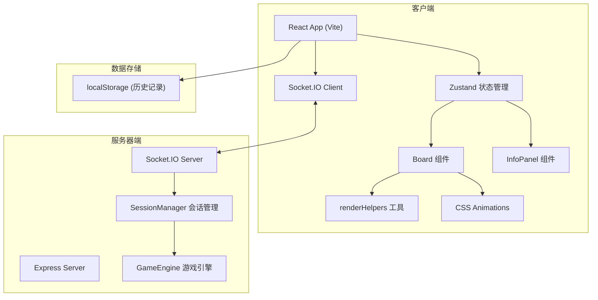
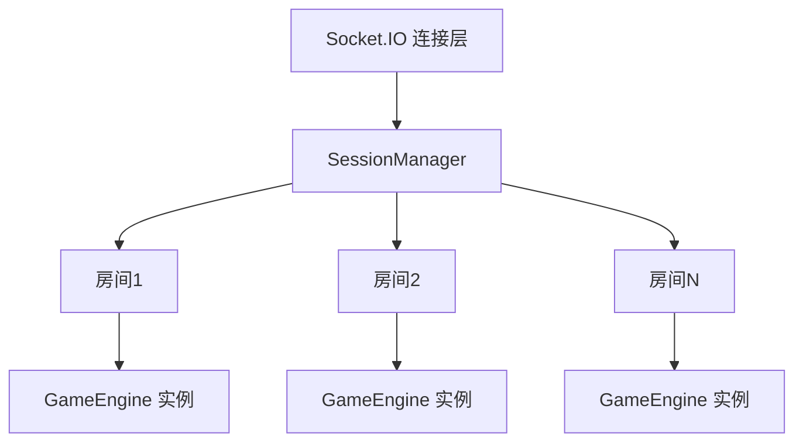

## 1. 架构设计



## 2. 技术描述

### 2.1 技术栈
- **前端**：React@18 + TypeScript + Vite + Zustand + Socket.IO Client
- **后端**：Express@4 + TypeScript + Socket.IO + uuid + cors
- **状态管理**：Zustand 管理全局游戏状态
- **构建工具**：Vite
- **通信协议**：WebSocket (Socket.IO)

### 2.2 核心依赖版本
- react: ^18.2.0
- react-dom: ^18.2.0
- zustand: ^4.4.0
- socket.io-client: ^4.7.0
- express: ^4.18.0
- socket.io: ^4.7.0
- uuid: ^9.0.0
- cors: ^2.8.5
- typescript: ^5.2.0
- vite: ^5.0.0
- @vitejs/plugin-react: ^4.2.0

### 2.3 初始化方式
- 使用 Vite 创建 React + TypeScript 项目
- 同时安装后端依赖 (express, socket.io 等)
- 配置 Vite 代理到后端 Socket.IO 服务

## 3. 文件结构

```
├── package.json                 # 前后端统一依赖管理
├── vite.config.js               # Vite配置，React插件 + Socket.IO代理
├── tsconfig.json                # TypeScript配置，严格模式
├── index.html                   # 入口HTML，标题"幻影棋局"
├── server/                      # 后端代码
│   ├── index.ts                 # 服务器入口，Express + Socket.IO
│   ├── GameEngine.ts            # 游戏引擎，核心逻辑
│   └── SessionManager.ts        # 会话管理，多房间玩家管理
├── src/                         # 前端代码
│   ├── main.tsx                 # React入口
│   ├── App.tsx                  # 主组件，状态管理和路由
│   ├── components/
│   │   ├── Board.tsx            # 棋盘组件
│   │   └── InfoPanel.tsx        # 信息面板组件
│   ├── utils/
│   │   └── renderHelpers.ts     # 渲染工具函数
│   └── store/
│       └── useGameStore.ts      # Zustand状态管理
└── .trae/documents/             # 文档目录
```

## 4. API / Socket.IO 事件定义

### 4.1 Socket.IO 事件

#### 客户端发送事件
| 事件名 | 参数 | 说明 |
|--------|------|------|
| `createRoom` | { roomId: string, playerName: string } | 创建房间 |
| `joinRoom` | { roomId: string, playerName: string } | 加入房间 |
| `makeMove` | { roomId: string, from: Position, to: Position } | 发送移动请求 |
| `surrender` | { roomId: string } | 认输 |
| `requestHistory` | { roomId: string } | 请求对局历史 |

#### 服务器发送事件
| 事件名 | 参数 | 说明 |
|--------|------|------|
| `roomCreated` | { roomId: string, playerId: string, color: 'red' \| 'black' } | 房间创建成功 |
| `playerJoined` | { playerId: string, playerName: string, color: 'red' \| 'black' } | 玩家加入 |
| `gameStarted` | { board: BoardState, currentTurn: 'red' \| 'black' } | 游戏开始 |
| `moveValidated` | { success: boolean, message?: string } | 移动验证结果 |
| `moveExecuted` | { from: Position, to: Position, board: BoardState, currentTurn: 'red' \| 'black', capturedPiece?: Piece, isCheck: boolean, isCheckmate: boolean } | 移动执行结果 |
| `gameOver` | { winner: 'red' \| 'black', reason: 'checkmate' \| 'surrender', history: MoveRecord[] } | 游戏结束 |
| `error` | { message: string } | 错误信息 |

### 4.2 类型定义

```typescript
// 位置
interface Position {
  row: number;
  col: number;
}

// 棋子类型
type PieceType = 'jiang' | 'shi' | 'xiang' | 'ma' | 'ju' | 'pao' | 'bing';
type PieceColor = 'red' | 'black';

// 棋子
interface Piece {
  id: string;
  type: PieceType;
  color: PieceColor;
  position: Position;
  name: string; // 中文名称
}

// 棋盘状态 (8x8)
type BoardState = (Piece | null)[][];

// 移动记录
interface MoveRecord {
  turn: number;
  player: PieceColor;
  from: Position;
  to: Position;
  piece: PieceType;
  capturedPiece?: PieceType;
  description: string; // 如"红方车二进三"
  isCheck: boolean;
  isCheckmate: boolean;
}

// 游戏状态
type GamePhase = 'waiting' | 'matching' | 'playing' | 'replaying' | 'gameOver';

// 游戏信息
interface GameState {
  phase: GamePhase;
  roomId: string | null;
  playerId: string | null;
  playerColor: PieceColor | null;
  opponentName: string | null;
  board: BoardState;
  currentTurn: PieceColor;
  selectedPiece: Position | null;
  validMoves: Position[];
  validAttacks: Position[];
  moveHistory: MoveRecord[];
  currentTurnNumber: number;
  isCheck: boolean;
  isCheckmate: boolean;
  winner: PieceColor | null;
  isReplaying: boolean;
  replayIndex: number;
}
```

## 5. 服务器架构



### 5.1 核心模块职责

#### GameEngine.ts
- `initializeBoard(): BoardState` - 初始化8x8棋盘，放置双方棋子
- `validateMove(board: BoardState, from: Position, to: Position, playerColor: PieceColor): { valid: boolean; reason?: string }` - 验证移动合法性
- `executeMove(board: BoardState, from: Position, to: Position): { newBoard: BoardState; capturedPiece?: Piece; isCheck: boolean; isCheckmate: boolean }` - 执行移动
- `checkGameOver(board: BoardState, currentTurn: PieceColor): { gameOver: boolean; winner?: PieceColor; reason?: string }` - 检测游戏结束
- `getValidMoves(board: BoardState, position: Position, playerColor: PieceColor): { moves: Position[]; attacks: Position[] }` - 获取棋子合法移动位置
- `isInCheck(board: BoardState, color: PieceColor): boolean` - 检测是否被将军
- `findKingPosition(board: BoardState, color: PieceColor): Position | null` - 查找将/帅位置

#### SessionManager.ts
- `createRoom(roomId: string, playerId: string, playerName: string): { roomId: string; color: PieceColor }` - 创建房间
- `joinRoom(roomId: string, playerId: string, playerName: string): { success: boolean; color?: PieceColor; opponentName?: string; reason?: string }` - 加入房间
- `handleMove(roomId: string, playerId: string, from: Position, to: Position): { success: boolean; ... }` - 处理移动请求
- `handleSurrender(roomId: string, playerId: string): { success: boolean; winner: PieceColor }` - 处理认输
- `getRoomState(roomId: string): RoomState | null` - 获取房间状态
- `removePlayer(playerId: string): void` - 玩家断开连接处理

## 6. 棋子移动规则

### 6.1 棋子类型与初始位置（8x8简化棋盘）

**红方（下方，row=6,7）**：
- row=7: 车、马、象、士、将、士、象、马
- row=6: 炮(列1)、兵(列0,2,4,6,7)

**黑方（上方，row=0,1）**：
- row=0: 车、马、象、士、将、士、象、马
- row=1: 炮(列1)、兵(列0,2,4,6,7)

### 6.2 各棋子走法（简化版）

| 棋子 | 红方名称 | 黑方名称 | 移动规则 |
|------|----------|----------|----------|
| 将/帅 | 将 | 将 | 上下左右1格，不能出九宫（中间2x4区域） |
| 士/仕 | 士 | 士 | 斜走1格，不能出九宫 |
| 象/相 | 象 | 象 | 斜走2格（田字），不能越子，不能过河 |
| 马 | 马 | 马 | 走"日"字，先直1再斜1，有蹩马腿限制 |
| 车 | 车 | 车 | 横竖直走，不限步数，不能越子 |
| 炮 | 炮 | 炮 | 横竖直走，不限步数；吃子需隔一个棋子（炮架） |
| 兵/卒 | 兵 | 兵 | 前进1格，过河后可横走，不能后退 |

## 7. 核心算法

### 7.1 移动合法性检测流程
1. 检查起始位置是否有己方棋子
2. 检查目标位置是否有己方棋子（不能吃己）
3. 根据棋子类型检查移动路径是否符合规则
4. 检查路径上是否有阻挡（除车、炮外）
5. 检查炮吃子是否有炮架
6. 检查马是否蹩腿
7. 检查象是否塞象眼
8. 模拟移动后检查是否会导致己方被将军（不允许送将）

### 7.2 将军检测算法
1. 找到己方将/帅的位置
2. 遍历对方所有棋子
3. 对每个棋子，检测是否能直接攻击到将/帅
4. 只要有一个棋子能攻击到，即为被将军

### 7.3 将杀检测算法
1. 检测当前是否被将军
2. 如果被将军，尝试所有可能的应将方法：
   - 将/帅移动到安全位置
   - 用其他棋子吃掉攻击的棋子
   - 用其他棋子阻挡攻击路径
3. 如果没有任何应将方法，即为将杀

## 8. 性能优化点

1. **前端渲染**：
   - 使用 React.memo 避免不必要的重渲染
   - 使用 CSS transform 实现棋子移动动画，避免重排
   - 合法位置使用绝对定位的伪元素，不影响主渲染流

2. **动画性能**：
   - 使用 CSS transition 和 animation
   - requestAnimationFrame 处理复杂动画帧
   - will-change 提前提示浏览器优化

3. **后端性能**：
   - GameEngine 所有方法为纯函数，便于缓存
   - 移动验证逻辑优化，提前返回不合法情况
   - 棋盘状态使用数组引用传递，避免深拷贝

## 9. 运行方式

```bash
# 安装依赖
npm install

# 开发模式（同时启动前后端）
npm run dev

# 前端地址: http://localhost:5173
# 后端地址: http://localhost:3000
```
