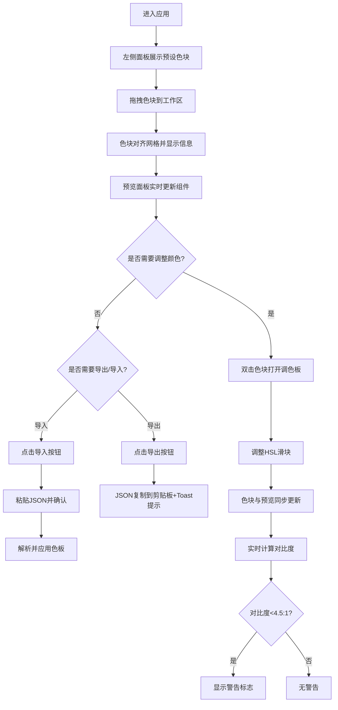

## 1. 产品概述
品牌色板构建器是一款面向设计师的语义化颜色规划工具，通过拖拽排列语义颜色块快速构建品牌色板，并实时预览色板在真实UI组件上的视觉效果。
- 解决设计师选定主色后难以直观预判整个界面视觉效果的痛点
- 目标用户为 UI/UX 设计师、前端开发人员、品牌设计师

## 2. 核心功能

### 2.1 功能模块
1. **主界面**：左侧颜色面板、中央工作区、底部预览面板
2. **色块管理**：预设语义色块、拖拽放置、双击编辑调色板、网格对齐
3. **语义映射**：色块标签自动绑定UI组件、右键手动绑定
4. **实时预览**：卡片、按钮、渐变背景组件展示、300ms平滑过渡动画
5. **导入导出**：JSON格式色板方案导入导出、剪贴板复制
6. **对比度检测**：WCAG AA标准对比度计算、不足警告提示

### 2.2 页面详情
| 页面名称 | 模块名称 | 功能描述 |
|-----------|-------------|---------------------|
| 主界面 | 左侧颜色面板 | 渲染预设语义色块（主色、辅色、强调色、背景色、文字色），支持拖拽到工作区 |
| 主界面 | 中央工作区 | 浅灰背景，网格对齐，色块放置显示名称与色值，双击编辑调色板，最多12个色块 |
| 主界面 | 底部预览面板 | 展示卡片、按钮、渐变背景组件，实时响应颜色变更，显示对比度警告 |
| 主界面 | 顶部操作区 | 导出/导入按钮，Toast提示反馈 |
| 调色板弹窗 | HSL调色器 | 顶部色条、HSL滑块，修改立即更新色块和预览 |
| 导入弹窗 | JSON输入框 | 360x200文本框，粘贴JSON解析应用色板 |
| 绑定菜单 | 右键菜单 | 将组件颜色属性绑定到指定色块标签 |

## 3. 核心流程
用户进入应用 → 从左侧面板拖拽语义色块到工作区 → 色块自动对齐网格并显示标签 → 预览面板实时更新组件颜色 → 可双击色块微调颜色 → 可右键组件绑定其他色块 → 检测对比度并警告 → 导出JSON或粘贴JSON导入色板方案

## 4. 用户界面设计
### 4.1 设计风格
- 配色：深色侧栏(#1E1E2E)与浅色工作区(#F5F5F7)+预览区(#FFFFFF)的明暗对比布局
- 按钮风格：圆角8-12px，hover时scale(1.05)缩放，0.15s过渡
- 字体：12px辅助文字(#64748B)、14px交互文字(#1E293B)
- 布局：三栏式布局（左面板 + 中央工作区 + 底部预览面板）
- 阴影：预览区 0 4px 16px rgba(0,0,0,0.08)，卡片 0 2px 8px rgba(0,0,0,0.06)

### 4.2 页面设计概览
| 页面名称 | 模块名称 | UI元素 |
|-----------|-------------|-------------|
| 主界面 | 左侧颜色面板 | #1E1E2E背景，圆形色块(48px直径，2px白色描边)，hover缩放 |
| 主界面 | 中央工作区 | #F5F5F7背景，16px网格，虚线放置提示(8px圆角，#94A3B8虚线) |
| 主界面 | 底部预览面板 | 240px高，#FFFFFF背景，顶部12px圆角，三组UI组件 |
| 主界面 | 色块展示 | 色块下方12px#64748B文字显示名称和色值 |
| 调色板弹窗 | 调色器 | 280px宽，顶部色条，HSL滑块 |
| Toast提示 | 反馈条 | #334155深灰背景，白色12px文字，8px圆角，2秒自动消失 |
| 警告标志 | 对比度提示 | 橙色三角形，16px宽，内嵌黑色感叹号，hover提示文字 |

### 4.3 响应式设计
- Desktop-first设计，主布局为左侧固定面板 + 中央工作区 + 底部预览区
- 页面宽度<768px时：左侧颜色面板折叠为顶部横条(80px高)，色块横向排列
- 触摸设备优化：色块热区足够大，拖拽流畅

### 4.4 性能要求
- 色块拖拽帧率≥45FPS
- 预览组件颜色过渡动画帧率≥30FPS
- 过渡动画：300ms ease-in-out渐变
