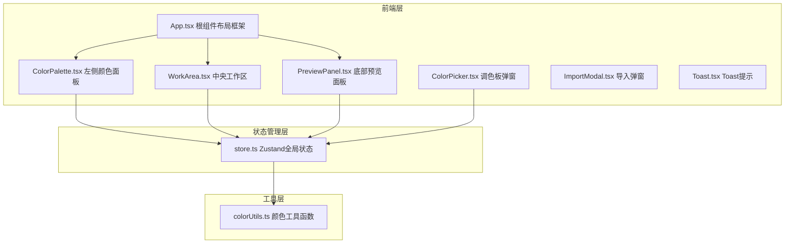

## 1. 架构设计



## 2. 技术描述
- 前端框架：React@18 + TypeScript
- 构建工具：Vite + @vitejs/plugin-react
- 状态管理：Zustand（轻量级，管理色块列表和语义映射）
- 样式方案：原生CSS + CSS变量（无需额外CSS框架，保持轻量）
- 拖拽实现：原生HTML5 Drag and Drop API + React事件处理
- 后端：无（纯前端应用）
- 数据持久化：剪贴板导入导出JSON

## 3. 模块文件组织
| 文件路径 | 用途 |
|-------|---------|
| /package.json | 项目依赖配置（react, react-dom, zustand, typescript, vite, @vitejs/plugin-react） |
| /index.html | Vite入口页面 |
| /vite.config.js | Vite构建配置 |
| /tsconfig.json | TypeScript严格模式配置 |
| /src/App.tsx | 根组件，三栏式布局主框架（左面板+工作区+预览区） |
| /src/store.ts | Zustand store，色块CRUD、语义绑定、导入导出actions |
| /src/components/ColorPalette.tsx | 左侧颜色面板，预设色块渲染与拖拽源逻辑 |
| /src/components/WorkArea.tsx | 中央工作区，放置目标、网格、双击编辑、右键绑定菜单 |
| /src/components/PreviewPanel.tsx | 底部预览区，卡片/按钮/渐变组件渲染、对比度警告 |
| /src/components/ColorPicker.tsx | 双击色块弹出的HSL调色板组件 |
| /src/components/ImportModal.tsx | 导入弹窗，JSON粘贴输入框 |
| /src/components/Toast.tsx | Toast全局提示组件 |
| /src/utils/colorUtils.ts | 颜色转换（hex↔hsl↔rgb）、WCAG对比度计算、渐变生成 |
| /src/index.css | 全局样式、CSS变量、响应式媒体查询 |

## 4. 数据模型与类型定义

### 4.1 核心类型
```typescript
// 语义标签类型
type SemanticTag = 'primary' | 'secondary' | 'accent' | 'background' | 'text';

// 色块数据模型
interface Swatch {
  id: string;
  tag: SemanticTag;
  name: string;
  color: string; // hex格式 #RRGGBB
  x: number; // 工作区网格坐标
  y: number;
}

// UI组件颜色属性绑定映射
interface SemanticBindings {
  'card-header': SemanticTag;
  'card-button': SemanticTag;
  'button-bg': SemanticTag;
  'gradient-start': SemanticTag;
  'gradient-end': SemanticTag;
  'text-primary': SemanticTag;
  'surface-bg': SemanticTag;
}

// 色板导出格式
interface PaletteExport {
  swatches: Swatch[];
  bindings: SemanticBindings;
  version: string;
}
```

### 4.2 Zustand Store State & Actions
```typescript
interface PaletteState {
  swatches: Swatch[];
  bindings: SemanticBindings;
  // Actions
  addSwatch: (tag: SemanticTag, x: number, y: number) => void;
  updateSwatch: (id: string, color: string) => void;
  removeSwatch: (id: string) => void;
  setSemanticBinding: (componentKey: keyof SemanticBindings, tag: SemanticTag) => void;
  exportPalette: () => string; // 返回JSON字符串
  importPalette: (json: string) => boolean; // 成功返回true
}
```

## 5. 性能优化策略
- 拖拽使用requestAnimationFrame确保≥45FPS流畅度
- 颜色过渡使用CSS transition（300ms ease-in-out），GPU加速
- Zustand状态更新通过selector避免不必要的重渲染
- 对比度计算采用WCAG公式，仅在颜色变更时重新计算
- 色块数量限制≤12，防止过多DOM节点影响性能
