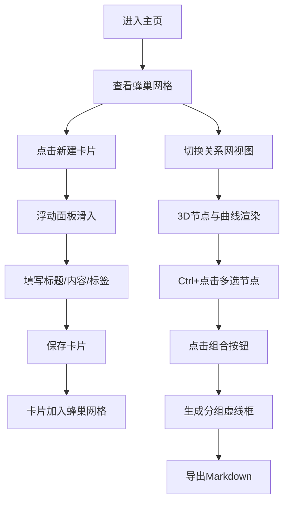

## 1. 产品概述

灵感蜂巢是一款面向创意工作者（写作、设计、策划）的灵感管理工具，以养蜂式的六边形蜂巢隐喻来组织和管理碎片化的创意灵感。用户可以随手记录灵感卡片、建立卡片间的关联关系，系统自动生成可视化的灵感关系网络，并支持将相关灵感组合导出为结构化文档。

- 核心价值：将散落的灵感碎片结构化、可视化，激发创意联想，提升创意产出效率
- 目标用户：作家、设计师、策划师、内容创作者等需要管理创意灵感的专业人士

## 2. 核心功能

### 2.1 用户角色
| 角色 | 注册方式 | 核心权限 |
|------|----------|----------|
| 创意工作者 | 无需注册（本地使用） | 完整功能：创建/编辑/删除卡片、查看关系网、组合导出 |

### 2.2 功能模块
1. **蜂巢网格主页**：六边形卡片不规则排列展示，卡片悬停动画，快速新建入口，视图切换
2. **新建/编辑卡片面板**：浮动面板动画，标题、内容、标签表单，标签胶囊样式
3. **3D关系网视图**：Three.js全屏画布，发光节点，半透明曲线连接，视角切换，节点多选
4. **组合导出功能**：多选节点组合，分组虚线框，生成大纲，导出Markdown

### 2.3 页面详情
| 页面名称 | 模块名称 | 功能描述 |
|----------|----------|----------|
| 蜂巢网格主页 | 六边形卡片网格 | 不规则蜂巢布局，卡片悬停放大旋转，右下角关联数量标识，点击编辑，右键菜单 |
| 蜂巢网格主页 | 顶部导航栏 | 六边形分割线装饰，新建按钮，视图切换（蜂巢/关系网），导出入口 |
| 新建/编辑卡片面板 | 表单区域 | 标题输入（35字限制），内容文本域（800字限制），标签输入（最多5个），渐变胶囊标签 |
| 新建/编辑卡片面板 | 浮动动画 | 底部向上滑入0.4s ease-out，关闭向下滑动淡出，暖光背景#FFF8E7，圆角24px |
| 3D关系网视图 | 节点渲染 | 发光节点，半径随内容长度0.5-1.2变化，颜色按标签类型区分 |
| 3D关系网视图 | 曲线连接 | 半透明曲线，颜色按关联强度渐变（红→绿），悬停变实心显示标签 |
| 3D关系网视图 | 视角控制 | 鼠标拖拽旋转，45°/90°俯视角快速切换，相机平滑过渡0.8s |
| 3D关系网视图 | 多选组合 | Ctrl+点击多选，选中白色光环脉冲1s周期，组合按钮生成分组 |
| 组合导出 | 分组显示 | 半透明白色虚线框，框内卡片缩小80%保持相对位置 |
| 组合导出 | Markdown导出 | 按选定顺序生成写作大纲/策划方案，导出.md文件 |

## 3. 核心流程

### 3.1 主要用户流程
1. 用户打开应用，进入蜂巢网格主页，查看已有的灵感卡片以六边形排列
2. 点击"新建"按钮，浮动面板从底部向上滑入，填写标题、内容、标签后保存
3. 保存后卡片出现在蜂巢网格中，用户可点击卡片编辑或悬停查看动画效果
4. 切换到关系网视图，系统根据标签和内容相似度自动计算关联关系，渲染3D节点和连接曲线
5. 用户在关系网中按住Ctrl多选相关节点，点击组合按钮生成分组
6. 选择导出功能，将分组内容按顺序生成Markdown文件下载

### 3.2 流程图

## 4. 用户界面设计

### 4.1 设计风格
- **主色调**：暖米色背景 #FFF8E7，蜂巢白 #FFFFFF，边框米色 #E0D5C1，暖橘强调色 #E67E22
- **标签色**：写作 #E67E22（橙）、设计 #3498DB（蓝）、策划 #2ECC71（绿）、其他 #9B59B6（紫）
- **关系网背景**：深蓝 #0D1B2A
- **按钮风格**：六边形元素装饰，圆角胶囊按钮，渐变背景，悬停加深阴影缩放0.95
- **字体**：标题使用思源宋体/Noto Serif SC（优雅衬线体），正文使用思源黑体/Noto Sans SC，灵感卡片手写感点缀
- **布局风格**：蜂巢六边形网格贯穿全局，导航栏分割线、按钮图标、背景装饰均为六边形图案
- **动画风格**：柔和流畅过渡，浮动面板滑入、卡片悬停外扩旋转、节点发光脉冲、相机平滑移动

### 4.2 页面设计概述
| 页面名称 | 模块名称 | UI元素 |
|----------|----------|--------|
| 蜂巢网格主页 | 六边形卡片网格 | 六边形（120px边长）、白色背景、米色边框、悬停1.2倍外扩+3°旋转0.3s、右下角橘色圆点关联数 |
| 蜂巢网格主页 | 顶部导航栏 | 六边形图案分割线、左侧Logo（六边形+蜂巢图标）、右侧新建按钮+视图切换 |
| 蜂巢网格主页 | 背景装饰 | 淡灰色六边形蜂窝纹理平铺，低透明度不干扰内容 |
| 新建/编辑卡片面板 | 面板容器 | 背景#FFF8E7、圆角24px、柔和内阴影、底部向上滑动0.4s ease-out |
| 新建/编辑卡片面板 | 表单控件 | 标题输入（下划线风格）、内容文本域（自适应高度）、标签胶囊（渐变#F0B27A→#FAD7A1，文字#5D4037，悬停缩小0.95+阴影） |
| 3D关系网视图 | 节点 | 发光球体、半径0.5-1.2、标签色、Bloom泛光效果 |
| 3D关系网视图 | 连接线 | 贝塞尔曲线、半透明、强度色渐变、悬停实心+文字标签 |
| 3D关系网视图 | 控制面板 | 右上角视角切换按钮（45°/90°）、底部组合按钮、选中计数 |
| 组合导出 | 分组框 | 半透明白色虚线框、内边距、卡片缩小80% |

### 4.3 响应式
- **桌面端（>1200px）**：六边形边长120px，关系网鼠标操作
- **平板端（768-1200px）**：六边形边长90px，网格列数自适应减少，关系网支持双指缩放和平移
- **移动端（<768px）**：简化为列表视图或紧凑网格，关系网支持触屏操作

### 4.4 3D场景指引
- **环境**：深蓝背景 #0D1B2A，营造深邃宇宙感，节点如星辰
- **光照**：环境光+点光源，节点自身发光（Bloom后处理），无需HDRI
- **相机**：默认45°俯视角，PerspectiveCamera，支持90°俯视快速切换，切换过渡0.8s ease-in-out
- **构图**：节点按力导向算法分布，中心密集外围稀疏，形成星系感
- **交互**：OrbitControls拖拽旋转，滚轮缩放，Ctrl+点击多选，悬停高亮关联线
- **后处理**：Bloom泛光（发光节点效果），FXAA抗锯齿，100节点保持60FPS
- **性能**：InstancedMesh批量渲染节点，曲线使用LineSegments合并，帧率目标60FPS
