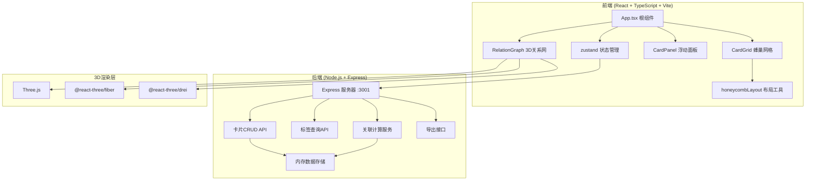
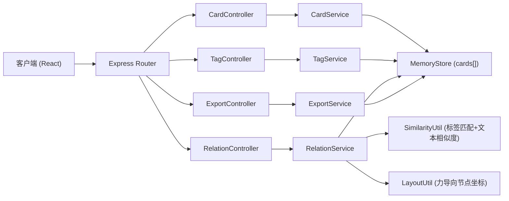
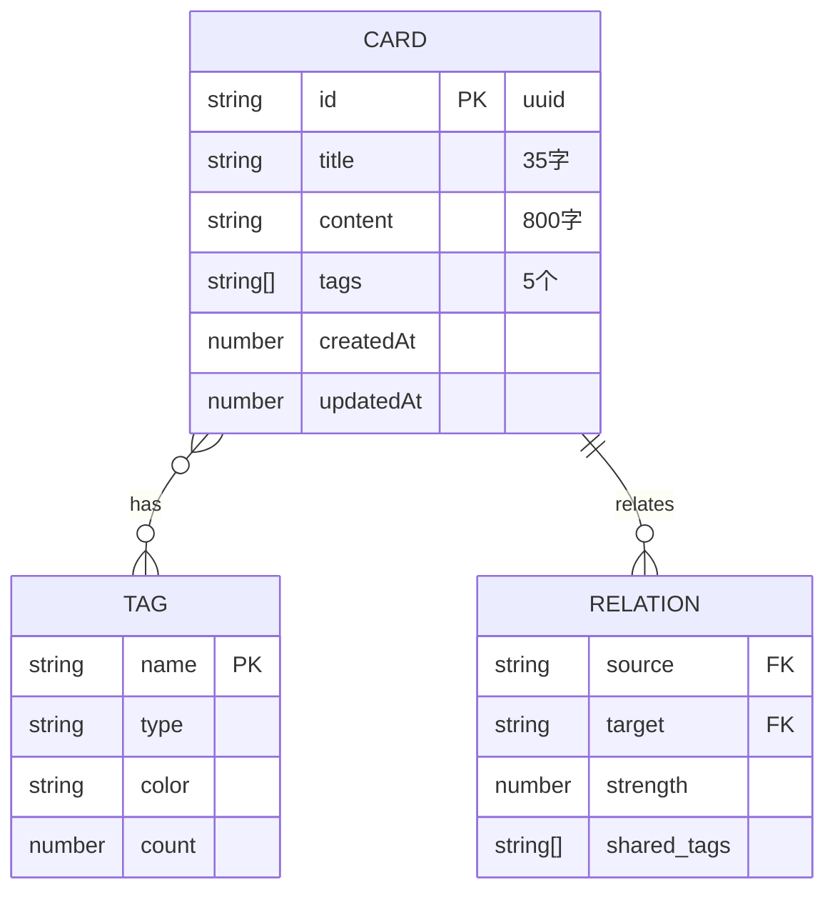

## 1. 架构设计



## 2. 技术描述
- **前端**：React 18 + TypeScript 5 + Vite 5
- **状态管理**：zustand 4（轻量级状态管理，存储卡片列表、选中状态、关系网数据）
- **3D渲染**：Three.js r160 + @react-three/fiber 8 + @react-three/drei 9
- **拖拽排序**：react-beautiful-dnd 13（蜂巢网格卡片拖拽）
- **初始化工具**：Vite 手动搭建项目结构
- **后端**：Express 4（Node.js HTTP服务器）
- **跨域**：cors 2（前后端端口分离跨域处理）
- **ID生成**：uuid 9（卡片唯一标识）
- **数据库**：内存数组存储（无需持久化，重启清空）

## 3. 路由定义
| 路由 | 用途 |
|------|------|
| / | 单页应用，前端通过状态切换蜂巢网格/关系网视图 |
| /api/cards [GET] | 获取所有卡片列表 |
| /api/cards [POST] | 创建新卡片 |
| /api/cards/:id [PUT] | 更新指定卡片 |
| /api/cards/:id [DELETE] | 删除指定卡片 |
| /api/tags [GET] | 获取所有标签及统计 |
| /api/relations [GET] | 计算并返回卡片关联关系数据 |
| /api/export [POST] | 根据选中卡片ID列表生成Markdown内容返回 |

## 4. API定义

### 4.1 类型定义
```typescript
interface Card {
  id: string;
  title: string;       // 最大35字
  content: string;     // 最大800字
  tags: string[];      // 最多5个
  createdAt: number;
  updatedAt: number;
}

interface TagInfo {
  name: string;
  count: number;
  type: 'writing' | 'design' | 'planning' | 'other';
  color: string;
}

interface Relation {
  source: string;      // 卡片ID
  target: string;      // 卡片ID
  strength: number;    // 0-1 关联强度
  tags: string[];      // 共同标签
}

interface GraphData {
  nodes: Array<{
    id: string;
    x: number; y: number; z: number;
    radius: number;
    color: string;
    label: string;
  }>;
  edges: Relation[];
}

interface ExportGroup {
  cardIds: string[];
  order: number[];
  title: string;
}
```

### 4.2 请求响应示例
- **GET /api/cards** → `{ cards: Card[] }`
- **POST /api/cards** body: `{ title, content, tags }` → `{ card: Card }`
- **PUT /api/cards/:id** body: `{ title?, content?, tags? }` → `{ card: Card }`
- **DELETE /api/cards/:id** → `{ success: true }`
- **GET /api/tags** → `{ tags: TagInfo[] }`
- **GET /api/relations** → `{ relations: Relation[], graph: GraphData }`
- **POST /api/export** body: `{ cardIds: string[], title: string }` → `{ markdown: string, filename: string }`

## 5. 服务端架构图



## 6. 数据模型

### 6.1 数据模型ER图


### 6.2 初始Mock数据
服务端启动时初始化15-20条示例卡片数据，覆盖写作、设计、策划三种标签类型，确保关联关系计算后有足够节点展示3D效果：
- 写作类：小说开头片段、人物设定、情节转折、环境描写等灵感
- 设计类：配色方案、排版灵感、界面交互、品牌元素等想法
- 策划类：活动主题、用户场景、传播节点、合作方案等构思
