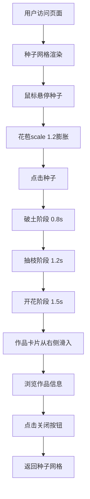

## 1. 产品概述

数字生长花园是一个面向数字艺术社区的交互式作品展示平台，通过动态、非线性的生长动画形式，将艺术作品转化为独特的数字种子，观众点击后可体验从播种到开花的完整视觉旅程。

- 核心目标：为数字艺术创作者提供富有诗意和沉浸感的作品展示方式，增强观众与作品之间的情感连接
- 目标用户：数字艺术创作者、艺术爱好者、画廊策展人
- 产品价值：将静态作品展示转化为可交互的沉浸式体验，提升作品传播力和观众参与度

## 2. 核心功能

### 2.1 功能模块

1. **种子展示面板**：以3列响应式网格布局展示8-12颗种子卡片
2. **三段式生长动画**：破土→抽枝→开花的完整生长序列
3. **作品信息卡片**：动画结束后展示作品详情（名称、作者、描述、日期）
4. **花园氛围背景**：渐变背景、草地装饰、应用标题展示

### 2.2 页面详情

| 页面名称 | 模块名称 | 功能描述 |
|-----------|-------------|---------------------|
| 主页面 | 种子展示网格 | 3列响应式布局，每颗种子显示为圆形花苞图标，hover膨胀效果，点击触发生长 |
| 主页面 | 生长动画系统 | 破土(0.8s)、抽枝(1.2s)、开花(1.5s)三段式Canvas动画，粒子效果 |
| 主页面 | 作品信息卡片 | 毛玻璃半透明卡片，从右侧滑入，展示作品详细信息，可关闭 |
| 主页面 | 背景氛围层 | 径向渐变背景、底部草地曲线、标题文字装饰 |

## 3. 核心流程

用户访问页面 → 浏览种子网格 → 鼠标悬停查看花苞膨胀反馈 → 点击种子触发生长动画 → 破土阶段(土粒粒子四散) → 抽枝阶段(茎叶展开) → 开花阶段(花瓣绽放+花粉飘散) → 作品信息卡片滑入 → 用户浏览作品信息 → 关闭卡片返回网格浏览

## 4. 用户界面设计

### 4.1 设计风格

- **主色调**：大地色系+柔和粉彩融合
  - 主色：#D4A373（暖棕）、#B8860B（暗金棕）
  - 辅色：#8FBC8F（柔和绿）、#F5E6CA（米白）
  - 背景：#FFF3E0 → #FDEDEC 径向渐变（浅米到淡粉）
- **字体**：标题使用Georgia衬线字体，正文使用系统默认字体
- **卡片风格**：圆角16px，毛玻璃效果（rgba(255,245,235,0.85) + 8px背光模糊）
- **动效风格**：所有过渡使用ease-out缓动，动画帧率≥50FPS

### 4.2 页面设计概述

| 页面名称 | 模块名称 | UI元素 |
|-----------|-------------|-------------|
| 主页面 | 标题区 | 左上角"数字生长花园"，Georgia 28px，#5D4037，带1px阴影 |
| 主页面 | 种子网格 | 居中最大960px，留白40px，3列等宽，单元格最小120px |
| 主页面 | 种子卡片 | 圆角16px，#FAF5F0背景，1px #E8DDD0边框，hover边框#D4A373+4px模糊阴影 |
| 主页面 | 花苞图标 | 圆形半径20px，#D4A373→#E6C8A6径向渐变，hover scale 1.2，0.3s过渡 |
| 主页面 | 作品卡片 | 圆角16px，毛玻璃，右侧滑入0.5s ease-out，关闭按钮hover变色 |
| 主页面 | 草地装饰 | 页面底部CSS伪元素，高度60px，#8FBC8F绿色曲线，透明度0.4 |

### 4.3 响应式设计

- 桌面端（≥768px）：3列网格布局
- 平板端（480px-768px）：2列网格布局
- 移动端（<480px）：1列网格布局
- 所有交互反馈在200ms内可视化
- 触控设备优化点击区域

### 4.4 性能约束

- Canvas渲染器维持60FPS
- 粒子数量≤150颗
- 使用requestAnimationFrame驱动动画循环
- 生长阶段切换无卡顿
- 内存占用合理，无泄漏
