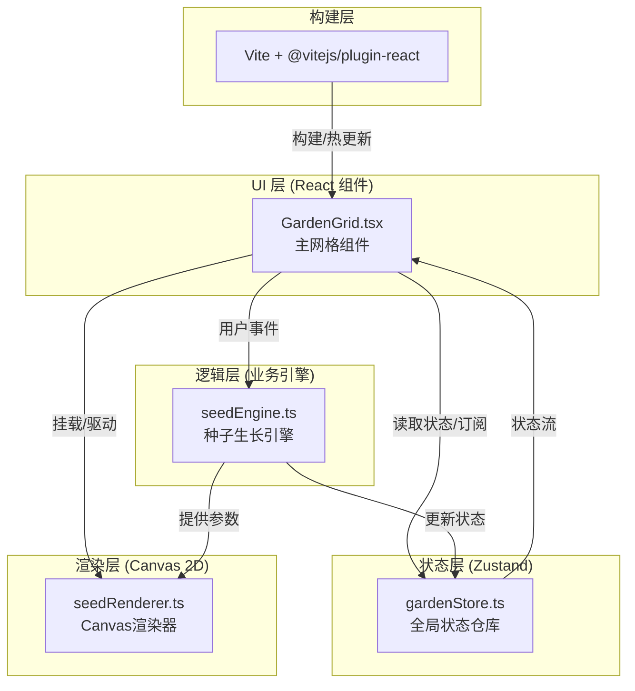
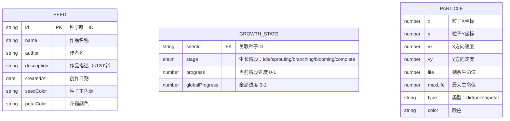

## 1. 架构设计

本项目为纯前端React应用，采用分层架构设计，职责清晰，数据流单向可控。



**数据流说明：**
1. 用户点击种子 → GardenGrid组件捕获事件 → 调用seedEngine.startGrowth(seedId)
2. seedEngine计算生长参数 → 更新gardenStore中的生长阶段和动画进度
3. GardenGrid订阅store变化 → 触发Canvas渲染器重绘
4. seedRenderer从store/engine获取数据 → 用requestAnimationFrame绘制动画
5. 动画结束 → seedEngine更新store → GardenGrid展示作品信息卡片

## 2. 技术描述

- **前端框架**：React@18 + TypeScript@5
- **构建工具**：Vite@5 + @vitejs/plugin-react@4
- **状态管理**：zustand@4
- **渲染技术**：HTML5 Canvas 2D API
- **样式方案**：原生CSS（CSS Modules）+ CSS变量
- **包管理器**：npm
- **初始化方式**：vite-init脚手架（react-ts模板）

## 3. 文件结构与调用关系

```
d:\Pro\tasks\auto202\
├── package.json              # 依赖配置（typescript, vite, react, zustand）
├── vite.config.js            # Vite配置（React插件）
├── tsconfig.json             # TS配置（严格模式，target ES2020）
├── index.html                # 入口HTML（#root容器）
└── src/
    ├── main.tsx              # 应用入口（渲染GardenGrid）
    ├── App.tsx               # 根组件
    ├── gardenStore.ts        # ⭐ Zustand状态仓库（被GardenGrid、seedEngine调用）
    ├── seedEngine.ts         # ⭐ 种子引擎（被GardenGrid调用，调用gardenStore）
    ├── seedRenderer.ts       # ⭐ Canvas渲染器（被GardenGrid调用）
    ├── GardenGrid.tsx        # ⭐ React主组件（调用store/engine/renderer）
    ├── SeedCard.tsx          # 种子卡片子组件
    ├── ArtworkCard.tsx       # 作品信息卡片子组件
    ├── SeedCanvas.tsx        # Canvas渲染子组件
    ├── styles/
    │   ├── GardenGrid.css    # 主组件样式
    │   ├── SeedCard.css      # 种子卡片样式
    │   ├── ArtworkCard.css   # 作品卡片样式
    │   └── global.css        # 全局样式（背景、草地、标题）
    └── types/
        └── seed.ts           # 类型定义
```

**调用关系详解：**

| 模块 | 被谁调用 | 调用谁 | 职责 |
|------|----------|--------|------|
| gardenStore.ts | GardenGrid、seedEngine | 无（纯状态存储） | 存储种子列表、选中ID、生长阶段、动画进度 |
| seedEngine.ts | GardenGrid | gardenStore | 计算生长参数、阶段转换逻辑、动画时间线 |
| seedRenderer.ts | GardenGrid、SeedCanvas | 无（纯渲染） | 绘制花苞、茎、叶、花瓣、粒子效果 |
| GardenGrid.tsx | main.tsx(App) | gardenStore、seedEngine、seedRenderer | 网格布局、事件处理、组件编排 |
| SeedCard.tsx | GardenGrid | 无（纯展示） | 单个种子卡片UI、hover效果 |
| ArtworkCard.tsx | GardenGrid | 无（纯展示） | 作品信息毛玻璃卡片、滑入动画 |
| SeedCanvas.tsx | GardenGrid | seedRenderer | Canvas元素挂载、动画循环 |

## 4. 数据模型与类型定义

### 4.1 数据模型定义



### 4.2 核心TypeScript类型

```typescript
// src/types/seed.ts
export type GrowthStage = 'idle' | 'sprouting' | 'branching' | 'blooming' | 'complete';

export interface Seed {
  id: string;
  name: string;
  author: string;
  description: string;
  createdAt: string;
  seedColor: string;
  petalColor: string;
}

export interface GrowthState {
  selectedSeedId: string | null;
  stage: GrowthStage;
  stageProgress: number;
  globalProgress: number;
  startTime: number | null;
}

export interface Particle {
  x: number;
  y: number;
  vx: number;
  vy: number;
  life: number;
  maxLife: number;
  type: 'dirt' | 'pollen' | 'petal';
  color: string;
  size: number;
  rotation: number;
  rotationSpeed: number;
}

export interface GardenStore {
  seeds: Seed[];
  growth: GrowthState;
  selectSeed: (id: string) => void;
  clearSelection: () => void;
  updateGrowth: (patch: Partial<GrowthState>) => void;
  resetGrowth: () => void;
}
```

## 5. 动画时序配置

| 阶段 | 英文名 | 时长 | 视觉效果 | 粒子类型 |
|------|--------|------|----------|----------|
| 破土 | sprouting | 0.8s | 花苞从底部弹起，弹跳曲线 | dirt（土粒） |
| 抽枝 | branching | 1.2s | 茎向上延伸，叶片旋转展开 | 无 |
| 开花 | blooming | 1.5s | 花瓣放射性展开+缓慢旋转 | pollen（花粉）、petal（花瓣） |
| 完成 | complete | 持续 | 花朵静止摇曳，卡片滑入 | 少量pollen |

**阶段转换时间节点：**
- 0ms：sprouting开始
- 800ms：sprouting→branching
- 2000ms：branching→blooming
- 3500ms：blooming→complete + 作品卡片滑入

## 6. 性能优化策略

1. **Canvas渲染优化**：离屏Canvas缓存静态元素，仅重绘变化区域
2. **粒子池**：对象池复用Particle实例，避免GC频繁触发
3. **状态订阅**：Zustand选择器精确订阅，避免不必要重渲染
4. **节流控制**：动画帧内计算合并，避免重复计算
5. **响应式Canvas**：使用DPR适配，避免高分辨率下过度绘制
6. **CSS优化**：transform/opacity动画触发GPU合成层，避免layout
