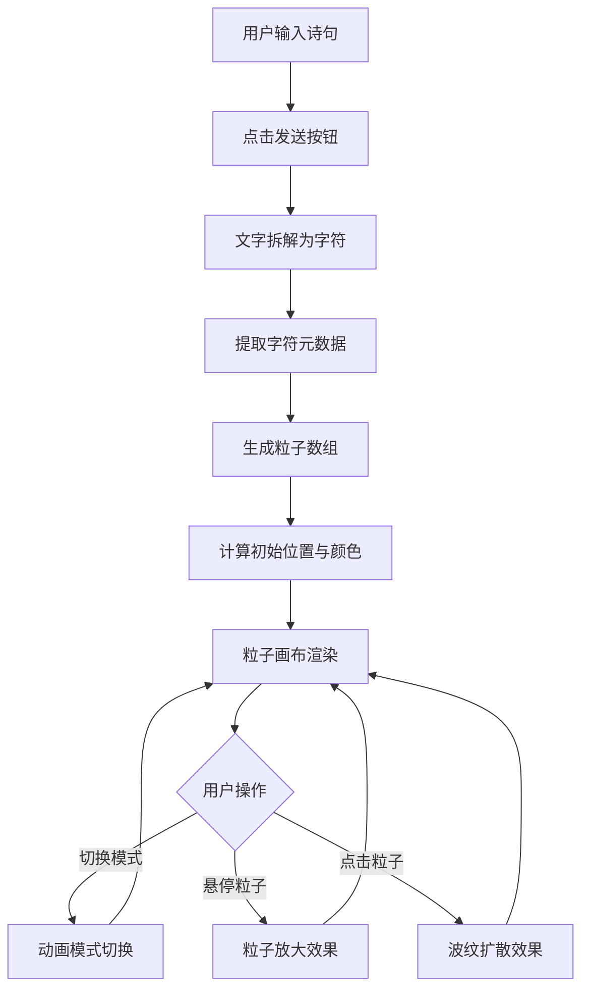

## 1. 产品概述

光影诗笺是一款交互式文字动画生成应用，用户输入诗歌或短句后，系统将每个字符拆解为独立粒子并依据语义情感生成动态光影动画。

- **主要目的**：为用户提供富有诗意和艺术感的文字视觉化体验，将静态文字转化为流动的光影粒子艺术
- **目标用户**：诗歌爱好者、设计师、创意工作者以及追求独特视觉体验的普通用户
- **市场价值**：填补文字视觉化工具在艺术表现力和交互体验上的空白，为社交媒体内容创作、个人表达提供新颖的呈现方式

## 2. 核心功能

### 2.1 用户角色

| 角色 | 注册方式 | 核心权限 |
|------|----------|----------|
| 普通用户 | 无需注册，直接使用 | 输入文字、切换动画模式、与粒子交互 |

### 2.2 功能模块

1. **主页面**：文字输入区域、粒子画布区域、动画模式切换区域
2. **文字解析模块**：将输入文字按字符拆解，提取元数据（Unicode、笔画数等）
3. **粒子动画模块**：三种动画模式（涟漪扩散、螺旋上升、烟花迸发）
4. **交互反馈模块**：鼠标悬停、点击粒子的视觉反馈效果

### 2.3 页面详情

| 页面名称 | 模块名称 | 功能描述 |
|----------|----------|----------|
| 主页面 | 文字输入区域 | 居中输入框（最大50汉字），圆形发光发送按钮，点击后解析文字生成粒子 |
| 主页面 | 粒子画布区域 | Canvas画布，展示粒子动画，支持鼠标交互（悬停放大、点击波纹） |
| 主页面 | 动画模式切换 | 底部三个模式按钮，切换涟漪、螺旋、烟花三种动画效果 |
| 主页面 | 情感色彩映射 | 根据文字情感自动调整光晕颜色（喜悦暖橙、悲伤冷蓝、平静湖绿） |

## 3. 核心流程

用户输入诗句 → 点击发送按钮 → 系统拆解文字为粒子 → 计算每个粒子的初始位置、颜色、光晕 → 粒子按默认排列展示 → 用户可切换动画模式 → 粒子根据所选模式执行动画 → 用户可与粒子交互（悬停/点击）

## 4. 用户界面设计

### 4.1 设计风格

- **主色调**：深蓝色渐变背景（#0F0C29 → #302B63 → #24243E）
- **粒子颜色**：暖金色（#FFD700）到冷银色（#C0C0C0）渐变
- **情感色彩**：喜悦暖橙#FF8C00、悲伤冷蓝#4169E1、平静湖绿#40E0D0
- **按钮样式**：圆形发光发送按钮（直径48px，渐变#667eea到#764ba2），模式切换按钮（50px×30px，圆角8px）
- **输入框样式**：背景#1A1A2E，圆角12px，内边距16px，白色文字16px
- **动画缓动**：600ms cubic-bezier(0.25, 0.1, 0.25, 1)

### 4.2 页面设计概述

| 页面名称 | 模块名称 | UI 元素 |
|----------|----------|---------|
| 主页面 | 文字输入区域 | 居中输入框（600px宽）、右侧圆形发送按钮、渐变背景、发光效果 |
| 主页面 | 粒子画布区域 | Canvas全屏画布、粒子文字排列、动态光晕、动画效果 |
| 主页面 | 模式切换区域 | 底部居中三个按钮、选中态高亮、弹性过渡动画 |
| 主页面 | 交互反馈 | 粒子悬停放大、光晕扩展、文字提示浮层、点击波纹扩散 |

### 4.3 响应式设计

- **桌面端（≥768px）**：输入框宽度600px，粒子大小32px，间距20px
- **移动端（<768px）**：输入框宽度90%，粒子大小24px，间距自适应调整
- **触摸优化**：按钮最小触摸区域48px，粒子交互区域扩大便于触摸

### 4.4 视觉动效指导

- **入场动画**：页面加载时背景渐变淡入，输入框从顶部滑入
- **粒子生成**：文字解析后粒子逐个淡入，带随机延迟效果
- **动画过渡**：模式切换时粒子平滑过渡到新状态，无突兀跳变
- **光晕效果**：粒子光晕持续呼吸动画，增强沉浸感
- **性能指标**：200个粒子时帧率稳定在55FPS以上
