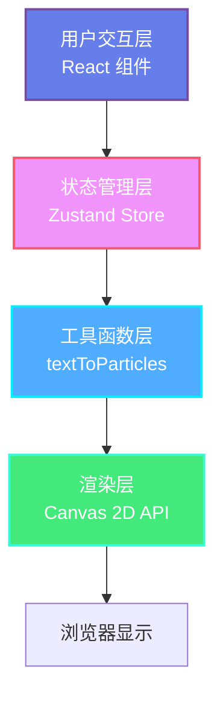

## 1. 架构设计



## 2. 技术描述

- **前端框架**：React 18 + TypeScript
- **构建工具**：Vite 5.x
- **状态管理**：Zustand 4.x
- **渲染引擎**：Canvas 2D API（requestAnimationFrame 驱动）
- **唯一标识**：uuid 9.x
- **初始化方式**：Vite 官方脚手架初始化

## 3. 目录结构

```
├── package.json
├── index.html
├── vite.config.ts
├── tsconfig.json
├── src/
│   ├── main.tsx              # 应用挂载入口
│   ├── App.tsx               # 主组件，状态协调
│   ├── stores/
│   │   └── poemStore.ts      # Zustand 状态管理
│   ├── components/
│   │   └── ParticleCanvas.tsx  # 粒子画布组件
│   └── utils/
│       └── textToParticles.ts  # 文字转粒子工具函数
```

## 4. 数据模型

### 4.1 粒子数据结构

```typescript
interface Particle {
  id: string;
  char: string;
  unicode: number;
  strokeCount: number;
  x: number;
  y: number;
  targetX: number;
  targetY: number;
  vx: number;
  vy: number;
  color: string;
  glowColor: string;
  glowRadius: number;
  glowOpacity: number;
  scale: number;
  rotation: number;
  opacity: number;
  delay: number;
  speedFactor: number;
  emotion: 'joy' | 'sadness' | 'calm';
}
```

### 4.2 应用状态结构

```typescript
interface PoemState {
  inputText: string;
  particles: Particle[];
  animationMode: 'ripple' | 'spiral' | 'firework';
  isAnimating: boolean;
  hoveredParticleId: string | null;
  ripples: Ripple[];
  setInputText: (text: string) => void;
  generateParticles: () => void;
  setAnimationMode: (mode: AnimationMode) => void;
  setHoveredParticle: (id: string | null) => void;
  addRipple: (x: number, y: number) => void;
  updateParticles: (deltaTime: number) => void;
}
```

### 4.3 波纹效果结构

```typescript
interface Ripple {
  id: string;
  x: number;
  y: number;
  radius: number;
  maxRadius: number;
  opacity: number;
  createdAt: number;
}
```

## 5. 动画模式实现

### 5.1 涟漪扩散模式
- 粒子以画布中心为圆心向外扩散
- 每个粒子延迟 50ms 依次启动
- 运动轨迹：极坐标转换，半径随时间增加

### 5.2 螺旋上升模式
- 粒子沿螺旋路径向上运动
- 速度因子 0.5-1.2 随机分配
- 运动公式：`r = a + bθ`（阿基米德螺旋）

### 5.3 烟花迸发模式
- 粒子从中心向四周炸开
- 初速度方向随机，大小在 2-5 之间
- 模拟重力加速度（向下 0.15 每帧）
- 空气阻力：速度乘以 0.98 每帧

## 6. 性能优化策略

### 6.1 渲染优化
- 使用 `requestAnimationFrame` 驱动动画循环
- 粒子数量限制：最多 200 个
- 离屏缓存：静态文字渲染到离屏 Canvas
- 脏矩形渲染：只重绘变化区域

### 6.2 计算优化
- 粒子更新使用批量处理
- 避免在动画循环中创建新对象
- 使用 `Float32Array` 存储粒子坐标
- 防抖处理用户输入

### 6.3 内存管理
- 动画暂停时清除 RAF
- 粒子销毁时清理引用
- 事件监听器及时移除
- 避免内存泄漏

## 7. 核心算法

### 7.1 文字情感分析（简化版）
- 基于关键词匹配：快乐词库、悲伤词库、中性词库
- 情感得分加权计算
- 映射到三种情感类型

### 7.2 笔画数估算
- 基于 Unicode 范围估算
- 常用汉字笔画数查表
- 生僻字使用默认值 8

### 7.3 颜色渐变计算
- HSL 颜色空间插值
- 基于粒子索引计算渐变位置
- 情感色彩动态调整色相偏移
