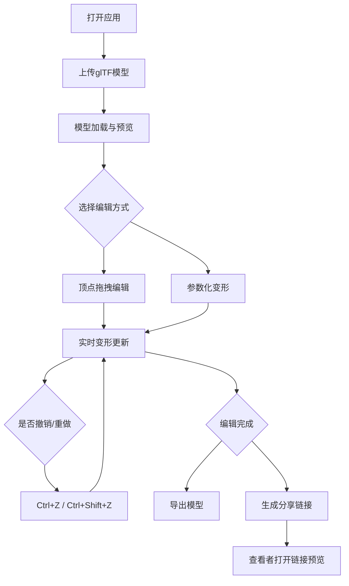

## 1. 产品概述

3D模型在线预览与轻量级编辑器，支持glTF模型加载、顶点拖拽变形、参数化调整、协作分享和撤销重做功能。面向3D设计师、开发者及协作团队，解决在线场景下无法直观拖拽修改模型形态、缺少实时反馈与协作分享的问题。

## 2. 核心功能

### 2.1 用户角色

| 角色 | 注册方式 | 核心权限 |
|------|----------|----------|
| 编辑者 | 无需注册 | 上传模型、拖拽编辑、参数调整、导出、分享 |
| 查看者 | 通过分享链接 | 只读预览模型（含变形效果），不可编辑 |

### 2.2 功能模块

1. **模型编辑器页面**：3D场景预览、模型上传、顶点编辑、参数面板、分享与导出

### 2.3 页面详情

| 页面名称 | 模块名称 | 功能描述 |
|----------|----------|----------|
| 模型编辑器 | 3D场景区域 | 使用Three.js渲染glTF模型，深蓝渐变背景，地面网格辅助线，模型自适应相机视野，加载进度条动画 |
| 模型编辑器 | 模型上传 | 点击上传按钮选择glTF文件（最大50MB），使用GLTFLoader加载并居中显示 |
| 模型编辑器 | 顶点拖拽编辑 | 点击模型表面生成可拖拽控制点（球形，#F6AD55），沿法线方向拖拽，拉普拉斯变形实时更新，拖拽结束控制点消失 |
| 模型编辑器 | 参数化变形面板 | 细分级别(1-4)、噪声强度(0-1)、平滑度(0-1)滑动条，实时数值显示，50ms内更新 |
| 模型编辑器 | 协作分享 | 生成只读链接（pako压缩），复制到剪贴板，查看者打开可见一致模型预览 |
| 模型编辑器 | 历史撤销/重做 | Ctrl+Z撤销(最多20步)，Ctrl+Shift+Z重做，0.3s ease过渡动画 |

## 3. 核心流程

用户打开应用 → 上传glTF模型文件 → 模型加载并在3D场景中显示 → 用户通过点击模型表面创建控制点并拖拽变形 → 或通过右侧参数面板调整全局属性 → 编辑完成后可导出或生成分享链接 → 其他用户通过链接查看只读模型

## 4. 用户界面设计

### 4.1 设计风格

- 主色调：深蓝色系背景（#0B0F19 → #1A2440），绿色强调色（#4FD1C5），橙色交互色（#F6AD55），红色操作色（#E53E3E）
- 按钮风格：圆角8px-12px，0.2s ease-out过渡动画，悬停缩放/变暗效果
- 字体：模型名称白色18px加粗，提示文字#A0AEC0 14px，时间标注#718096 12px
- 布局风格：左右两栏（75%场景 + 320px面板），毛玻璃效果卡片
- 视觉特效：毛玻璃效果（rgba(26,32,44,0.8)，边框1px solid #2D3748，模糊12px）

### 4.2 页面设计概述

| 页面名称 | 模块名称 | UI元素 |
|----------|----------|--------|
| 模型编辑器 | 左侧3D场景 | 深蓝渐变背景，半透明地面网格(#4A5568, 0.3透明度)，顶部加载进度条(#4FD1C5, 4px)，模型居中自适应 |
| 模型编辑器 | 右侧面板-顶部 | 模型名称(白18px加粗)、上传时间(灰12px)，毛玻璃背景 |
| 模型编辑器 | 右侧面板-顶点编辑卡片 | 提示"点击模型表面开始编辑"(#A0AEC0 14px居中)，重置变形按钮(#E53E3E 圆角8px) |
| 模型编辑器 | 右侧面板-参数卡片 | 细分/噪声/平滑滑动条，轨道#4A5568，滑块#4FD1C5，悬停放大1.1倍+阴影，数值显示#A0AEC0 14px |
| 模型编辑器 | 右侧面板-底部按钮 | 导出按钮(#48BB78 圆角8px 点击缩放0.95)，分享按钮(#3182CE 圆角8px)，间距16px |

### 4.3 响应式适配

- 桌面端（≥768px）：左右两栏，左侧75%场景 + 右侧320px面板
- 移动端（<768px）：上下布局，上方场景60%高度 + 下方面板40%高度
- 所有交互元素0.2s ease-out过渡动画

### 4.4 3D场景设计

- 环境氛围：深蓝色渐变背景（#0B0F19到#1A2440），营造沉浸式深空感
- 光照：环境光 + 方向光，确保模型细节可见
- 相机：初始位置原点前方8单位、高度5单位、俯角20度，模型自动适应视野80%
- 地面：半透明网格辅助线（#4A5568，0.3透明度）
- 交互元素：控制点球形发光(#F6AD55)，拖拽变红(#E53E3E)，虚线连接(#CBD5E0)
- 动画：加载进度条过渡0.3s，撤销/重做0.3s ease过渡，控制点出现/消失动画
