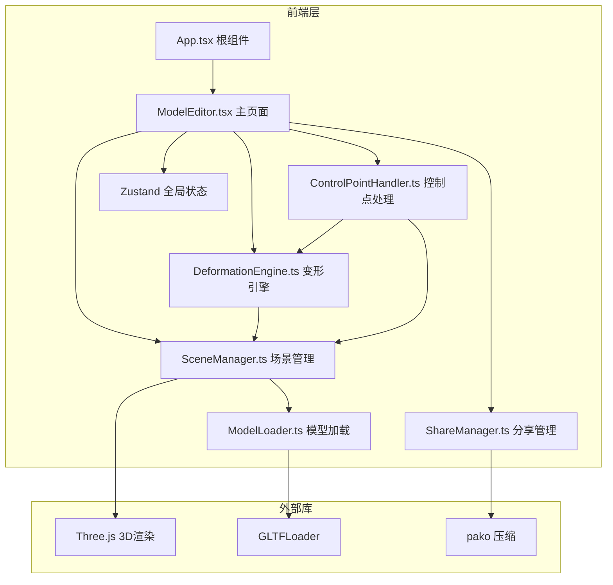

## 1. 架构设计



## 2. 技术说明

- 前端：React@18 + TypeScript + Three.js + Zustand + Vite
- 初始化工具：vite-init（react-ts模板）
- 后端：无（纯前端应用）
- 数据库：无（状态全部存储在内存和URL中）
- 关键依赖：three, @types/three, react, react-dom, @vitejs/plugin-react, typescript, vite, zustand, pako, uuid

## 3. 路由定义

| 路由 | 用途 |
|------|------|
| / | 模型编辑器主页面（上传、编辑、预览） |
| /view/:data | 只读预览页面（通过分享链接访问，不可编辑） |

## 4. 数据模型

### 4.1 全局状态定义（Zustand Store）

```typescript
interface EditorState {
  modelName: string;
  uploadTime: string;
  isLoading: boolean;
  loadProgress: number;
  subdivisionLevel: number;
  noiseIntensity: number;
  smoothness: number;
  isDragging: boolean;
  controlPoints: ControlPointData[];
  history: HistoryEntry[];
  historyIndex: number;
  isReadOnly: boolean;
}

interface ControlPointData {
  id: string;
  position: [number, number, number];
  normal: [number, number, number];
  displacement: number;
}

interface HistoryEntry {
  type: 'drag' | 'parameter';
  controlPoints: ControlPointData[];
  subdivisionLevel: number;
  noiseIntensity: number;
  smoothness: number;
  vertexPositions: Float32Array;
}
```

### 4.2 分享数据格式

```typescript
interface ShareData {
  modelName: string;
  subdivisionLevel: number;
  noiseIntensity: number;
  smoothness: number;
  vertexPositions: number[];
  originalVertices: number[];
}
```

## 5. 文件结构

```
project/
├── package.json
├── vite.config.ts
├── tsconfig.json
├── index.html
├── src/
│   ├── App.tsx
│   ├── main.tsx
│   ├── index.css
│   ├── modules/
│   │   ├── scene/
│   │   │   ├── SceneManager.ts
│   │   │   └── ModelLoader.ts
│   │   ├── editor/
│   │   │   ├── DeformationEngine.ts
│   │   │   └── ControlPointHandler.ts
│   │   └── share/
│   │       └── ShareManager.ts
│   ├── pages/
│   │   └── ModelEditor.tsx
│   └── store/
│       └── useEditorStore.ts
```

## 6. 核心算法

### 6.1 拉普拉斯变形算法

- 构建顶点邻接矩阵（基于网格拓扑）
- 计算拉普拉斯坐标（每个顶点与邻域均值的差值）
- 根据控制点位移，求解线性系统更新所有顶点位置
- 变形平滑度参数0.8，控制拉普拉斯坐标的保持程度

### 6.2 Perlin噪声变形

- 频率2.0，对每个顶点位置施加噪声偏移
- 噪声强度0-1控制偏移幅度

### 6.3 Laplacian平滑

- 迭代3次，每次将顶点移动到邻域均值位置
- 平滑度0-1控制移动比例
