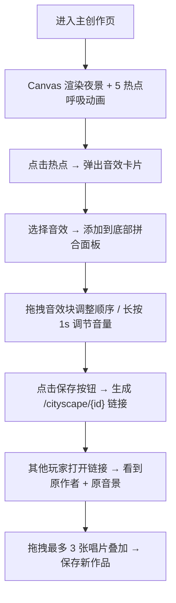

## 1. 产品概述

都市音景是一款基于 Web 的交互式城市背景音拼合应用。用户在 2D 夜景街道场景中，通过点击交互热点添加不同音效层，拖拽音效块调整顺序与音量，最终生成独特的城市音景作品并可分享给其他玩家，支持在他人音景基础上叠加唱片进行二次创作。

- 面向喜欢白噪音、环境音乐、城市氛围的都市用户，提供沉浸式、可定制的听觉体验
- 核心价值在于用视觉化的城市场景 + 多轨混音，让"声音拼贴"这一抽象过程变得直观有趣

## 2. 核心功能

### 2.1 用户角色

| 角色 | 注册方式 | 核心权限 |
|------|----------|----------|
| 普通用户 | 首次访问时设置昵称（localStorage） | 创建音景、保存、分享、在他人音景上叠加唱片 |

### 2.2 功能模块

1. **主创作页**：2D Canvas 夜景街道、5 个可交互热点、音效卡片弹窗
2. **音效拼合面板**：音效块列表、顺序拖拽、长按呼出音量旋钮、音量电平可视化
3. **保存与分享**：生成 `/cityscape/{id}` 分享链接、本地存储作品
4. **叠加创作**：他人音景页面最多叠加 3 张唱片、唱片旋转动画、拖拽到热点叠加
5. **导航视图**：城市图鉴、我的音景、排行榜（基于 state 切换，无路由库）

### 2.3 页面详情

| 页面名称 | 模块名称 | 功能描述 |
|----------|----------|----------|
| 主创作页 | Canvas 场景渲染 | 16:9 夜景渐变背景、路灯暖光晕染（径向渐变+模糊）、5 个呼吸动画热点 |
| 主创作页 | 音效卡片弹窗 | 点击热点弹出毛玻璃圆角卡片，选择对应音效 |
| 主创作页 | 底部拼合面板 | 150px 高暗色面板、黄色分隔线、按类别着色的音效块、8px 间距 |
| 主创作页 | 音量交互 | 长按 1s 切换音量旋钮（40px 圆形）、拖拽 0-100、左侧渐变电平条（#00FF88→#FF5733） |
| 主创作页 | 保存按钮 | 50px 圆形黄色按钮、悬停放大 55px 加阴影、点击下压 0.1s、生成分享链接 |
| 分享页 | 作者信息 | 右上角显示原作者昵称（localStorage 读取，未设置弹窗提示） |
| 分享页 | 唱片叠加 | 最多 3 张 40px 圆形旋转唱片（2s linear）、拖拽到热点上方松开叠加 |
| 导航栏 | 全局导航 | 50px 高毛玻璃栏、项目名"都市音景"、3 个文字按钮（下划线从中间展开 0.2s） |

## 3. 核心流程

## 4. 用户界面设计

### 4.1 设计风格

- **主色**：深蓝夜空色系（#0B132B → #1C2541 渐变背景），暖黄灯光（#FFD93D）作为点缀
- **按钮风格**：圆形保存按钮带放大与下压动画；导航按钮悬停下划线从中间展开
- **字体**：标题使用有设计感的展示字体（如 "Noto Serif SC" 或 "ZCOOL XiaoWei"），正文使用现代无衬线字体
- **布局**：Canvas 居中 16:9 铺满，底部固定操作面板，顶部固定导航栏
- **图标**：使用 lucide-react 线性图标，配合暖黄灯光色

### 4.2 页面设计概览

| 页面名称 | 模块名称 | UI 元素 |
|----------|----------|----------|
| 主创作页 | Canvas 场景 | 渐变背景、径向渐变暖光晕斑、5 个呼吸放大缩小热点 |
| 主创作页 | 音效卡片 | 16px 圆角毛玻璃（rgba(255,255,255,0.1)）、1px 半透明白色边框 |
| 主创作页 | 拼合面板 | #2C2C54 背景、顶部 #FFD93D 分隔线、四色音效块（交通红/自然蓝/人声橙/电子紫） |
| 主创作页 | 电平条 | 渐变柱状图（#00FF88 → #FF5733），实时反映总音量 |
| 分享页 | 唱片叠加 | 40px 圆形唱片图标、2s 匀速旋转、拖拽交互 |
| 全局 | 导航栏 | rgba(11,19,43,0.9) 背景、#A0C4FF 字色、悬停变 #FFD93D |

### 4.3 响应式

- 桌面优先，最小宽度 320px
- 平板宽度（≤768px）：操作面板高度由 150px 变为 120px，热点间距自适应
- 所有 Canvas 按容器宽度等比缩放，保持 16:9 比例
- 触摸设备长按 500ms 替代桌面长按 1s

### 4.4 性能要求

- 音效缓存不超过 30MB，超过后 LRU 淘汰
- 所有动画稳定 60FPS，使用 requestAnimationFrame，避免频繁布局计算
- Canvas 采用分层渲染（静态背景层 + 动态热点层），减少重绘开销
