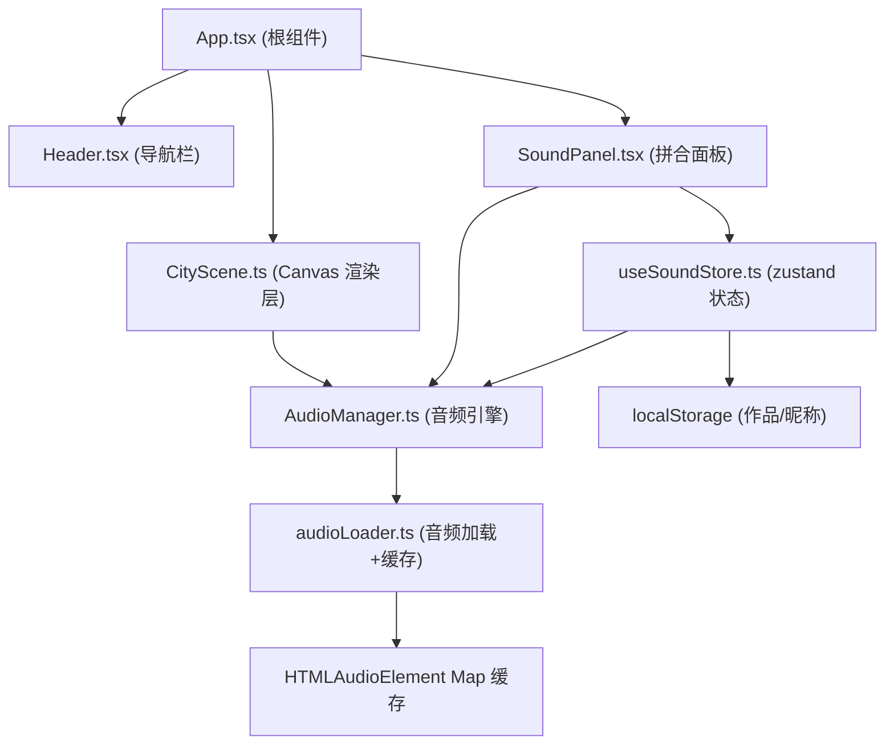
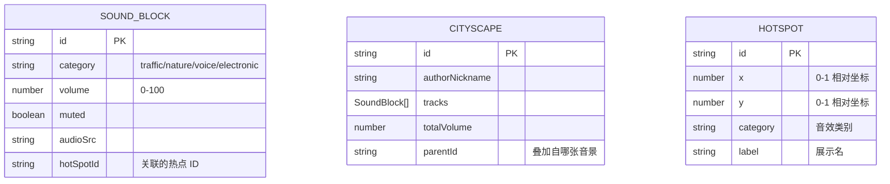

## 1. 架构设计



## 2. 技术栈说明

- **前端框架**：React 18 + TypeScript（target ES2020，strict 模式）
- **构建工具**：Vite + @vitejs/plugin-react
- **状态管理**：zustand
- **渲染层**：Canvas 2D API（纯 TS 类，不依赖第三方图形库）
- **音频层**：HTMLAudioElement + Web Audio API（AnalyserNode 用于电平可视化）
- **样式方案**：CSS Modules（避免与全局样式冲突），配合内联 CSS 变量
- **不使用**：路由库（使用 state 切换视图）、UI 组件库、tailwindcss

## 3. 模块与文件拆分

| 文件路径 | 职责 |
|----------|------|
| `package.json` | 依赖声明与 `npm run dev` 启动脚本 |
| `index.html` | 应用入口 HTML |
| `vite.config.js` | React 插件配置，`/audio` 代理到本地音频目录 |
| `tsconfig.json` | strict 模式，target ES2020 |
| `src/App.tsx` | 根组件，组合 Header + CityScene + SoundPanel，视图 state 切换 |
| `src/scenes/CityScene.ts` | 2D 夜景街道渲染、热点绘制与点击检测、接收 AudioManager 数据做可视化反馈 |
| `src/engine/AudioManager.ts` | 单例，管理最多 6 个音轨层，加载/播放/音量调节/混音，提供 `getAudioData()` 给 CityScene |
| `src/engine/SoundBlock.ts` | 音效块数据模型（id、category、volume、muted、audioSrc 等） |
| `src/store/useSoundStore.ts` | zustand store：音效块列表、总音量、当前场景 ID、与 AudioManager 双向同步 |
| `src/components/SoundPanel.tsx` | 底部拼合面板：音效块渲染、顺序拖拽、长按音量旋钮、电平条、保存按钮 |
| `src/components/Header.tsx` | 顶部导航栏，基于 state 的视图切换（城市图鉴/我的音景/排行榜） |
| `src/utils/audioLoader.ts` | 音频文件预加载，返回 HTMLAudioElement，Map 缓存 + 30MB LRU 限制 |

## 4. 关键数据模型



## 5. 状态与数据流

1. 用户点击 Canvas 热点 → CityScene 上报点击坐标 → 判断命中热点 → App 弹出音效卡片
2. 用户选择音效 → `useSoundStore.addBlock(block)` → store 调用 `AudioManager.addTrack(block)` → AudioManager 通过 audioLoader 加载音频并播放
3. 用户拖拽音效块调序/长按调音量 → SoundPanel dispatch action → store 更新 → AudioManager 同步 `setVolume(id, v)`
4. AudioManager 内部使用 AnalyserNode 获取频域数据，通过 `getAudioData()` 暴露给 CityScene 做灯光随动可视化
5. 点击保存 → store 序列化到 localStorage + 生成随机 ID → 展示 `/cityscape/{id}` 链接

## 6. 性能与缓存策略

- **音频缓存**：`audioLoader.ts` 维护 `Map<string, { el: HTMLAudioElement, size: number, ts: number }>`，总 size 超过 30MB 时淘汰最早使用的条目
- **Canvas 渲染**：CityScene 内部双缓冲（离屏画布缓存静态夜景），热点层与可视化层每帧重绘
- **动画**：热点呼吸动画、唱片旋转、按钮过渡均使用 CSS transform + opacity，Canvas 使用 `requestAnimationFrame`
- **触摸优化**：长按检测使用独立 Timer，避免干扰拖拽的 pointermove

## 7. 目录结构

```
auto212/
├── index.html
├── package.json
├── vite.config.js
├── tsconfig.json
├── public/
│   └── audio/            (静态音频占位目录)
└── src/
    ├── App.tsx
    ├── index.css
    ├── scenes/
    │   └── CityScene.ts
    ├── engine/
    │   ├── AudioManager.ts
    │   └── SoundBlock.ts
    ├── store/
    │   └── useSoundStore.ts
    ├── components/
    │   ├── SoundPanel.tsx
    │   ├── Header.tsx
    │   └── SoundCard.tsx  (新增: 音效卡片弹窗)
    └── utils/
        └── audioLoader.ts
```
