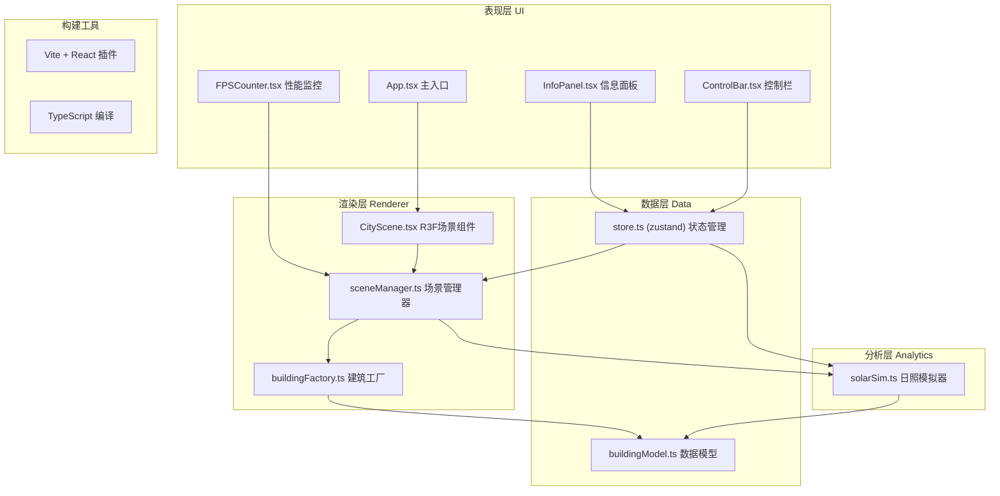

## 1. 架构设计



## 2. 技术描述

- **前端框架**：React@18 + TypeScript@5
- **3D渲染**：three@0.160 + @react-three/fiber@8 + @react-three/drei@9
- **状态管理**：zustand@4
- **构建工具**：Vite@5 + @vitejs/plugin-react@4
- **HTTP客户端**：axios@1（用于模拟API数据获取）
- **初始化工具**：vite-init react-ts模板
- **后端**：无后端，使用内置Mock数据

## 3. 路由定义

| 路由 | 用途 |
|-------|---------|
| / | 主场景页（唯一页面，全屏3D视口+浮层控件） |

## 4. 数据模型

### 4.1 核心接口定义

```typescript
// 能耗等级
type EnergyLevel = 'A' | 'B' | 'C' | 'D' | 'E';

// 建筑方案类型
type SchemeType = 'box' | 'streamline' | 'terraced';

// 位置接口
interface Position {
  x: number;
  y: number;
  z: number;
}

// 尺寸接口
interface Dimensions {
  width: number;
  height: number;
  depth: number;
}

// 建筑数据接口
interface Building {
  id: string;
  name: string;
  floors: number;
  position: Position;
  dimensions: Dimensions;
  energyLevel: EnergyLevel;
  energyConsumption: number; // kWh/年
  occlusionRelations: string[]; // 遮挡的建筑ID列表
}

// 日照分析结果
interface SolarResult {
  buildingId: string;
  sunIntensity: number; // 0.3 - 1.0
  daylightHours: number; // 当前日照时长百分比 0-100
  surfaceBrightness: Record<'east'|'west'|'south'|'north'|'top', number>;
}

// 全局状态
interface AppState {
  // 场景状态
  buildings: Building[];
  selectedBuildingId: string | null;
  hoveredBuildingId: string | null;
  
  // 时间控制
  currentHour: number; // 8 - 18
  
  // 方案控制
  currentScheme: SchemeType;
  isTransitioning: boolean;
  
  // 日照结果
  solarResults: Map<string, SolarResult>;
  
  // Actions
  setSelectedBuilding: (id: string | null) => void;
  setHoveredBuilding: (id: string | null) => void;
  setCurrentHour: (hour: number) => void;
  switchScheme: (scheme: SchemeType) => void;
  updateSolarResults: (results: SolarResult[]) => void;
}
```

### 4.2 数据流向

1. **buildingModel.ts** → sceneManager.ts：提供建筑原始数据，`transformAPIData()` 函数将JSON转换为Building对象数组
2. **sceneManager.ts** → buildingFactory.ts：调用 `createBuildingMesh()` 为每个Building创建Three.js Mesh组
3. **solarSim.ts** → sceneManager.ts：`calculateSolar()` 接收时间和建筑数据，返回SolarResult数组，更新建筑材质亮度
4. **ControlBar.tsx** → store → solarSim.ts：时间滑块值变更触发日照重新计算
5. **InfoPanel.tsx** → store → buildingModel.ts：根据selectedBuildingId查询建筑详情

## 5. 文件结构与调用关系

```
project-root/
├── package.json                 # 项目依赖配置
├── vite.config.js               # Vite构建配置（React插件）
├── tsconfig.json                # TypeScript配置（strict模式，target ES2020）
├── index.html                   # 入口HTML
└── src/
    ├── main.tsx                 # 应用入口，挂载React
    ├── App.tsx                  # 根组件，组合场景+UI
    │
    ├── data/
    │   └── buildingModel.ts     # ━━ 数据模型模块
    │                            #    ├─ 定义 Building / EnergyLevel 等接口
    │                            #    ├─ transformAPIData(json) 转换JSON→Building[]
    │                            #    └─ getBuildingById(id) 查询单个建筑
    │
    ├── renderer/
    │   ├── sceneManager.ts      # ━━ 场景管理模块
    │   │                        #    ├─ initScene() 创建场景/相机/控制器/光照/地面
    │   │                        #    ├─ addBuildings(buildings[]) 批量添加建筑
    │   │                        #    ├─ removeAllBuildings() 清空建筑群组
    │   │                        #    └─ transitionBuildings(target[], 2000ms) 方案过渡
    │   │
    │   └── buildingFactory.ts   # ━━ 建筑建造模块
    │                            #    ├─ createBuildingMesh(building) 生成带渐变纹理Mesh组
    │                            #    ├─ applyEnergyColor(material, level) 按能耗等级着色
    │                            #    ├─ addTopGlowBorder(mesh) 添加顶部白色发光边框
    │                            #    └─ setSolarBrightness(mesh, intensity) 更新日照亮度
    │
    ├── analytics/
    │   └── solarSim.ts          # ━━ 日照分析模块
    │                            #    ├─ calculateSunPosition(hour) 计算太阳弧线位置
    │                            #    ├─ getSunColor(hour) 获取光色渐变（暖黄→橙→紫红）
    │                            #    ├─ calculateSolar(hour, buildings[]) 计算日照强度
    │                            #    └─ getDaylightPercent(building, hour) 日照时长百分比
    │
    ├── ui/
    │   ├── InfoPanel.tsx        # ━━ 信息面板组件
    │   │                        #    ├─ 监听 store.selectedBuildingId
    │   │                        #    ├─ 从 buildingModel 查询建筑详情
    │   │                        #    └─ 展示能耗、日照曲线图（SVG/Canvas）
    │   │
    │   └── ControlBar.tsx       # ━━ 控制栏组件
    │                            #    ├─ 时间滑块 onChange → store.setCurrentHour()
    │                            #    ├─ 方案按钮 onClick → store.switchScheme()
    │                            #    └─ 视角按钮 → sceneManager.setCameraPreset()
    │
    ├── components/
    │   ├── CityScene.tsx        # ━━ R3F场景组件（Canvas）
    │   │                        #    ├─ 集成 sceneManager 初始化逻辑
    │   │                        #    ├─ useFrame 驱动呼吸光效/性能监控
    │   │                        #    └─ 射线拾取 → hover/click 事件分发
    │   │
    │   ├── FPSCounter.tsx       # ━━ FPS计数器组件
    │   │                        #    └─ useFrame 统计帧率，右上角显示
    │   │
    │   └── BuildingMesh.tsx     # ━━ 单个建筑R3F组件
    │                            #    ├─ 封装 Mesh + 材质 + EdgesGeometry 边框
    │                            #    ├─ onPointerOver / onPointerOut 高亮
    │                            #    └─ onClick 选中事件
    │
    └── store/
        └── useAppStore.ts       # ━━ zustand 全局状态管理
                                 #    └─ 导出 useAppStore hook 供所有组件使用
```

## 6. 性能优化策略

1. **几何复用**：相同尺寸建筑共享BoxGeometry实例
2. **材质复用**：相同能耗等级共享MeshStandardMaterial，通过uniforms动态调整亮度
3. **阴影优化**：DirectionalLight.shadow.mapSize = 1024x1024，shadow.camera.near/far精确裁剪
4. **渲染循环优化**：useFrame中仅更新必要uniforms，避免每帧重建材质
5. **对象池化**：方案切换时复用Mesh对象，仅更新position.scale而非销毁重建
6. **按需计算**：solarSim仅在hour变化或方案切换后重新计算，非每帧计算
