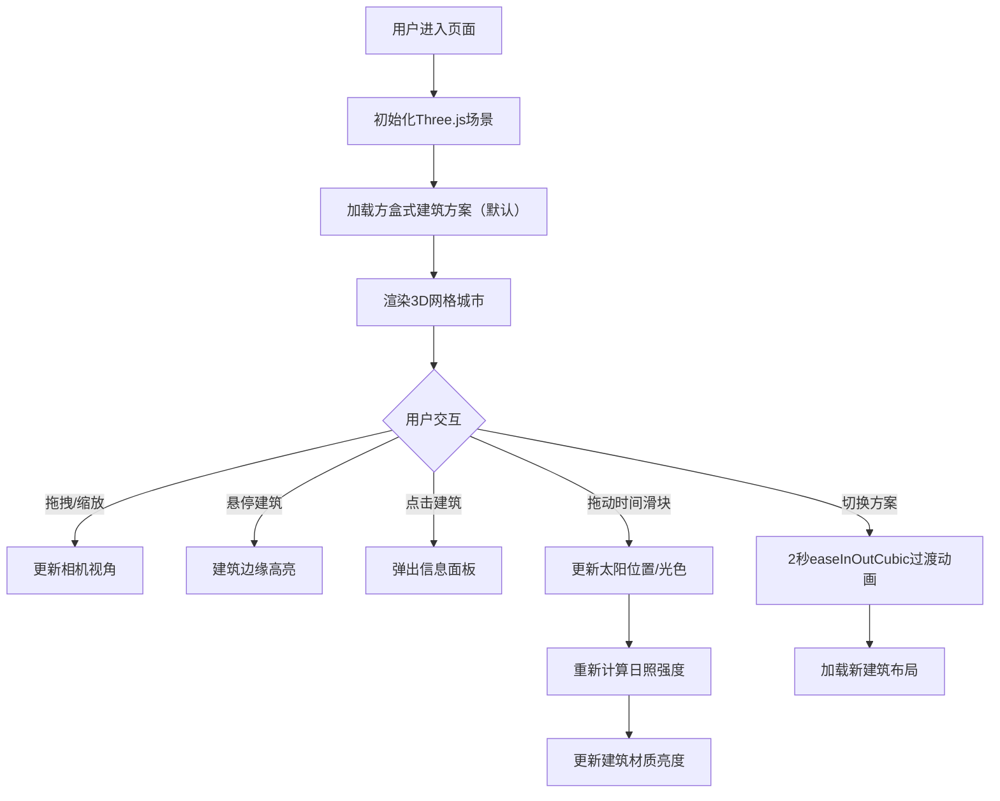

## 1. 产品概述

城境推演师是一款基于Web的3D城市建筑方案可视化平台，为城市规划师和公众提供沉浸式的建筑方案探索体验。
- 核心价值：通过交互式3D场景直观对比不同建筑设计方案对城市天际线的影响，实时查看建筑能耗和日照数据，辅助科学决策
- 目标用户：城市规划师、建筑设计师、政府决策者、公众参与人员

## 2. 核心功能

### 2.1 用户角色

| 角色 | 核心权限 |
|------|----------|
| 规划师 | 查看3D场景、切换方案、查看能耗/日照数据、调整时间模拟 |
| 公众用户 | 查看3D场景、切换方案、查看建筑基本信息 |

### 2.2 功能模块

1. **3D场景渲染模块**：网格城市地面、建筑群渲染、光照与阴影、相机交互控制
2. **日照模拟模块**：太阳轨迹模拟、光色渐变、建筑表面日照强度计算
3. **建筑信息模块**：悬停高亮、点击选中、信息面板展示
4. **方案切换模块**：3种预置方案（方盒式/流线式/阶梯式）、2秒平滑过渡动画
5. **控制交互模块**：时间滑块（8:00-18:00）、视角切换按钮、FPS性能监控
6. **响应式界面模块**：桌面端/移动端自适应布局

### 2.3 页面详情

| 页面名称 | 模块名称 | 功能描述 |
|-----------|-------------|---------------------|
| 主场景页 | 3D视口 | 展示20x20网格城市，10-15幢预置建筑，支持拖拽旋转/滚轮缩放/右键平移 |
| 主场景页 | 顶部性能区 | FPS计数器（monospace 12px #00FF00），每秒刷新 |
| 主场景页 | 底部控制栏 | 时间滑块、方案切换按钮组、视角切换按钮 |
| 主场景页 | 右侧信息面板 | 滑入式面板（宽320px，毛玻璃#1E1E2E），显示选中建筑详情 |

## 3. 核心流程

### 3.1 主用户流程
用户进入页面 → 自动加载预置建筑方案（方盒式）→ 鼠标拖拽旋转场景/滚轮缩放 → 悬停建筑查看高亮效果 → 点击建筑弹出信息面板 → 拖动时间滑块观察日照变化 → 切换建筑方案观察天际线变化

## 4. 用户界面设计

### 4.1 设计风格
- **主色调**：深邃太空蓝 #0A0E1A（背景）、科技蓝 #4A6FA5（交互控件）
- **辅助色**：能耗等级渐变色 A级#00E676 → E级#FF5252、日照光色 #FFD699→#FF6B35→#C2185B
- **文字色**：白色系 #FFFFFF / #E0E0E0
- **设计方向**：赛博科技风、深色主题、毛玻璃质感、微发光效果
- **按钮样式**：圆角8px，#4A6FA5底色，hover时亮度提升15%，0.2s过渡
- **字体**：正文使用系统sans-serif，数值/代码使用monospace，标题字号18px，正文字号14px
- **布局**：全屏沉浸式3D视口，控件悬浮式布局（顶部FPS、底部控制栏、右侧信息面板）

### 4.2 页面设计概述

| 页面名称 | 模块名称 | UI元素 |
|-----------|-------------|-------------|
| 主场景页 | 3D视口 | 网格地面（#2A3A5A 透明度0.4）、建筑群（能耗等级渐变色+顶部白色发光边框+呼吸光效）、阴影投射 |
| 主场景页 | FPS计数器 | 右上角固定，monospace 12px #00FF00 |
| 主场景页 | 控制栏 | 底部居中，时间滑块（带刻度8:00-18:00）、3个方案按钮、视角切换按钮 |
| 主场景页 | 信息面板 | 右侧滑入，圆角16px，毛玻璃backdrop-filter: blur(8px)，背景rgba(30,30,46,0.85) |

### 4.3 响应式设计
- **桌面端（≥768px）**：控制栏底部居中展开，信息面板右侧滑入（320px宽）
- **移动端（<768px）**：控制栏折叠为底部固定条，信息面板改为全屏底部弹窗（从底部滑入）
- **触摸优化**：支持单指旋转、双指缩放、双击选中

### 4.4 3D场景指引
- **环境氛围**：深邃夜空感，雾效（FogExp2，密度0.015）增强空间纵深感
- **光照设置**：主光源DirectionalLight（模拟太阳，支持位置/颜色动态变化）+ 环境光AmbientLight(0.3) + HemisphereLight补光
- **相机设置**：PerspectiveCamera，初始位置(0, 25*sin(30°), 25*cos(30°))，fov 50°，near 0.1，far 1000
- **构图焦点**：场景中心为原点，建筑群围绕原点在20x20网格内分布
- **交互动画**：建筑悬停边缘高亮（0.2s过渡）、方案切换（2s easeInOutCubic）、建筑呼吸光效（3s sine 0.6-0.9透明度）
- **后处理效果**：抗锯齿MSAA、阴影映射PCFSoftShadowMap
- **性能预算**：12幢建筑+实时阴影+日照计算 ≥ 50FPS，首屏加载 ≤ 3秒
