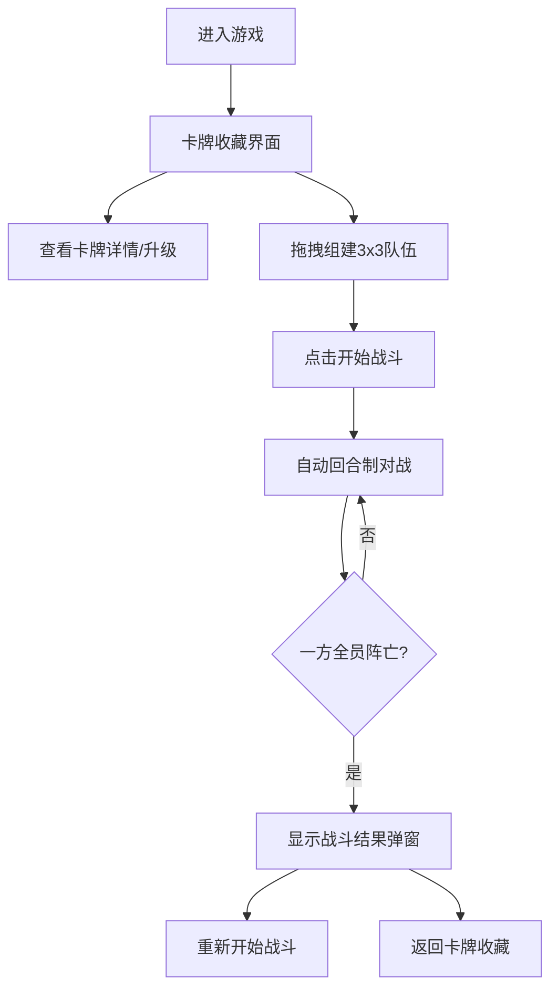

## 1. 产品概述

像素封神榜是一款基于中国神话背景的卡牌自动回合制对战游戏。玩家收集并组合神话角色卡牌，组建3x3战斗队伍，通过策略性的卡牌搭配和技能系统与敌方进行自动对战。

- 目标用户：喜欢卡牌收集、策略对战类游戏的玩家
- 产品价值：提供轻松有趣的卡牌收集和自动战斗体验，结合神话元素带来独特的游戏沉浸感

## 2. 核心功能

### 2.1 功能模块

1. **卡牌收藏界面**：展示全部卡牌、稀有度分类、卡牌详情查看、卡牌升级强化
2. **队伍组建界面**：3x3队伍槽位、拖拽卡牌组队、队伍管理
3. **战斗界面**：双方卡牌布局展示、自动回合对战、战斗日志、技能特效、弹道动画、伤害数字
4. **结果统计界面**：胜负判定、战斗数据统计、重新开始/返回卡牌

### 2.2 页面详情

| 页面名称 | 模块名称 | 功能描述 |
|-----------|-------------|---------------------|
| 卡牌收藏界面 | 卡牌网格展示 | 18张起始卡按稀有度排列，金紫蓝绿四档稀有度颜色区分 |
| 卡牌收藏界面 | 卡牌详情弹窗 | 显示卡牌属性、技能说明，右侧升级面板 |
| 卡牌收藏界面 | 卡牌升级系统 | 消耗金币升级，每级提升5%攻击和3%防御，最高10级 |
| 队伍组建界面 | 3x3队伍槽位 | 拖拽卡牌放入槽位，弹性动画，防重复，满员提示 |
| 战斗界面 | 双方卡牌布局 | 敌我双方3x3网格展示 |
| 战斗界面 | 自动回合战斗 | 按速度排序轮流行动，普攻+技能系统，10%暴击率 |
| 战斗界面 | Canvas动画特效 | 攻击闪烁、弹道飞行、受击抖动、伤害数字飘移 |
| 战斗界面 | 技能冷却管理 | 3回合冷却，灰色遮罩显示剩余回合数 |
| 战斗界面 | 战斗日志 | 滚动显示回合动作，新条目淡入 |
| 结果界面 | 胜负弹窗 | 渐变背景，缩放动画，战斗统计展示 |

## 3. 核心流程

### 3.1 用户主流程

玩家进入游戏后，首先浏览卡牌收藏界面，查看卡牌详情并可升级强化卡牌。然后通过拖拽组建3x3战斗队伍。点击开始战斗后，系统自动按速度排序进行回合制对战，双方角色轮流使用普攻或技能攻击。当一方全部卡牌生命值归零时战斗结束，显示结果弹窗，玩家可选择重新开始或返回卡牌收藏。

## 4. 用户界面设计

### 4.1 设计风格

- **主题色**：暗黑神话风格，主背景渐变 #0B0C10 到 #1F2833
- **稀有度颜色**：金#FFD700、紫#9C27B0、蓝#2196F3、绿#4CAF50
- **元素颜色**：火#FF4500、水#1E90FF、风#32CD32、土#8B4513
- **卡牌发光效果**：金色box-shadow 0 0 10px，紫色0 0 8px，蓝色0 0 6px，绿色0 0 4px
- **字体**：采用现代无衬线字体，突出神话风格
- **弹窗样式**：半暗化背景rgba(0,0,0,0.7)，内容白色透明度0.85文本
- **按钮样式**：圆角设计，悬停有发光或脉冲动画

### 4.2 页面设计概述

| 页面名称 | 模块名称 | UI元素 |
|-----------|-------------|-------------|
| 卡牌收藏 | 卡牌网格 | 响应式网格，稀有度发光边框，悬停效果 |
| 卡牌收藏 | 详情弹窗 | 毛玻璃升级面板(rgba(255,255,255,0.1)背景)，圆角16px，升级按钮脉冲发光 |
| 队伍组建 | 3x3槽位 | 空槽位占位符，拖拽跟随鼠标(80x110px圆角8px)，松开弹性吸附动画(0.3s ease-out) |
| 战斗界面 | Canvas区域 | 100vw x 100vh，攻击闪烁0.2s，弹道速度500px/s，受击抖动0.15s，伤害数字1s飘移 |
| 战斗界面 | 战斗日志 | 宽400px高200px，自定义滚动条，新条目淡入0.2s |
| 结果界面 | 胜负弹窗 | 胜利#FFD700→#FF6B00渐变，失败#303030→#1A1A1A，缩放动画0.3s cubic-bezier |

### 4.3 响应式

- 桌面优先设计，最小宽度800px
- 浏览器宽度小于1000px时，卡牌网格从3列变为2列
- 队伍槽位卡牌缩放到70%尺寸

## 5. 战斗系统规则

### 5.1 伤害计算
- 基础伤害 = 攻击力 × 技能倍率 - 对方防御力 × 0.5
- 暴击率：10%，暴击伤害×1.5

### 5.2 技能系统
- 主动技能：消耗3点能量，AI优先对敌方血量最低目标使用
- 被动技能：持续生效
- 技能冷却：3回合，期间图标灰色遮罩显示剩余回合数

### 5.3 AI决策逻辑
- 优先使用能量充足的主动技能攻击敌方血量最低目标
- 无合适目标则使用普通攻击

### 5.4 战后奖励
- 胜利获得100金币
- 显示统计：总回合数、总伤害、最大单次伤害、暴击次数
