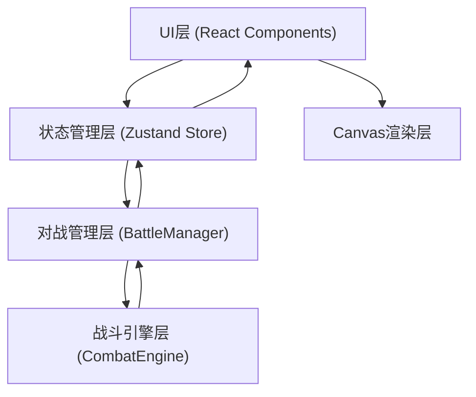

## 1. 架构设计



## 2. 技术描述

- **前端框架**：React 18 + TypeScript
- **构建工具**：Vite
- **状态管理**：Zustand
- **渲染技术**：HTML5 Canvas (战斗动画) + CSS (UI界面)
- **无后端**：纯前端游戏，所有状态内存管理

## 3. 目录结构

```
src/
├── game/
│   ├── engine/
│   │   └── CombatEngine.ts       # 战斗引擎：回合逻辑、伤害计算
│   └── manager/
│       └── BattleManager.ts      # 对战管理：状态持有、流程控制
├── ui/
│   ├── GameBoard.tsx             # 主战斗界面
│   └── CardCollection.tsx        # 卡牌收藏界面
├── store/
│   └── gameStore.ts              # Zustand全局状态
├── types/
│   └── game.ts                   # TypeScript类型定义
├── data/
│   └── cards.ts                  # 初始卡牌数据
├── App.tsx
├── main.tsx
└── index.css
```

## 4. 数据模型

### 4.1 卡牌类型定义

```typescript
type Rarity = 'gold' | 'purple' | 'blue' | 'green';
type Element = 'fire' | 'water' | 'wind' | 'earth';

interface Skill {
  name: string;
  description: string;
  multiplier: number;      // 技能倍率
  energyCost: number;      // 能量消耗
  cooldown: number;        // 冷却回合数
  type: 'active' | 'passive';
  effect?: string;         // 被动效果描述
}

interface Card {
  id: string;
  name: string;
  rarity: Rarity;
  element: Element;
  baseAttack: number;
  baseDefense: number;
  baseHp: number;
  speed: number;
  level: number;           // 1-10级
  maxLevel: number;
  skills: Skill[];
  avatar: string;          // 头像标识
}

interface BattleCard extends Card {
  currentHp: number;
  maxHp: number;
  currentEnergy: number;
  maxEnergy: number;
  cooldowns: Record<string, number>;  // 技能名->剩余冷却
  isAlive: boolean;
  position: { row: number; col: number };
}
```

### 4.2 游戏状态类型

```typescript
interface GameState {
  // 玩家数据
  playerHp: number;
  playerGold: number;
  ownedCards: Card[];
  teamSlots: (Card | null)[];  // 9个槽位
  
  // 战斗状态
  isInBattle: boolean;
  currentRound: number;
  battleLog: BattleLogEntry[];
  battleResult: 'win' | 'lose' | null;
  playerTeam: BattleCard[];
  enemyTeam: BattleCard[];
  
  // UI状态
  currentView: 'collection' | 'battle';
  selectedCard: Card | null;
  showResultModal: boolean;
  
  // 战斗统计
  stats: {
    totalDamage: number;
    maxSingleDamage: number;
    critCount: number;
    totalRounds: number;
  };
}
```

### 4.3 战斗日志类型

```typescript
interface BattleLogEntry {
  id: string;
  round: number;
  timestamp: number;
  type: 'attack' | 'skill' | 'critical' | 'death' | 'info';
  attacker?: string;
  target?: string;
  damage?: number;
  message: string;
}
```

## 5. 核心模块职责与数据流

### 5.1 CombatEngine (战斗引擎)
- **职责**：纯逻辑计算，无UI依赖
- **输入**：双方BattleCard数组
- **输出**：战斗日志条目、更新后的卡牌状态、胜负判定
- **核心方法**：
  - `calculateDamage(attacker, target, multiplier)`: 伤害计算
  - `executeTurn(attacker, targets)`: 执行单角色回合
  - `checkBattleEnd(playerTeam, enemyTeam)`: 判定胜负
  - `aiSelectAction(attacker, enemyTeam)`: AI决策

### 5.2 BattleManager (对战管理)
- **职责**：持有战斗状态，管理回合流程
- **与Store交互**：从store获取初始队伍，将结果写回store
- **核心方法**：
  - `initBattle(playerTeam, enemyTeam)`: 初始化战斗
  - `startNextTurn()`: 推进到下一个行动者
  - `processActionResult(result)`: 处理引擎计算结果
  - `endBattle(result)`: 结束战斗并发放奖励

### 5.3 gameStore (状态管理)
- **职责**：全局状态单一数据源
- **Actions**：
  - `selectCard(card)`: 选择卡牌查看详情
  - `addToTeam(card, slotIndex)`: 添加卡牌到队伍
  - `removeFromTeam(slotIndex)`: 从队伍移除
  - `startBattle()`: 开始战斗
  - `executeRound()`: 执行回合
  - `retreat()`: 撤退
  - `upgradeCard(cardId)`: 升级卡牌
  - `resetBattle()`: 重置战斗
  - `goToCollection()`: 返回卡牌收藏

### 5.4 Canvas渲染
- 由GameBoard组件管理
- requestAnimationFrame实现60FPS动画
- 动画对象池：攻击闪烁、弹道、抖动、伤害数字
- 与状态解耦：仅读取快照，不直接修改store

## 6. 性能优化策略

1. **Zustand选择器**：UI组件使用精细的selector订阅，避免全树重渲染
2. **Canvas分层**：静态卡牌层与动态特效层分离
3. **对象池**：弹道、伤害数字等动画对象复用
4. **不可变数据**：战斗状态更新使用不可变方式，便于React优化
5. **requestAnimationFrame**：所有Canvas动画使用RAF调度
