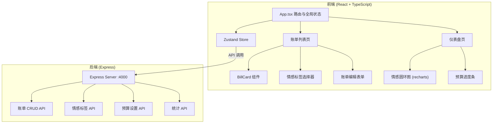
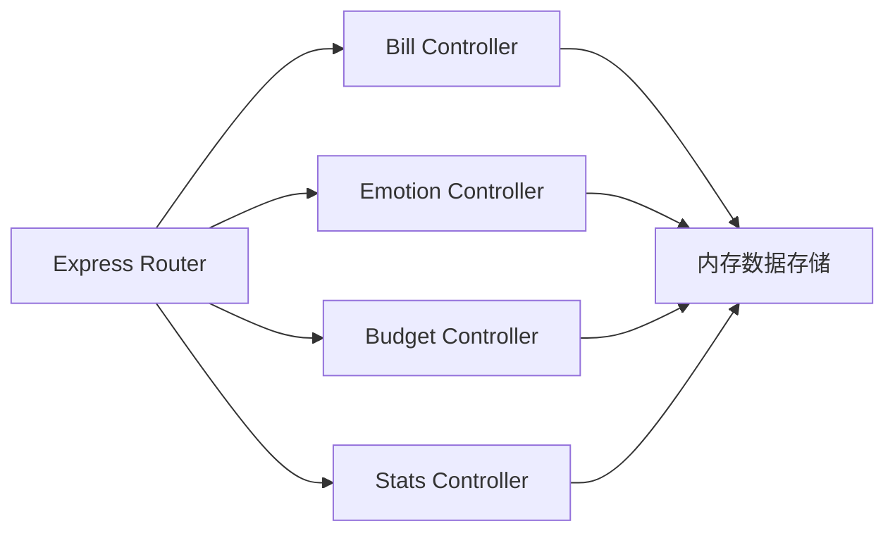
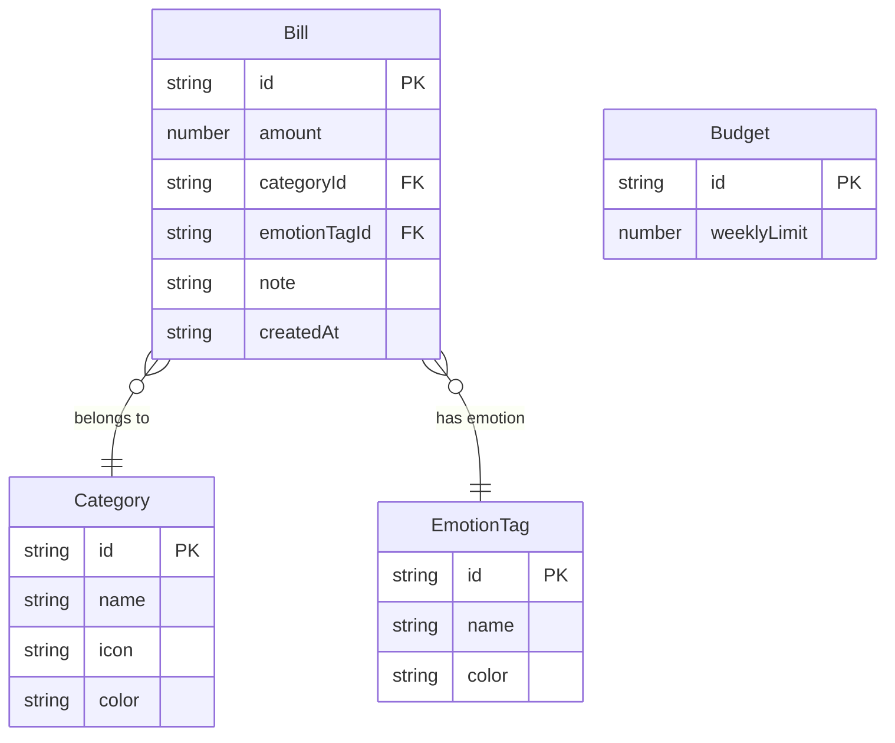

## 1. 架构设计



## 2. 技术说明
- 前端：React@18 + TypeScript + Vite + Zustand + Recharts
- 初始化工具：vite-init (react-express-ts 模板)
- 后端：Express@4 + cors + uuid
- 数据库：内存数据存储（JSON），无需外部数据库
- 样式方案：全局CSS + CSS变量（深色主题）

## 3. 路由定义
| 路由 | 用途 |
|------|------|
| / | 账单列表页，展示所有消费记录 |
| /dashboard | 仪表盘页，情感分析与预算可视化 |

## 4. API 定义

### 4.1 TypeScript 类型定义

```typescript
interface EmotionTag {
  id: string;
  name: string;
  color: string;
}

interface Category {
  id: string;
  name: string;
  icon: string;
  color: string;
}

interface Bill {
  id: string;
  amount: number;
  categoryId: string;
  emotionTagId: string;
  note: string;
  createdAt: string;
}

interface Budget {
  id: string;
  weeklyLimit: number;
}

interface EmotionStat {
  emotionTagId: string;
  emotionName: string;
  color: string;
  totalAmount: number;
  percentage: number;
  bills: Bill[];
}
```

### 4.2 请求/响应模式

| 方法 | 路径 | 请求体 | 响应 | 说明 |
|------|------|--------|------|------|
| GET | /api/emotions | - | EmotionTag[] | 获取情感标签列表 |
| GET | /api/categories | - | Category[] | 获取分类列表 |
| GET | /api/bills | - | Bill[] | 获取所有账单 |
| POST | /api/bills | Bill(无id) | Bill | 新增账单 |
| PUT | /api/bills/:id | Bill(无id) | Bill | 更新账单 |
| DELETE | /api/bills/:id | - | {success: boolean} | 删除账单 |
| GET | /api/budget | - | Budget | 获取预算设置 |
| PUT | /api/budget | {weeklyLimit: number} | Budget | 更新预算 |
| GET | /api/stats/emotion?range=day\|week\|month | - | EmotionStat[] | 情感消费统计 |
| GET | /api/stats/budget-usage | - | {used: number, limit: number, percentage: number, daysRemaining: number} | 预算使用情况 |

## 5. 服务器架构图



## 6. 数据模型

### 6.1 数据模型定义



### 6.2 初始数据

**情感标签**：开心(#FFD700)、焦虑(#FF6B6B)、满足(#6BCB77)、后悔(#A66CFF)、平静(#4FC3F7)

**消费分类**：餐饮(🍜, #FF7043)、交通(🚗, #42A5F5)、娱乐(🎮, #AB47BC)、购物(🛍, #FFA726)、居住(🏠, #66BB6A)、医疗(💊, #EF5350)、教育(📚, #5C6BC0)、其他(📌, #78909C)

**默认预算**：周预算 2000 元
