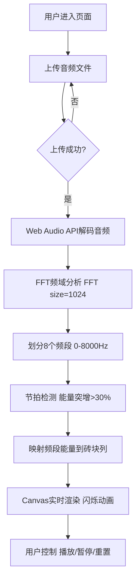

## 1. 产品概述
音律彩窗是一款将音乐节拍与彩色玻璃砖墙视觉效果相结合的沉浸式音频可视化应用。通过实时频域分析技术，将音乐的不同频段能量映射到8x8的彩色玻璃阵列上，形成随音乐动态变化的光影壁画。

- 核心目标：让用户通过视觉感受音乐的节奏与层次，创造沉浸式的视听体验
- 目标用户：音乐爱好者、视觉艺术爱好者、创意工作者
- 市场价值：提供独特的音乐可视化方式，可用于音乐欣赏、现场演出背景、氛围营造等场景

## 2. 核心功能

### 2.1 功能模块
1. **音频上传模块**：支持MP3/WAV格式上传，最长30秒，支持拖拽与点击上传
2. **实时音频分析模块**：基于Web Audio API的FFT频域分析与节拍检测
3. **玻璃砖墙渲染模块**：8x8彩色玻璃阵列的Canvas实时渲染与动画
4. **控制面板模块**：播放/暂停、音量调节、重置等控制按钮

### 2.2 页面详情
| 页面名称 | 模块名称 | 功能描述 |
|---------|---------|---------|
| 主页面 | 玻璃砖墙展示区 | 居中显示8x8彩色玻璃阵列，每块砖50x50px，2px黑色间隔，实时响应音频信号 |
| 主页面 | 音频上传区 | 虚线圆角方框，支持拖拽上传，拖拽时显示紫色发光描边动画 |
| 主页面 | 控制按钮栏 | 磨砂玻璃质感按钮，包含播放/暂停、音量控制、重置功能 |
| 主页面 | 背景氛围层 | 深蓝黑渐变背景，四周晕影光效，沉浸式暗色氛围 |

## 3. 核心流程
用户进入页面 → 上传音频文件（点击或拖拽） → 系统解码音频并开始分析 → 实时将频段能量映射到玻璃砖墙 → 砖块根据节拍闪烁发光 → 用户可通过控制按钮暂停/继续播放

## 4. 用户界面设计

### 4.1 设计风格
- **主色调**：深蓝黑渐变背景 `#0A0E1A` → `#1A1F2E`
- **砖块底色**：低饱和度柔和色 `#4A7C6F`（青绿）、`#8B6B4A`（棕金）、`#6A4A78`（紫灰）等
- **频段色系**：
  - 低音（暖红橙）：`#FF4500` → `#FF6347` 渐变
  - 中音（金黄粉）：`#FFD700` → `#FFB6C1` 渐变
  - 高音（蓝青色）：`#00CED1` → `#87CEFA` 渐变
- **按钮样式**：磨砂玻璃质感，背景 `rgba(255,255,255,0.1)`，边框 `1px rgba(255,255,255,0.2)`，圆角16px，悬停上抬2px
- **整体氛围**：沉浸式暗色主题，四周晕影光效（径向渐变，透明度0.15）

### 4.2 页面设计概述
| 页面名称 | 模块名称 | UI元素 |
|---------|---------|--------|
| 主页面 | 玻璃砖墙 | 居中8x8网格，每块50x50px，2px铅条间隔，中心扩散发光动画（0.02s扩散+0.25s渐回） |
| 主页面 | 音频上传区 | 虚线圆角方框，`#6C63FF`发光描边动画，拖拽高亮反馈 |
| 主页面 | 控制按钮 | 磨砂玻璃质感，悬停背景变亮+上抬，0.2s ease过渡 |
| 主页面 | 背景 | 深蓝黑径向渐变，四周晕影伪元素叠加 |

### 4.3 响应式
- Desktop优先设计，主内容居中固定宽度
- Canvas固定尺寸416x416px（8*50 + 9*2 = 418，实际8*50 + 7*2 = 414 + 2边距）
- 移动端适配：缩小砖墙比例，控制按钮垂直排列

### 4.4 动画规范
- **砖块发光**：中心扩散0.02s → 渐回底色0.25s，形成呼吸闪烁效果
- **按钮悬停**：0.2s ease过渡，背景 `rgba(255,255,255,0.1)` → `rgba(255,255,255,0.2)`，上移2px
- **拖拽上传**：`#6C63FF` 发光描边动画（脉冲效果）
