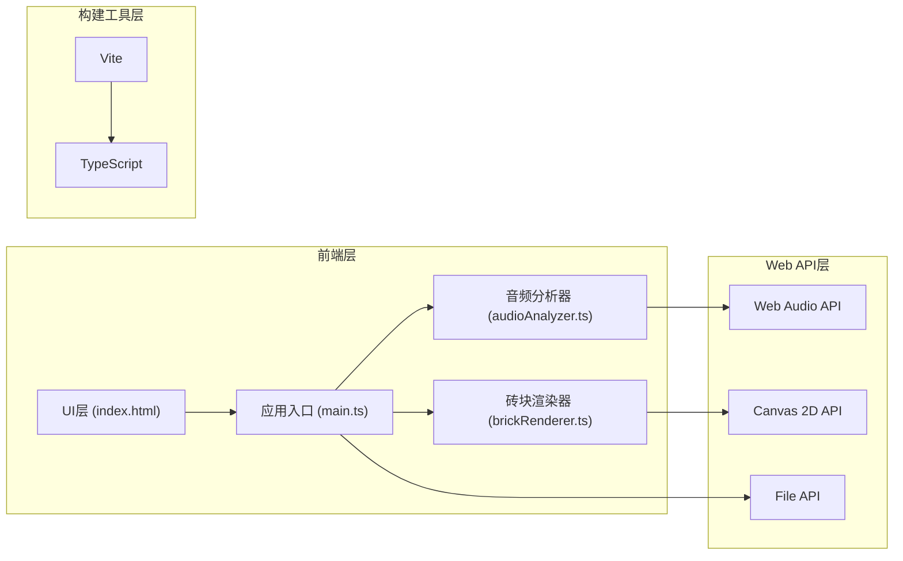

## 1. 架构设计



## 2. 技术描述
- **前端框架**：无框架，原生 TypeScript + HTML5 Canvas
- **构建工具**：Vite 5.x
- **语言**：TypeScript 5.x（严格模式，target ES2020）
- **音频处理**：Web Audio API（AnalyserNode, AudioContext, decodeAudioData）
- **渲染引擎**：原生 Canvas 2D Context
- **样式方案**：原生 CSS（无外部CSS库）

## 3. 项目文件结构
```
.
├── package.json          # 项目依赖与脚本配置
├── vite.config.js        # Vite构建配置
├── tsconfig.json         # TypeScript编译配置
├── index.html            # 应用入口页面
└── src/
    ├── main.ts           # 应用入口，协调数据流
    ├── audioAnalyzer.ts  # 音频加载、解码、频域分析、节拍检测
    └── brickRenderer.ts  # 玻璃砖墙渲染与动画管理
```

## 4. 核心模块定义

### 4.1 AudioAnalyzer 类
职责：音频文件加载、解码、实时FFT频域分析、频段能量计算、节拍检测

```typescript
interface BandEnergy {
  band: number;        // 频段索引 0-7
  energy: number;      // 当前能量值 0-1
  isBeat: boolean;     // 是否触发节拍
}

class AudioAnalyzer {
  constructor(fftSize?: number);
  loadFile(file: File): Promise<void>;
  start(): void;
  stop(): void;
  getBandEnergies(): BandEnergy[];  // 返回8个频段的能量数据
  getAudioDuration(): number;
  getCurrentTime(): number;
  setVolume(volume: number): void;
  dispose(): void;
}
```

### 4.2 BrickRenderer 类
职责：Canvas渲染管理、砖块状态管理、颜色过渡动画

```typescript
interface BrickState {
  baseColor: string;      // 砖块底色
  currentColor: string;   // 当前显示颜色
  glowIntensity: number;  // 发光强度 0-1
  glowStartTime: number;  // 发光开始时间
  bandIndex: number;      // 关联频段索引
}

class BrickRenderer {
  constructor(canvas: HTMLCanvasElement);
  update(bandEnergies: BandEnergy[]): void;  // 每帧更新砖块状态
  render(): void;                             // 渲染当前帧
  reset(): void;                              // 重置所有砖块状态
}
```

### 4.3 频段划分（0-8000Hz → 8频段）
| 频段索引 | 频率范围 | 色系 | 砖块列 |
|---------|---------|------|-------|
| 0 | 0-1000Hz | 低音-暖红橙 | 第0-2列 |
| 1 | 1000-2000Hz | 低音-暖红橙 | 第0-2列 |
| 2 | 2000-3000Hz | 中音-金黄粉 | 第2-5列 |
| 3 | 3000-4000Hz | 中音-金黄粉 | 第2-5列 |
| 4 | 4000-5000Hz | 中音-金黄粉 | 第2-5列 |
| 5 | 5000-6000Hz | 高音-蓝青色 | 第5-7列 |
| 6 | 6000-7000Hz | 高音-蓝青色 | 第5-7列 |
| 7 | 7000-8000Hz | 高音-蓝青色 | 第5-7列 |

## 5. 性能优化策略
- **渲染帧率**：使用 `requestAnimationFrame` 同步屏幕刷新率（60FPS）
- **FFT计算**：AnalyserNode FFT size = 1024，smoothingTimeConstant = 0.8
- **节拍检测**：基于滑动窗口能量均值对比，突增 >30% 判定为节拍
- **颜色插值**：预计算渐变色表，避免每帧重复计算
- **Canvas优化**：使用离屏Canvas缓存砖块底图，仅更新发光区域
- **内存管理**：音频播放结束后及时释放 AudioContext 资源

## 6. 颜色系统

### 6.1 砖块底色池（低饱和度）
```typescript
const BASE_COLORS = [
  '#4A7C6F', // 青绿
  '#8B6B4A', // 棕金
  '#6A4A78', // 紫灰
  '#5A6B7A', // 灰蓝
  '#7A6B5A', // 暖棕
  '#4A6A7C', // 蓝绿
  '#6B5A7A', // 紫棕
  '#5A7A6B', // 橄榄绿
];
```

### 6.2 频段渐变色系
```typescript
const BAND_GRADIENTS = {
  low:    ['#FF4500', '#FF6347'],   // 低音：红橙
  mid:    ['#FFD700', '#FFB6C1'],   // 中音：金黄粉
  high:   ['#00CED1', '#87CEFA'],   // 高音：蓝青
};
```

## 7. 动画时序
- **发光扩散阶段**：0ms → 20ms，发光半径从0扩散到整块砖
- **渐回阶段**：20ms → 270ms，发光强度从1.0线性衰减到0
- **总动画时长**：270ms
- **缓动函数**：扩散阶段使用 easeOutQuad，渐回阶段使用 easeInQuad
