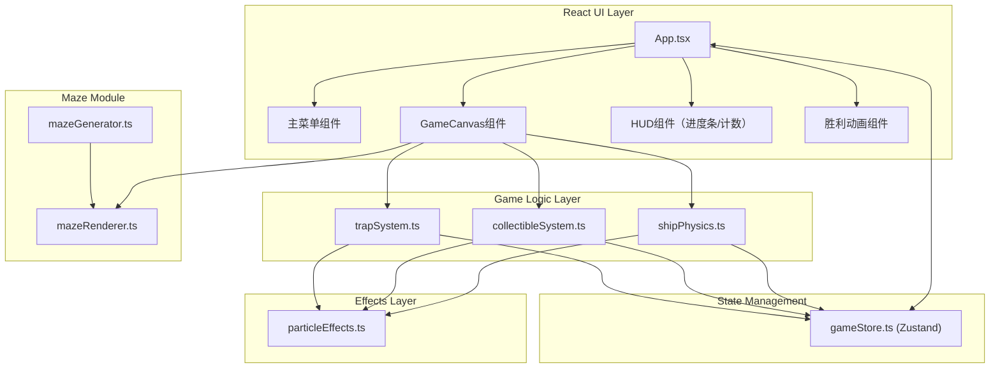

## 1. 架构设计



## 2. 技术描述

- **前端框架**：React@18 + TypeScript@5
- **构建工具**：Vite@5 + @vitejs/plugin-react
- **状态管理**：Zustand@4
- **渲染引擎**：原生Canvas 2D API（自行实现粒子系统和物理引擎）
- **无第三方游戏引擎/物理库**：全部自行实现

## 3. 核心模块设计

### 3.1 迷宫生成模块 (mazeGenerator.ts)

```typescript
// 递归分割算法生成10x10网格迷宫
export interface Wall {
  x: number;           // 原始x坐标
  y: number;           // 原始y坐标
  width: number;       // 墙壁宽度
  height: number;      // 墙壁高度
  isHorizontal: boolean;
  phase: number;       // 波动相位偏移
}

export interface MazeData {
  walls: Wall[];
  gridSize: number;    // 10
  cellSize: number;    // 60px
  width: number;       // 总宽
  height: number;      // 总高
  startCell: { x: number; y: number };
  endCell: { x: number; y: number };
}

export function generateMaze(): MazeData;

// 根据时间获取动态墙壁坐标
export function getDynamicWallPosition(
  wall: Wall,
  time: number,
  speedMultiplier: number
): { x: number; y: number };
```

### 3.2 迷宫渲染模块 (mazeRenderer.ts)

```typescript
export interface RenderContext {
  ctx: CanvasRenderingContext2D;
  maze: MazeData;
  time: number;
  collectionProgress: number; // 0-1
  victoryTint: number;        // 0-1 胜利时金色渐变强度
}

export function renderMaze(rc: RenderContext): void;
export function renderGridLines(rc: RenderContext): void;
export function renderWalls(rc: RenderContext): void;
export function renderWallPulse(rc: RenderContext): void;
```

### 3.3 飞船物理模块 (shipPhysics.ts)

```typescript
export interface Ship {
  x: number;
  y: number;
  vx: number;
  vy: number;
  size: number;        // 24px
  speed: number;       // 基础速度
  isSlowed: boolean;
  slowTimer: number;
  boosted: boolean;
}

export interface TrailParticle {
  x: number;
  y: number;
  size: number;
  life: number;
  maxLife: number;
  color: string;
}

export class ShipPhysics {
  ship: Ship;
  maze: MazeData;
  trailParticles: TrailParticle[];

  constructor(maze: MazeData, startX: number, startY: number);

  update(
    keys: Set<string>,
    dt: number,
    walls: Wall[]
  ): { ship: Ship; newParticles: TrailParticle[] };

  checkCollision(x: number, y: number, walls: Wall[], time: number): boolean;
}
```

### 3.4 音符收集系统 (collectibleSystem.ts)

```typescript
export interface Collectible {
  id: number;
  x: number;
  y: number;
  collected: boolean;
  rotation: number;
  haloRotation: number;
}

export interface AutoTrackTarget {
  id: number;
  x: number;
  y: number;
}

export class CollectibleSystem {
  collectibles: Collectible[];
  totalCount: number;     // 20
  collectedCount: number;
  boostMode: boolean;
  boostTimer: number;
  trackTarget: AutoTrackTarget | null;

  constructor(maze: MazeData);

  update(
    shipX: number,
    shipY: number,
    dt: number
  ): {
    collected: boolean;
    collectPos: { x: number; y: number } | null;
    trackTarget: AutoTrackTarget | null;
    boostActivated: boolean;
    boostEnded: boolean;
  };

  private isInOpenCell(maze: MazeData, gx: number, gy: number): boolean;
}
```

### 3.5 陷阱系统 (trapSystem.ts)

```typescript
export interface Trap {
  id: number;
  baseX: number;
  baseY: number;
  x: number;
  y: number;
  innerRadius: number;    // 24
  outerRadius: number;    // 60
  phase: number;          // 正弦相位
  pulsePhase: number;     // 脉动相位
  direction: 1 | -1;
}

export class TrapSystem {
  traps: Trap[];
  spawnTimer: number;
  maze: MazeData;
  extraTrapPairs: number; // 每5个碎片加2个

  constructor(maze: MazeData);

  update(
    shipX: number,
    shipY: number,
    shipRadius: number,
    collectedCount: number,
    dt: number
  ): {
    hit: boolean;
    hitPos: { x: number; y: number } | null;
  };

  private spawnBatch(count: number): void;
  private findOpenCorridor(): { x: number; y: number };
}
```

### 3.6 粒子特效模块 (particleEffects.ts)

```typescript
export interface Particle {
  x: number;
  y: number;
  vx: number;
  vy: number;
  size: number;
  life: number;
  maxLife: number;
  color: string;
  type: 'trail' | 'collect' | 'explosion' | 'ring';
  ringRadius?: number;
  ringMaxRadius?: number;
}

export class ParticleSystem {
  particles: Particle[];
  maxParticles: number;

  constructor(maxParticles?: number);

  update(dt: number): void;
  render(ctx: CanvasRenderingContext2D): void;

  spawnTrail(x: number, y: number): void;
  spawnCollectWave(x: number, y: number): void; // 3个扩散圆环
  spawnVictoryExplosion(x: number, y: number): void; // 100个金色粒子
  spawnTrapHit(x: number, y: number): void;
}
```

### 3.7 Zustand状态库 (gameStore.ts)

```typescript
export type GamePhase = 'menu' | 'playing' | 'victory';

export interface GameState {
  phase: GamePhase;
  collected: number;
  total: number;
  boostActive: boolean;
  boostTimeLeft: number;
  trapCount: number;
  isSlowed: boolean;
  slowTimeLeft: number;
  screenFlash: number;      // 0-1 血色晕染强度
  victoryProgress: number;  // 0-1 胜利动画进度
  startGame: () => void;
  endGame: () => void;
  incrementCollected: () => void;
  setBoostActive: (v: boolean) => void;
  setBoostTimeLeft: (t: number) => void;
  setSlowed: (v: boolean, t: number) => void;
  setScreenFlash: (v: number) => void;
  setVictoryProgress: (v: number) => void;
  resetGame: () => void;
}
```

## 4. 性能优化策略

### 4.1 渲染优化
- Canvas分层：背景层（迷宫+网格）、实体层（飞船/音符/陷阱）、粒子层
- 离屏Canvas缓存静态迷宫背景，每帧只绘制动态偏移
- requestAnimationFrame + 固定时间步长（dt）物理更新

### 4.2 内存优化
- 粒子对象池：ParticleSystem内部维护对象池，避免频繁创建/销毁
- 数组预分配：collectibles、traps初始化一次性分配
- TypedArray用于粒子位置/速度计算（可选）

### 4.3 碰撞优化
- 空间网格索引：将迷宫墙壁按格子索引，碰撞检测只检查相邻格子墙壁
- AABB预检测 → 精确检测的两阶段碰撞
- 音符/陷阱圆形碰撞用距离平方比较（避免开根号）

## 5. 响应式与触摸控制

```typescript
// 画布缩放计算
function calculateCanvasSize(): { width: number; height: number; scale: number } {
  const vw = window.innerWidth;
  const vh = window.innerHeight;
  const aspect = 16 / 9;
  let w = vw, h = vw / aspect;
  if (h > vh) { h = vh; w = vh * aspect; }
  const scale = w / 960; // 基准宽度960px
  return { width: w, height: h, scale };
}

// 触摸滑动控制
interface TouchState {
  startX: number;
  startY: number;
  active: boolean;
}
function handleTouch(e: TouchEvent): { dx: number; dy: number };
```

## 6. 构建与开发

```json
{
  "scripts": {
    "dev": "vite",
    "build": "tsc && vite build",
    "preview": "vite preview",
    "check": "tsc --noEmit"
  },
  "dependencies": {
    "react": "^18.3.1",
    "react-dom": "^18.3.1",
    "zustand": "^4.5.2"
  },
  "devDependencies": {
    "@types/react": "^18.3.3",
    "@types/react-dom": "^18.3.0",
    "@vitejs/plugin-react": "^4.3.1",
    "typescript": "^5.4.5",
    "vite": "^5.3.1"
  }
}
```

## 7. 项目文件结构

```
auto22/
├── .trae/documents/
│   ├── PRD.md
│   └── ARCHITECTURE.md
├── index.html
├── package.json
├── vite.config.ts
├── tsconfig.json
└── src/
    ├── App.tsx
    ├── store/
    │   └── gameStore.ts
    ├── maze/
    │   ├── mazeGenerator.ts
    │   └── mazeRenderer.ts
    ├── game/
    │   ├── shipPhysics.ts
    │   ├── collectibleSystem.ts
    │   ├── trapSystem.ts
    │   └── particleEffects.ts
    └── components/
        ├── MainMenu.tsx
        ├── GameCanvas.tsx
        ├── HUD.tsx
        └── VictoryScreen.tsx
```
