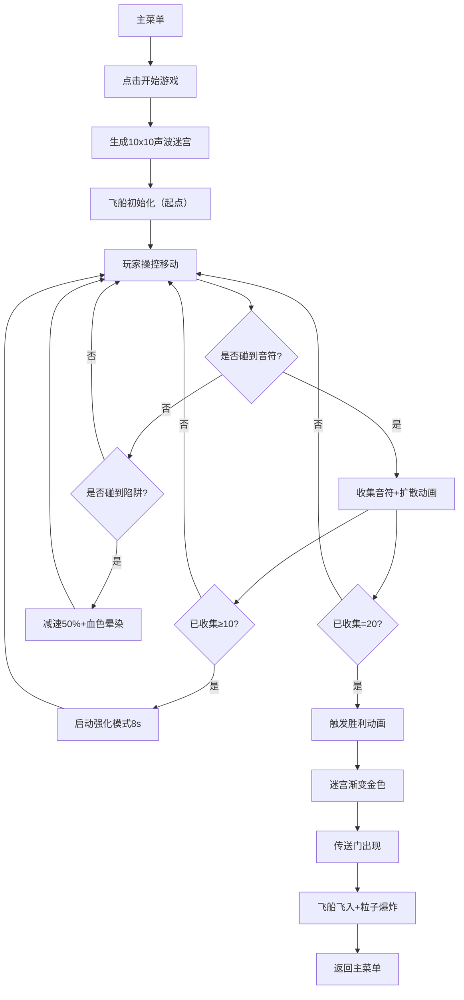

## 1. 产品概述

声波迷宫音符收集游戏是一款基于Canvas 2D的动态迷宫游戏，玩家操控发光飞船在声波驱动的动态迷宫中收集音符碎片，躲避声波陷阱，体验沉浸式的音乐迷宫冒险。

- **主要目的**：解决传统迷宫游戏路径固定、缺乏实时反馈和沉浸感的问题，通过动态声波墙壁、丰富粒子特效和即时音效反馈创造独特游戏体验
- **目标用户**：休闲游戏爱好者、音乐题材游戏玩家
- **产品价值**：创新的动态迷宫机制、流畅的视觉反馈、高沉浸感的游戏流程

## 2. 核心功能

### 2.1 功能模块

1. **主菜单页面**：动态粒子星云背景、开始游戏按钮、控制提示
2. **游戏主画布**：Canvas全屏渲染，包含迷宫、飞船、音符、陷阱、粒子系统
3. **进度显示系统**：顶部进度条、左下角音符计数器
4. **胜利结算页面**：胜利动画、传送门效果、粒子爆炸

### 2.2 页面详情

| 页面名称 | 模块名称 | 功能描述 |
|-----------|-------------|---------------------|
| 主菜单 | 粒子星云背景 | 150个随机飘动粒子，3-8px大小，紫色渐变色调 |
| 主菜单 | 开始按钮 | 悬停放大1.1倍+发光效果，点击进入游戏 |
| 主菜单 | 控制提示 | 半透明底部栏，显示WASD/方向键操作说明 |
| 游戏画布 | 迷宫渲染 | 10x10递归分割迷宫，墙壁声波波动（±8px，5s周期） |
| 游戏画布 | 飞船系统 | 白色菱形飞船，金色粒子尾迹，速度控制，碰撞检测 |
| 游戏画布 | 音符收集 | 20个金色八分音符，旋转光环，收集扩散音波动画 |
| 游戏画布 | 强化模式 | 收集10个后启动，持续8秒，速度+40%，自动追踪150px内音符 |
| 游戏画布 | 陷阱系统 | 每20s生成，正弦漂浮，红色脉动圆环，碰撞减速50%+血色晕染 |
| 游戏画布 | 粒子系统 | 尾迹、收集音波、陷阱碰撞、胜利爆炸统一管理 |
| 进度UI | 进度条 | 400x12px，金色渐变填充，平滑过渡动画 |
| 进度UI | 音符计数 | 白色24px文字，金色外发光效果 |
| 胜利动画 | 迷宫渐变 | 整体渐变为金色，持续2s |
| 胜利动画 | 传送门 | 中央120px直径旋转发光传送门 |
| 胜利动画 | 粒子爆炸 | 100个金色粒子扩散，1.2s时长 |

## 3. 核心流程

玩家从主菜单开始游戏 → 进入游戏画布后飞船出现在迷宫起点 → 使用WASD或方向键控制飞船移动 → 收集音符碎片（进度条更新） → 收集满10个进入强化模式（速度提升+自动追踪） → 躲避声波陷阱（碰撞减速+血色效果） → 收集全部20个碎片触发胜利动画 → 迷宫变金色+传送门出现 → 飞船飞入传送门+粒子爆炸 → 返回主菜单或重新开始

## 4. 用户界面设计

### 4.1 设计风格

- **主色调**：深紫色#1A0B2E → 蓝紫色#2A1B4E渐变背景
- **高亮色**：金色#FFD700、白色#FFFFFF、粉紫#7A5BAE
- **警示色**：红色#FF3366 → #FF6699渐变
- **字体**：无衬线现代字体，白色文字配金色外发光
- **布局**：游戏画布全屏居中，顶部进度条，底部控制提示
- **动效风格**：平滑过渡（ease-out）、脉冲光晕、正弦波动、粒子扩散

### 4.2 页面设计概述

| 页面名称 | 模块名称 | UI元素 |
|-----------|-------------|-------------|
| 主菜单 | 粒子星云 | 150粒子，3-8px，#4A3B6E→#7A5BAE，0.5px/帧移动，透明度0.3-0.6 |
| 主菜单 | 开始按钮 | 紫色半透明背景，白色文字，悬停1.1倍放大+金色光晕 |
| 主菜单 | 控制提示 | 底部居中，rgba(26,11,46,0.8)背景，圆角12px，高40px，白色14px文字 |
| 游戏画布 | 迷宫背景 | 线性渐变#1A0B2E→#2A1B4E，半透明白色网格线（0.15透明度） |
| 游戏画布 | 墙壁 | #4A3B6E半透明紫色，圆角4px，#7A5BAE脉冲光晕（1.5s周期） |
| 游戏画布 | 飞船 | 白色菱形（24px边长）+金色尾迹（#FFD700→#FF8C00渐变，3-8px粒子，0.6s时长） |
| 游戏画布 | 音符 | 金色八分音符（16px直径）+旋转光环（2s周期，#FFD700→#FFA500） |
| 游戏画布 | 陷阱 | 红色圆环（内24px/外60px），#FF3366→#FF6699，脉动0.8s |
| 进度UI | 进度条 | 400x12px，圆角6px，背景#2A1B4E，填充#FFD700→#FF8C00渐变，过渡0.3s |
| 进度UI | 计数文字 | 白色24px，金色#FFD700外发光8px半径 |
| 胜利动画 | 传送门 | 120px直径，#FFD700→#FFFFFF渐变，2s旋转周期 |

### 4.3 响应式设计

- **桌面优先**：默认16:9比例，画布占满视口
- **断点<768px**：画布自动缩放适应屏幕，保持16:9比例
- **触屏适配**：<768px时启用滑动手势控制方向（替代WASD）
- **触摸优化**：按钮最小触摸目标44x44px

## 5. 性能要求

- **帧率目标**：稳定≥30fps，理想60fps
- **更新频率**：迷宫动画、粒子特效更新≥30fps
- **内存管理**：粒子对象池复用，避免频繁GC
- **渲染优化**：脏矩形检测（可选），分层Canvas（前景粒子层+背景迷宫层）
