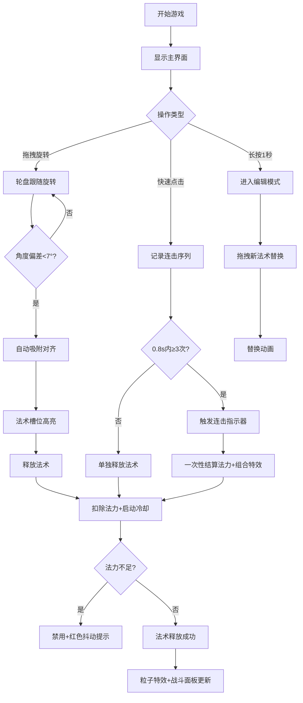

## 1. 产品概述

法术咏唱轮盘是一款地下城法术管理游戏应用，为玩家提供直观的轮盘式法术交互界面，解决传统纯文本列表在战斗中反应迟缓的问题。目标用户为地牢探索类RPG游戏玩家，核心价值在于通过拖拽旋转轮盘实现快速法术选择与释放，配合连击系统和粒子特效带来沉浸式施法体验。

## 2. 核心功能

### 2.1 功能模块

1. **主游戏界面**: 玩家状态面板 + 法术轮盘 + 战斗特效区域
2. **法术轮盘交互系统**: 8扇形槽位拖拽旋转、选中高亮、法术释放动画
3. **法术冷却与法力管理**: 独立冷却计时、法力消耗、禁用状态反馈
4. **连续施法序列系统**: 连击判定、连击指示器、组合特效
5. **槽位编辑系统**: 自动吸附对齐、长按编辑、法术替换动画

### 2.2 页面详情

| 页面名称 | 模块名称 | 功能描述 |
|---------|---------|---------|
| 主游戏界面 | 玩家状态面板 | 显示生命值条（红色渐变）、法力值条（蓝色渐变），磨砂玻璃效果，血量/法力变化时数字动画 |
| 主游戏界面 | 法术轮盘 | 8等分扇形法术槽位，拖拽旋转，选中高亮扩散动画，释放时法术图标飞出并伴随粒子轨迹 |
| 主游戏界面 | 冷却遮罩 | 圆形进度遮罩从上方顺时针闭合，颜色#FF6B6B到#4FC3F7渐变，与冷却时长同步 |
| 主游戏界面 | 连击指示器 | 中心显示X3/X4数字，从中心向外放大spring动画，组合特效触发 |
| 主游戏界面 | 战斗特效面板 | 火球爆炸粒子、闪电链等组合特效，粒子池管理 |
| 主游戏界面 | 槽位编辑 | 长按1秒进入编辑，拖拽替换，缩小消失与放大出现动画 |

## 3. 核心流程

用户通过鼠标拖拽旋转法术轮盘选择法术，轮盘自动吸附对齐到最近槽位。选中法术后释放，触发飞出动画和粒子特效，同时扣除法力值并启动冷却计时。0.8秒内连续选中3个以上法术触发连击序列，一次性结算法力消耗并触发组合特效。长按槽位可进入编辑模式替换法术。

## 4. 用户界面设计

### 4.1 设计风格

- **主色调**: 深色奇幻风格，全屏背景#0E1624，纹理径向渐变#1A1A2E到#16213E
- **强调色**: 金色圆环#FFD700、火系#FF4500、冰系#00BFFF、雷系#FFD700、暗系#8B008B
- **按钮/交互风格**: 扇形槽位点击+拖拽，释放时射线飞出
- **字体**: 奇幻风格标题字体，清晰易读的UI字体
- **布局**: 左侧状态面板 + 右侧中央轮盘，深色沉浸式
- **特效风格**: 粒子系统、光芒扫射、磨砂玻璃

### 4.2 页面设计概览

| 页面名称 | 模块名称 | UI元素 |
|---------|---------|--------|
| 主游戏界面 | 背景 | #0E1624底色，径向渐变#1A1A2E→#16213E，角落星光粒子闪烁 |
| 主游戏界面 | 状态面板 | 磨砂玻璃(#2A1A3A 20%透明 12px模糊)，16px圆角，生命值条(200x20px红色渐变)，法力值条(200x20px蓝色渐变) |
| 主游戏界面 | 法术轮盘 | 直径400px，半透明#FFFFFF10背景，金色圆环3px，旋转扫光0.5s infinite linear |
| 主游戏界面 | 扇形槽位 | 45°等分，按属性渐变(火/冰/雷/暗)，64x64px SVG图标，选中时缩小50px+粒子环绕 |
| 主游戏界面 | 冷却遮罩 | 圆形进度从上方顺时针闭合，#FF6B6B→#4FC3F7渐变 |
| 主游戏界面 | 连击指示器 | 中心X3/X4数字，spring放大动画0.3s |
| 主游戏界面 | 战斗特效 | 火球爆炸20粒子(2-6px, #FF4500→#FFD700, 50-100px/s, 1.5s消失) |

### 4.3 响应式设计

- **桌面端**(≥768px): 左侧状态面板 + 右侧中央轮盘(400px直径)
- **移动端**(<768px): 轮盘缩小至70%，状态面板改为底部横条布局，收缩为圆形图标
- 触摸优化: 拖拽旋转支持触摸手势，槽位点击区域适当放大

### 4.4 性能约束

- 轮盘旋转和法术释放动画保持60FPS（requestAnimationFrame驱动）
- 一次性粒子特效不超过150个，粒子生命周期后回收到对象池复用
- 法力值计算60次/秒更新，延迟不超过50ms
