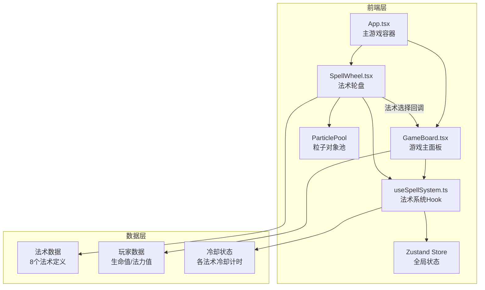

## 1. 架构设计



## 2. 技术说明

- **前端**: React@18 + TypeScript + Zustand + Vite
- **初始化工具**: vite-init (react-ts模板)
- **后端**: 无（纯前端应用）
- **数据库**: 无（状态由Zustand管理，法术数据硬编码）
- **动画**: requestAnimationFrame + CSS transitions
- **粒子系统**: 自定义粒子对象池，最大150个粒子复用

## 3. 路由定义

| 路由 | 用途 |
|------|------|
| / | 主游戏界面，包含法术轮盘和玩家状态 |

## 4. 数据模型

### 4.1 法术数据模型

```typescript
interface Spell {
  id: string
  name: string
  element: 'fire' | 'ice' | 'lightning' | 'dark'
  iconPath: string
  manaCost: number
  cooldownMs: number
  damage: number
  description: string
  gradientColors: [string, string]
}

interface PlayerState {
  hp: number
  maxHp: number
  mp: number
  maxMp: number
}

interface CooldownState {
  spellId: string
  remainingMs: number
  totalMs: number
}

interface ComboState {
  spells: string[]
  lastCastTime: number
  isActive: boolean
}
```

### 4.2 Zustand Store 定义

```typescript
interface GameStore {
  player: PlayerState
  spellSlots: (Spell | null)[]
  cooldowns: Map<string, CooldownState>
  combo: ComboState
  castSpell: (spellId: string) => void
  swapSpell: (slotIndex: number, newSpell: Spell) => void
  updateCooldowns: (deltaMs: number) => void
  regenerateMana: (deltaMs: number) => void
}
```

## 5. 文件结构与调用关系

```
project/
├── index.html                    # 入口页面
├── package.json                  # 依赖配置
├── vite.config.ts                # Vite+React插件配置
├── tsconfig.json                 # TypeScript严格模式 ES2020
├── src/
│   ├── App.tsx                   # 主容器 → 调用GameBoard, SpellWheel
│   ├── main.tsx                  # React渲染入口
│   ├── components/
│   │   ├── GameBoard.tsx         # 接收SpellWheel法术选择事件，更新战斗面板
│   │   └── SpellWheel.tsx        # 核心轮盘，回调通知GameBoard法术选择
│   ├── hooks/
│   │   └── useSpellSystem.ts     # 法术冷却/法力/效果逻辑，返回法术列表+冷却状态+释放接口
│   ├── store/
│   │   └── gameStore.ts          # Zustand全局状态
│   ├── utils/
│   │   └── particlePool.ts       # 粒子对象池管理
│   └── types/
│       └── index.ts              # TypeScript类型定义
```

**数据流向**:
1. `useSpellSystem` Hook 从 Zustand Store 读取法术和玩家状态
2. `SpellWheel` 通过 Hook 获取法术列表和冷却状态，用户交互触发释放
3. `SpellWheel` 释放法术时通过回调通知 `GameBoard`
4. `GameBoard` 接收选择事件，更新战斗面板和玩家状态
5. 粒子系统由 `SpellWheel` 和 `GameBoard` 共享，通过 `particlePool` 管理回收

## 6. 关键技术实现

### 6.1 轮盘旋转

- 使用 `requestAnimationFrame` 驱动轮盘旋转
- 鼠标拖拽时计算角度偏移量，0.05s线性跟随
- 角度偏差 < 7° 时触发吸附，0.15s ease-out动画对齐
- Canvas 绘制轮盘，每帧重绘

### 6.2 粒子系统

- 对象池预分配150个粒子对象
- 粒子属性: position, velocity, size, color, lifetime
- 超过生命周期的粒子回收到池中等待复用
- 法术释放时从中心发射，目标位置爆开

### 6.3 冷却系统

- 每个法术独立冷却计时器
- 圆形进度遮罩使用 Canvas arc 绘制
- 冷却进度通过 requestAnimationFrame 每帧更新
- 颜色从 #FF6B6B 到 #4FC3F7 按进度线性插值

### 6.4 连击系统

- 0.8秒时间窗口内记录法术选择
- 连续3次以上触发连击指示器
- 一次性结算法力消耗，避免重复扣除
- 连击长度决定组合特效类型
