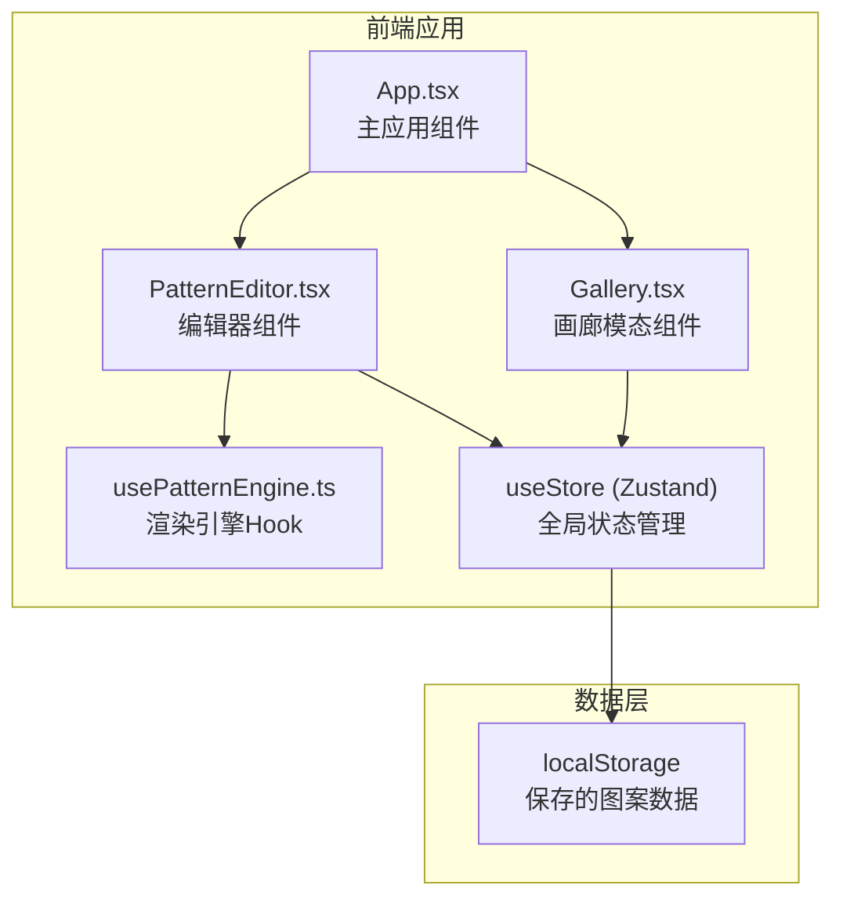

## 1. 架构设计



## 2. 技术说明

- **前端框架**：React@18 + TypeScript
- **构建工具**：Vite
- **状态管理**：Zustand（轻量级状态管理，保存参数和画廊数据）
- **样式方案**：CSS-in-JS（内联样式 + CSS变量，无需额外CSS框架）
- **Canvas渲染**：原生Canvas 2D API + requestAnimationFrame
- **数据持久化**：localStorage（最多20条保存记录）

## 3. 路由定义

| 路由 | 用途 |
|------|------|
| / | 主编辑器页面，包含参数面板和Canvas预览 |

本应用为单页面应用，画廊通过模态窗口实现，无需路由切换。

## 4. 状态管理设计

### 4.1 Zustand Store 结构

```typescript
interface PatternParams {
  shape: 'circle' | 'spiral' | 'ripple';
  colorTheme: 'warmSun' | 'aurora' | 'darkNight';
  dynamicType: 'breathe' | 'flow' | 'blink';
  speed: number;
}

interface SavedPattern {
  id: string;
  params: PatternParams;
  thumbnail: string;
  createdAt: number;
}

interface PatternStore {
  params: PatternParams;
  savedPatterns: SavedPattern[];
  isGalleryOpen: boolean;
  setParams: (params: Partial<PatternParams>) => void;
  savePattern: (thumbnail: string) => void;
  loadPattern: (id: string) => void;
  deletePattern: (id: string) => void;
  setGalleryOpen: (open: boolean) => void;
}
```

### 4.2 预设定义

| 预设名称 | 形状 | 颜色主题 | 动态类型 | 速度 |
|---------|------|---------|---------|------|
| 星轨 | 螺旋 | 暗夜 | 流动 | 0.8 |
| 水波 | 波纹 | 极光 | 呼吸 | 0.4 |
| 极光 | 螺旋 | 极光 | 流动 | 0.6 |
| 万花筒 | 圆形 | 暖阳 | 闪烁 | 1.0 |
| 脉冲 | 波纹 | 暗夜 | 闪烁 | 1.2 |

## 5. Canvas渲染引擎设计

### 5.1 渲染循环

- 使用 `requestAnimationFrame` 驱动渲染循环
- 每帧根据参数计算100-500个几何元素的位置、颜色、透明度
- 元素位置使用正弦/余弦/螺旋数学函数，随时间变化
- 颜色使用HSL渐变，色相以20秒为周期循环360度
- 透明度0.3-0.9随机分布
- 使用 `shadowBlur` 实现1px柔和光晕效果

### 5.2 动态类型计算

- **呼吸**：元素大小和透明度按正弦函数周期性缩放
- **流动**：元素位置沿数学函数路径持续移动
- **闪烁**：元素透明度随机跳变，产生闪烁效果

### 5.3 鼠标交互

- 追踪鼠标在Canvas上的位置
- 在鼠标位置附近生成拖影元素（长度50-100px，透明度0.1-0.3渐变）
- 拖影元素随时间衰减消失

## 6. 文件结构

```
├── package.json
├── vite.config.js
├── tsconfig.json
├── index.html
├── src/
│   ├── App.tsx          # 主应用组件
│   ├── PatternEditor.tsx # 编辑器组件
│   ├── Gallery.tsx       # 画廊模态组件
│   └── usePatternEngine.ts # Canvas渲染引擎Hook
```
