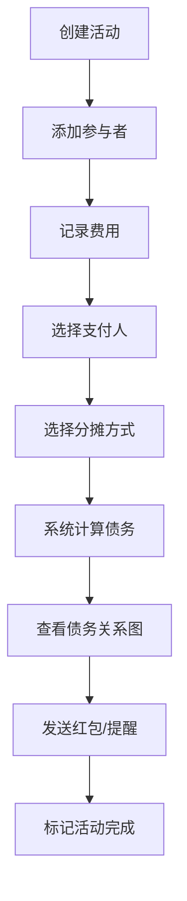

## 1. 产品概述

"账房先生"是一款多人聚餐费用分摊与债务追踪应用，解决传统AA制计算器无法处理多轮消费、非均摊比例、跨场景债务合并及人情红包互动等痛点。

- 主要用途：帮助用户在聚餐、旅行、合租等场景下公平分摊费用，自动追踪借贷关系
- 目标用户：经常参与多人聚餐、团队活动的年轻人群体
- 产品价值：提供比普通AA计算器更丰富的分摊方式、人情互动和可视化债务关系，让聚餐结算更公平、更有人情味

## 2. 核心功能

### 2.1 用户角色

| 角色 | 注册方式 | 核心权限 |
|------|----------|----------|
| 普通用户 | 直接使用 | 创建活动、记录费用、发送红包、查看债务关系 |

### 2.2 功能模块

1. **活动管理**：创建活动、编辑参与者、活动状态管理（进行中/已完成）
2. **费用记录**：按轮次记录消费、多种分摊方式（均摊/自定义比例/全包）、费用卡片展示
3. **债务结算**：债务关系有向图、节点拖拽、债务线着色区分、站内提醒
4. **人情红包**：红包发送、弹簧动画弹窗、金币粒子特效、祝福语

### 2.3 页面详情

| 页面名称 | 模块名称 | 功能描述 |
|----------|----------|----------|
| 首页 | 活动列表 | 标签页切换（进行中/已完成）、下拉刷新、活动卡片展示、创建活动按钮 |
| 活动详情页 | 参与者管理 | 参与者头像展示、点击确认到场、金色光环动画 |
| 活动详情页 | 费用记录区 | 费用卡片列表、添加费用按钮、分摊详情展示 |
| 活动详情页 | 债务关系图 | Canvas绘制有向图、节点拖拽、双击发送提醒、债务线着色 |
| 活动详情页 | 浮动统计栏 | 显示总债务、已还清比例、渐变比例条 |
| 红包弹窗 | 红包交互 | 弹簧动画弹出、系绳摆动、金币粒子撒落、祝福语 |

## 3. 核心流程

用户创建活动 → 添加参与者 → 记录多轮费用（选择支付人、分摊方式）→ 系统自动计算债务 → 查看债务关系图 → 发送红包/提醒 → 标记活动完成

## 4. 用户界面设计

### 4.1 设计风格

- **主色调**：#F7F1E3（米白）、#D4A574（暖棕）、#4A3B32（深褐）
- **整体风格**：暖调日式杂货铺风格，手绘质感，温馨治愈
- **按钮样式**：圆角24px胶囊按钮，#D4A574到#C19A6B渐变，白色文字，点击缩放0.95倍
- **字体**：使用"Noto Sans SC"作为中文主字体，搭配手写风格标题字体
- **背景**：手绘风格野餐垫纹理，CSS重复拼接，透明混合模式

### 4.2 页面设计概述

| 页面名称 | 模块名称 | UI元素 |
|----------|----------|--------|
| 首页 | 活动列表 | 野餐垫背景、标签页切换、活动卡片（圆角16px，左侧色带标识状态）、hover上浮4px阴影过渡 |
| 活动详情页 | 参与者头像 | 圆形40px直径，随机背景色互不冲突，点击标记到场，0.3s旋转金色光环 |
| 活动详情页 | 费用卡片 | 圆角12px，半透明白色磨砂质感，12px模糊，支付人头像放大1.2倍带淡金色光晕 |
| 活动详情页 | 债务关系图 | Canvas绘制，节点可拖拽，债务线#FF6B6B（纯债务）/#FFD93D（含红包），线宽2px |
| 活动详情页 | 浮动统计栏 | 固定定位底部，#4A3B32背景，半圆顶部#D4A574色块，渐变比例条0.5s动画 |
| 红包弹窗 | 红包动画 | 弹簧动画弹出，顶部系绳0.6s ease-in-out摆动，打开后80个金色粒子Canvas散射1.5s |

### 4.3 响应式设计

- **桌面端**：左右分栏布局，左侧活动列表，右侧详情面板，分割线可拖拽调整宽度
- **移动端**（<768px）：上下滚动单列布局，费用卡宽度自适应，优化触摸交互

### 4.4 性能要求

- 债务关系图：最多50个节点、200条边，Canvas绘制，帧率≥30fps
- 费用计算响应时间：<100ms
