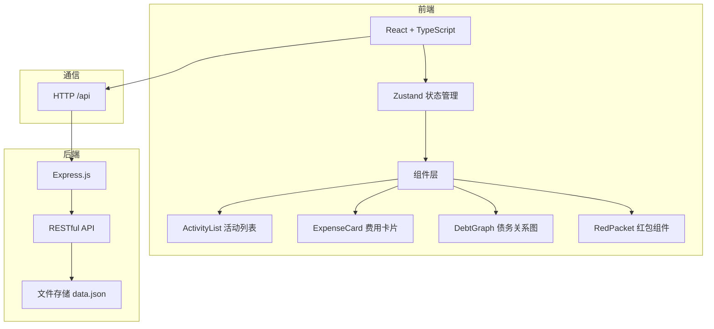
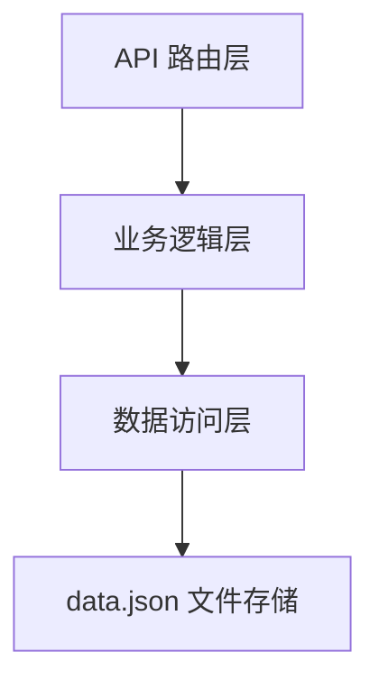
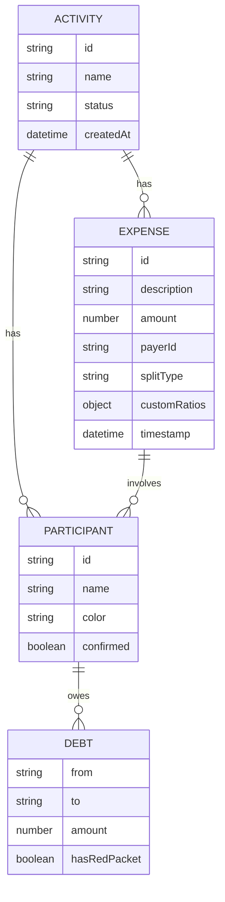

## 1. 架构设计



## 2. 技术描述

- **前端**：React@18 + TypeScript + Vite + Zustand
- **后端**：Express@4 + Node.js
- **数据存储**：JSON文件（data.json），使用uuid生成ID
- **初始化工具**：vite-init
- **主要依赖**：typescript, vite, @vitejs/plugin-react, react, react-dom, zustand, express, cors, uuid, body-parser

## 3. 项目结构

```
.
├── package.json
├── vite.config.js
├── tsconfig.json
├── index.html
├── src/
│   ├── App.tsx
│   ├── store/
│   │   └── useStore.ts
│   ├── components/
│   │   ├── ActivityList.tsx
│   │   ├── ExpenseCard.tsx
│   │   ├── DebtGraph.tsx
│   │   ├── ParticipantAvatar.tsx
│   │   ├── RedPacket.tsx
│   │   └── FloatingStats.tsx
│   └── types/
│       └── index.ts
└── server/
    ├── index.js
    └── data.json
```

## 4. 路由定义

| 路由 | 用途 |
|------|------|
| / | 首页 - 活动列表 |
| /activity/:id | 活动详情页 |

## 5. API 定义

### TypeScript 类型定义

```typescript
interface Participant {
  id: string;
  name: string;
  color: string;
  confirmed: boolean;
}

interface Expense {
  id: string;
  activityId: string;
  description: string;
  amount: number;
  payerId: string;
  splitType: 'equal' | 'custom' | 'full';
  customRatios?: { [participantId: string]: number };
  participants: string[];
  timestamp: number;
}

interface Debt {
  from: string;
  to: string;
  amount: number;
  hasRedPacket: boolean;
}

interface Activity {
  id: string;
  name: string;
  status: 'active' | 'completed';
  participants: Participant[];
  expenses: Expense[];
  createdAt: number;
}
```

### RESTful API

| 方法 | 路径 | 描述 |
|------|------|------|
| GET | /api/activities | 获取所有活动列表 |
| POST | /api/activities | 创建新活动 |
| GET | /api/activities/:id | 获取单个活动详情 |
| PUT | /api/activities/:id | 更新活动信息 |
| DELETE | /api/activities/:id | 删除活动 |
| GET | /api/expenses/:activityId | 获取活动费用列表 |
| POST | /api/expenses/:activityId | 添加费用记录 |
| PUT | /api/expenses/:activityId/:expenseId | 更新费用记录 |
| DELETE | /api/expenses/:activityId/:expenseId | 删除费用记录 |
| GET | /api/settle/:activityId | 计算并返回债务关系 |

### 服务器架构



## 6. 数据模型



## 7. 性能优化

- 债务关系图使用Canvas绘制，requestAnimationFrame动画循环
- 费用计算使用memoization缓存结果
- 大数据量使用虚拟滚动
- 状态更新使用Zustand的selectors避免不必要重渲染
