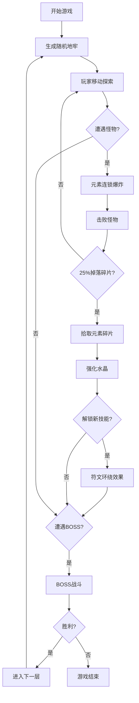

## 1. 产品概述

异界共鸣塔是一款2D俯视视角roguelite爬塔游戏，玩家携带三块元素共鸣水晶（火、冰、电），在随机生成的地牢中消灭怪物、收集元素碎片强化水晶、挑战每层BOSS。

- 核心玩法：元素切换战斗 + 技能解锁成长 + 随机地牢探索
- 目标用户：喜欢roguelite、地牢探索和元素魔法战斗的玩家
- 产品价值：提供快节奏、高爽感的元素连锁战斗体验，每局游戏都有新鲜感

## 2. 核心特性

### 2.2 功能模块

1. **主游戏界面**：35x35格子随机地牢、角色控制、怪物AI、碰撞检测
2. **元素系统**：火/冰/电三种元素切换，元素克制，连锁爆炸特效
3. **成长系统**：收集元素碎片强化水晶，解锁新技能，符文环绕效果
4. **特效系统**：粒子轨迹、元素徽章、爆炸特效、掉落物闪烁
5. **UI系统**：生命值/能量进度条、青铜色按钮面板、弹窗动画

### 2.3 页面详情

| 页面名称 | 模块名称 | 功能描述 |
|-----------|-------------|---------------------|
| 游戏主界面 | 地牢渲染 | 35x35格子木纹砖块地板，边缘6px蓝色结界墙 |
| 游戏主界面 | 角色控制 | WASD移动，Q/E/空格切换元素水晶 |
| 游戏主界面 | 战斗系统 | 碰撞触发元素爆炸，25%概率掉落元素碎片 |
| 游戏主界面 | 技能系统 | 解锁技能后水晶周围旋转符文（4个，2秒周期） |
| UI界面 | 状态显示 | 渐变色生命值（红→橙）和元素能量进度条 |
| UI界面 | 弹窗系统 | 缩放入场/淡出关闭动画 |

## 3. 核心流程

玩家进入游戏 → 随机生成地牢房间 → 控制角色移动探索 → 遭遇怪物触发元素爆炸战斗 → 收集元素碎片强化水晶 → 解锁技能获得符文环绕 → 击败BOSS进入下一层 → 循环直到通关或死亡。

## 4. 界面设计

### 4.1 设计风格
- **主题**：中世纪魔幻暗色调
- **主色调**：背景#1a1a2e，地砖#3A3A4A~#2C2C3C，结界墙#00BFFF(透明度0.3)
- **UI色系**：青铜色系 #4B3A2A（面板）和 #B8860B（边框/高亮）
- **元素色**：火#FF4500、冰#00CED1、电#FFD700
- **进度条**：生命值红→橙线性渐变，水晶能量对应元素渐变
- **动画**：弹窗0.3s缩放入场，0.2s淡出；元素切换0.2s颜色过渡

### 4.2 页面设计概览

| 页面名称 | 模块名称 | UI元素 |
|-----------|-------------|-------------|
| 游戏主界面 | 地牢层 | 木纹地砖格子，6px蓝色内发光结界墙 |
| 游戏主界面 | 角色层 | 12x12发光球体，渐隐粒子轨迹（10个粒子，0.5s消失） |
| 游戏主界面 | 怪物层 | 几何体怪物，随机颜色 |
| 游戏主界面 | 特效层 | 元素徽章（64px，缩放回弹0.5s）、爆炸特效（40px半径，30-50粒子）、五角星碎片（6px，0.8s闪烁） |
| 游戏主界面 | 技能层 | 4个8x8px旋转符文（2s周期） |
| UI层 | 状态栏 | 渐变色进度条（生命值、三块水晶能量） |
| UI层 | 弹窗 | 青铜色边框，缩放入场动画 |

### 4.3 响应性
- 全屏Canvas自适应窗口大小
- 游戏区域保持等比例缩放
- 触摸设备支持虚拟摇杆（可选扩展）

## 5. 性能要求

- 游戏循环保持30FPS以上
- 地牢生成时间不超过100ms
- 任意时刻粒子数量不超过200个
- 内存占用稳定，无明显泄漏
