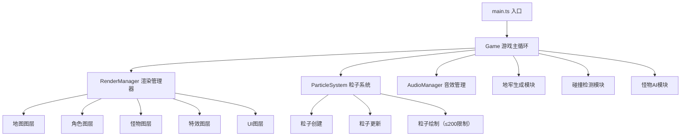

## 1. 架构设计



## 2. 技术选型

- **前端**：TypeScript + 原生HTML5 Canvas API（无游戏引擎）
- **构建工具**：Vite 5.x
- **语言标准**：ES2020，严格模式
- **音频**：Web Audio API 合成音效
- **无外部依赖**：typescript、vite 仅为开发依赖

## 3. 目录结构

```
auto229/
├── package.json          # 依赖与脚本
├── vite.config.js        # Vite基础配置
├── tsconfig.json         # TS严格模式，target ES2020
├── index.html            # 全屏Canvas，背景#1a1a2e
└── src/
    ├── main.ts           # 入口，初始化游戏循环
    ├── Game.ts           # 游戏主循环、房间生成、碰撞检测、怪物AI
    ├── RenderManager.ts  # 画面渲染、图层管理
    ├── ParticleSystem.ts # 粒子系统（≤200限制）
    └── AudioManager.ts   # Web Audio API音效
```

## 4. 核心模块定义

### 4.1 类型定义

```typescript
// 元素类型
type ElementType = 'fire' | 'ice' | 'electric' | 'none';

// 位置接口
interface Position {
  x: number;
  y: number;
}

// 角色接口
interface Player {
  position: Position;
  velocity: Position;
  activeElement: ElementType;
  color: string;
  health: number;
  maxHealth: number;
  crystals: Crystal[];
  runes: Rune[];
  trailParticles: Particle[];
}

// 水晶接口
interface Crystal {
  element: ElementType;
  energy: number;
  maxEnergy: number;
  level: number;
  skills: Skill[];
}

// 怪物接口
interface Monster {
  id: number;
  position: Position;
  velocity: Position;
  element: ElementType;
  color: string;
  shape: 'triangle' | 'square' | 'pentagon' | 'hexagon';
  size: number;
  health: number;
  maxHealth: number;
  speed: number;
}

// 粒子接口
interface Particle {
  id: number;
  position: Position;
  velocity: Position;
  size: number;
  color: string;
  opacity: number;
  maxOpacity: number;
  life: number;
  maxLife: number;
  type: 'trail' | 'explosion' | 'shard';
  gravity?: number;
}

// 符文接口
interface Rune {
  angle: number;
  orbitRadius: number;
  speed: number;
}
```

### 4.2 游戏常量

```typescript
const GRID_SIZE = 35;          // 35x35格子
const TILE_SIZE = 20;          // 每格20px
const ROOM_SIZE = GRID_SIZE * TILE_SIZE;  // 700px
const PLAYER_SIZE = 12;
const WALL_THICKNESS = 6;
const MAX_PARTICLES = 200;
const TARGET_FPS = 60;
const FRAME_TIME = 1000 / TARGET_FPS;
```

### 4.3 性能约束

1. **粒子限制**：ParticleSystem维护最大200粒子数组，超出时FIFO淘汰
2. **生成优化**：地牢生成使用预计算种子，<100ms完成
3. **渲染优化**：分层渲染，离屏Canvas缓存静态地图
4. **帧率控制**：requestAnimationFrame + 时间戳差值，稳定30+FPS

## 5. 核心算法

### 5.1 地牢生成算法
- 35x35网格，外围为墙，内部随机放置障碍物
- 保证连通性（洪水填充验证）
- 怪物随机分布，避开玩家出生点

### 5.2 碰撞检测
- 轴对齐包围盒（AABB）检测
- 玩家vs墙壁、玩家vs怪物、怪物vs墙壁

### 5.3 粒子系统
- 对象池模式复用粒子对象
- 每帧更新：位置 += 速度 * deltaTime，透明度衰减
- 最大200限制，超出移除最早粒子
