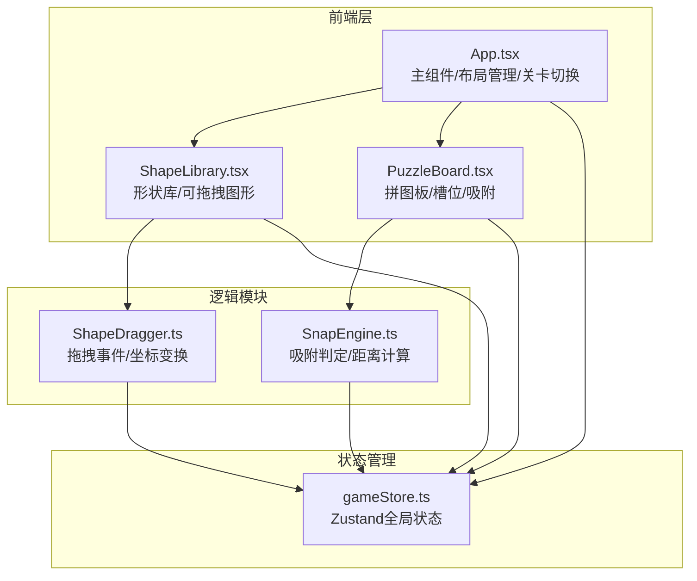

## 1. 架构设计



## 2. 技术说明

- **前端**：React@18 + TypeScript + Vite
- **初始化工具**：vite-init (react-ts 模板)
- **状态管理**：Zustand
- **样式方案**：CSS Modules / 内联样式（深色主题定制度高）
- **后端**：无（纯前端应用）
- **数据库**：无（关卡数据内嵌）

## 3. 路由定义

| 路由 | 用途 |
|------|------|
| / | 拼图游戏主界面（单页应用） |

## 4. 文件结构

```
├── package.json
├── vite.config.ts
├── tsconfig.json
├── index.html
└── src/
    ├── App.tsx                    # 主组件：布局管理、关卡切换
    ├── main.tsx                   # 入口文件
    ├── components/
    │   ├── ShapeLibrary.tsx       # 形状库组件：生成/渲染可拖拽几何图形
    │   └── PuzzleBoard.tsx        # 拼图板组件：槽位渲染/吸附逻辑
    ├── modules/
    │   ├── ShapeDragger.ts        # 拖拽逻辑：mousedown/move/up事件/坐标变换
    │   └── SnapEngine.ts          # 吸附引擎：距离计算/吸附判定/动画触发
    └── store/
        └── gameStore.ts           # 全局状态：形状位置/关卡列表/完成状态
```

## 5. 数据模型

### 5.1 核心类型定义

```typescript
type ShapeType = 'circle' | 'rectangle' | 'triangle';

interface ShapeConfig {
  id: string;
  type: ShapeType;
  color: string;
  width: number;
  height: number;
  originalPosition: { x: number; y: number };
  currentPosition: { x: number; y: number };
  isSnapped: boolean;
  targetSlotId: string | null;
}

interface SlotConfig {
  id: string;
  shapeType: ShapeType;
  color: string;
  position: { x: number; y: number };
  width: number;
  height: number;
  isOccupied: boolean;
}

interface LevelConfig {
  id: number;
  name: string;
  shapes: ShapeConfig[];
  slots: SlotConfig[];
}

interface GameState {
  levels: LevelConfig[];
  currentLevel: number;
  shapes: ShapeConfig[];
  slots: SlotConfig[];
  isCompleted: boolean;
}
```

### 5.2 关卡数据

- **关卡1**：6个形状（2圆+2矩+2三角），2x3网格布局
- **关卡2**：8个形状，3x3网格布局（更多种类）
- **关卡3**：9个形状，3x3网格布局（全部种类）

## 6. 性能要求

- 拖拽帧率 ≥ 55fps（使用requestAnimationFrame + 被动事件监听）
- 吸附判定响应 < 50ms（欧几里得距离简单计算）
- 动画流畅无卡顿（CSS transform + will-change优化）
- 使用React.memo减少不必要重渲染
