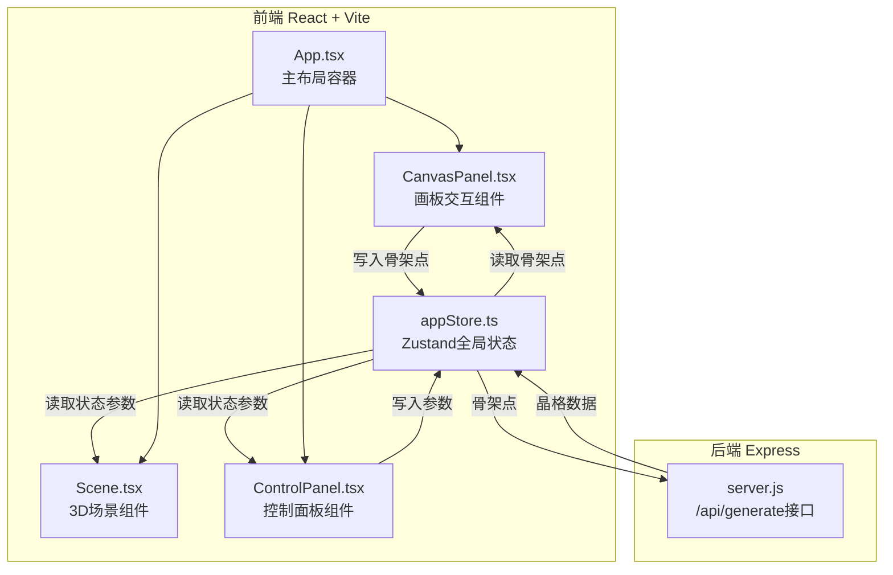

## 1. 架构设计



## 2. 技术说明

- 前端：React@18 + TypeScript + Vite@5 + Three.js + @react-three/fiber + @react-three/drei + Zustand + Axios
- 初始化工具：vite-init (react-ts模板)
- 后端：Express@4 + CORS + UUID
- 状态管理：Zustand 单 store 管理骨架点、模型数据、UI参数、loading状态
- API通信：Axios POST请求，Vite dev server代理/api到localhost:5000

## 3. 路由定义
| 路由 | 用途 |
|------|------|
| / | 主应用页面，包含画板、3D场景、控制面板 |

## 4. API 定义

### POST /api/generate
接收2D骨架点序列，返回3D晶格节点与连接线索引。

**请求体 (TypeScript):**
```typescript
interface GenerateRequest {
  skeleton: Array<{ x: number; y: number }>;
}
```

**响应体 (TypeScript):**
```typescript
interface GenerateResponse {
  nodes: Array<{ x: number; y: number; z: number }>;
  edges: Array<[number, number]>;
}
```

**后端生成逻辑：**
- 基于2D骨架点(x,y)，在Z轴方向对称扩展生成多层节点
- 每个骨架点生成奇数层Z平面(默认3层)，总深度 = 骨架宽度 × 1.5
- 相邻节点、上下层对应节点建立连接
- 返回节点坐标数组和边的索引对数组

## 5. 服务器架构图


后端为无状态轻量计算服务，不涉及数据库。

## 6. 数据模型

### 6.1 前端 Store 状态 (Zustand)
```typescript
interface AppState {
  skeleton: Array<{ x: number; y: number }>;
  latticeNodes: Array<{ x: number; y: number; z: number }>;
  latticeEdges: Array<[number, number]>;
  rotationSpeed: number;      // 0 ~ 0.02 rad/s, default 0.005
  glowIntensity: number;      // 0.1 ~ 1.0, default 0.6
  colorTheme: 'cool' | 'warm' | 'nature';
  isGenerating: boolean;
  isGenerated: boolean;
  setSkeleton: (pts: Array<{x:number;y:number}>) => void;
  setLattice: (nodes: any[], edges: any[]) => void;
  setRotationSpeed: (v: number) => void;
  setGlowIntensity: (v: number) => void;
  setColorTheme: (t: string) => void;
  setGenerating: (v: boolean) => void;
  resetCanvas: () => void;
}
```

### 6.2 颜色主题预设
| 主题名称 | 节点颜色 | 粒子颜色渐变 |
|----------|----------|--------------|
| cool (冷光蓝紫) | #00D2FF → #3A7BD5 | #8A2BE2 → #00BFFF |
| warm (暖光红金) | #FF6B6B → #FFD700 | #FF4500 → #FFD700 |
| nature (自然绿银) | #00FF88 → #C0C0C0 | #32CD32 → #E0E0E0 |
