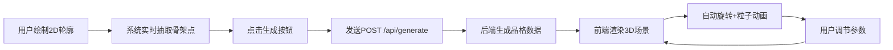

## 1. 产品概述

Lattice Sculptor 是一款将手绘二维轮廓自动转化为动态3D晶格雕塑的创意工具，解决抽象手绘灵感难以快速转化为可观察、可旋转的立体水晶结构的问题。

- 面向数字艺术家、设计师、创意爱好者，提供从2D线条到3D水晶雕塑的即时转化体验
- 核心价值：将模糊的创意灵感秒变为可交互的3D艺术作品，支持实时参数调节

## 2. 核心功能

### 2.1 用户角色
| 角色 | 注册方式 | 核心权限 |
|------|----------|----------|
| 创意用户 | 无需注册，直接使用 | 绘制轮廓、生成3D模型、调节参数、观察效果 |

### 2.2 功能模块
1. **画板模块**：500x500绘制区域，支持鼠标绘制黑白线条轮廓，实时捕捉路径并抽取骨架点
2. **3D场景模块**：基于Three.js的3D渲染视图，展示晶格雕塑、自动旋转、粒子特效
3. **控制面板模块**：旋转速度、发光强度、颜色主题等参数实时调节
4. **后端生成服务**：接收2D骨架点，生成3D晶格节点与连接线数据

### 2.3 页面详情
| 页面名称 | 模块名称 | 功能描述 |
|----------|----------|----------|
| 主应用页 | 状态提示条 | 显示"绘制阶段"或"生成完成"状态，高40px，蓝色背景 |
| 主应用页 | 画板区域 | 500x500画布，#F8F9FA背景，#DEE2E6虚线网格，4px线条绘制 |
| 主应用页 | 生成按钮 | 120x40px，#6C63FF→#4834D4线性渐变，圆角8px，悬浮投影上移 |
| 主应用页 | 3D场景视图 | 右侧55%区域，径向渐变背景，展示动态晶格雕塑 |
| 主应用页 | 控制面板 | 旋转速度滑块(0-0.02)、发光强度滑块(0.1-1.0)、颜色主题选择器(3组预设) |
| 主应用页 | 分割线 | 5px宽#E9ECEF竖线，支持拖拽调整左右比例 |

## 3. 核心流程

用户在左侧画板用鼠标绘制黑白线条轮廓 → 系统实时采样路径为骨架点序列(5px间隔) → 用户点击生成按钮 → 前端发送骨架数据至后端API → 后端生成3D晶格节点与连接线索引 → 前端渲染八面体节点和发光连接线 → 模型自动Y轴旋转+粒子布朗运动 → 用户通过右侧面板实时调节参数

## 4. 用户界面设计

### 4.1 设计风格
- 主色调：深空蓝紫渐变背景(#0B0B2B→#1A1A4E)，冷科技感
- 强调色：#6C63FF（紫）、#00D2FF（青蓝发光）、#FFD700（金）
- 按钮风格：线性渐变填充，圆角8px，0.2s ease-out过渡，悬浮时阴影上移3px
- 字体：Inter无衬线字体，全局统一
- 布局：左右分栏(45%/55%)，中间可拖拽分割线，桌面端优先

### 4.2 页面设计概述
| 页面名称 | 模块名称 | UI元素 |
|----------|----------|--------|
| 主应用 | 状态提示条 | 高度40px，#E8F4FD背景，#0D6EFD文字，圆角8px |
| 主应用 | 画板区域 | 500x500固定尺寸，#F8F9FA背景，1px #DEE2E6虚线网格 |
| 主应用 | 3D场景 | 透视相机(FOV60°)，径向渐变背景，黑色边框容器 |
| 主应用 | 控制面板 | 右侧底部/侧边，滑块带数值显示，主题切换按钮组 |
| 主应用 | 生成按钮 | 120x40px，#6C63FF→#4834D4渐变，hover translateY(-3px) |

### 4.3 响应性
- 桌面优先设计，最小宽度1200px
- 画板区域固定500x500px，3D场景自适应右侧空间
- 不做移动端适配，专注桌面创作体验

### 4.4 3D场景指导
- 环境：深空蓝紫径向渐变背景，营造水晶悬浮感
- 光照：环境光+点光源组合，突出晶格发光效果
- 相机：透视相机(60° FOV)，初始位置(5, 3, 5)，看向原点
- 动画：Y轴自动旋转(0.005rad/s默认)，500颗粒子布朗运动(±0.05偏移，0.1速度)
- 后期：晶格连接线使用#00D2FF→#3A7BD5渐变发光材质，营造呼吸水晶感
- 性能：模型生成≤2秒，帧率≥30fps
