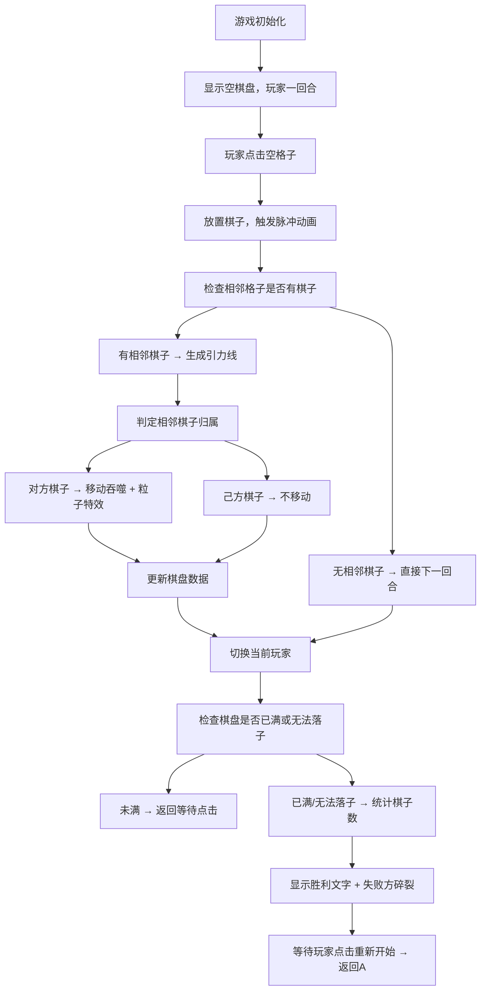

## 1. 产品概述

星轨棋是一款基于引力规则的策略对战游戏，玩家在动态星空棋盘上轮流放置星尘棋子，棋子间通过引力线自动移动并吞噬对方，最终以存活棋子数量决定胜负。

- 核心玩法：8x8星空棋盘上的双人回合制策略对战，融合引力物理规则与吞噬机制
- 目标用户：休闲游戏爱好者、策略桌游玩家

## 2. 核心功能

### 2.1 功能模块

1. **游戏主界面**：星空棋盘、信息面板、控制按钮
2. **棋盘系统**：8x8网格渲染、悬停高亮、星线背景
3. **棋子系统**：双色棋子放置、脉冲动画、引力线连接
4. **战斗系统**：自动移动、吞噬判定、粒子特效
5. **胜负系统**：棋子统计、胜利文字动画、失败方碎裂特效
6. **状态管理**：回合切换、棋盘数据、重置功能

### 2.2 页面详情

| 页面名称 | 模块名称 | 功能描述 |
|---------|---------|---------|
| 游戏主界面 | 星空背景 | 径向渐变深空背景，营造宇宙氛围 |
| 游戏主界面 | 棋盘区域 | 8x8渐变网格、星线分隔、悬停金色光环 |
| 游戏主界面 | 棋子系统 | 橙红/冰蓝双色棋子、放置脉冲动画、中心高光 |
| 游戏主界面 | 引力线系统 | 相邻棋子间的混合色引力线、脉动动画 |
| 游戏主界面 | 吞噬系统 | 自动移动、粒子爆发、棋子消除 |
| 游戏主界面 | 信息面板 | 当前回合头像、双方棋子数统计、重新开始按钮 |
| 游戏主界面 | 结算系统 | 中心胜利文字、失败方碎裂动画 |

## 3. 核心流程

## 4. 用户界面设计

### 4.1 设计风格

- **主色调**：深空蓝紫渐变（#0A0A23 → #12123A），棋盘格子渐变（#0B0C10 → #1F2833）
- **玩家一棋子**：炽热橙红#FF4500，中心高光#FFD700
- **玩家二棋子**：冰蓝#00BFFF，中心高光#E0FFFF
- **辅助色**：金色光环#FFD700（透明度0.4）、重新开始按钮#4FC3F7（悬浮#81D4FA）
- **按钮风格**：圆角8px，扁平化设计
- **字体**：选用具有未来科技感的无衬线字体，数字使用粗体
- **布局风格**：棋盘居中偏左，信息面板右侧，整体居中对齐
- **动效风格**：脉冲、脉动、粒子飞散、碎裂，所有动画平滑流畅

### 4.2 页面设计概览

| 模块名称 | UI元素 | 样式描述 |
|---------|--------|---------|
| 棋盘格子 | 渐变背景 + 星线分隔 | 深蓝→紫色渐变，1px半透明白色星线，悬停金色光环 |
| 棋子 | 圆形渐变 + 中心高光 | 半径25px，径向渐变填充，放置时0.5s脉冲动画（缩放0.5→1，透明度0→1） |
| 引力线 | 连接线 + 脉动 | 2px宽，两棋子颜色混合，周期性透明度脉动 |
| 粒子特效 | 飞散粒子 | 20个小圆点，被吞噬棋子颜色，0.3s向四周飞散淡出 |
| 胜利文字 | Canvas文字 | 居中放大至1.2倍，停留2秒后消失 |
| 碎裂特效 | 碎片飞散 | 每个棋子碎成5片，随机方向飞出，0.6s完成 |
| 玩家头像 | 圆形头像 + 边框 | 60x60px圆形，边框色与当前玩家棋子色一致 |
| 统计数字 | 白色粗体数字 | 大号粗体白色，显示双方棋子数量 |
| 重新开始按钮 | 圆角按钮 | 圆角8px，背景#4FC3F7，悬浮变亮#81D4FA |

### 4.3 响应式

- 桌面端优先设计，最小宽度支持1024px
- 棋盘尺寸固定为8x8格子，自适应视口高度
- 信息面板宽度固定，与棋盘保持适当间距

### 4.4 性能要求

- 所有动画帧率 ≥ 30fps，目标60fps
- 点击响应延迟 ≤ 100ms
- 使用CSS动画为主，Canvas处理复杂粒子和文字效果
- 合理使用React memo减少不必要重渲染
