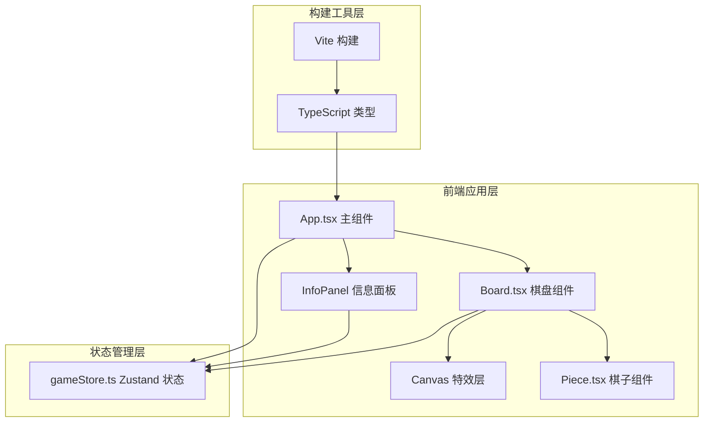

## 1. 架构设计



## 2. 技术选型说明

| 技术 | 版本 | 用途 |
|------|------|------|
| React | ^18.2.0 | UI组件框架，负责视图渲染与组件复用 |
| React DOM | ^18.2.0 | React DOM 渲染器 |
| Zustand | ^4.5.0 | 轻量级状态管理，维护棋盘数据、回合、胜负状态 |
| TypeScript | ^5.4.0 | 静态类型检查，target ES2020，严格模式 |
| Vite | ^5.2.0 | 前端构建工具，开发服务器 + 打包 |
| @vitejs/plugin-react | ^4.2.0 | Vite React 插件，支持 JSX/TSX Fast Refresh |
| Canvas API | 原生 | 渲染粒子特效、胜利文字动画 |
| CSS Animation | 原生 | 脉冲动画、引力线脉动、悬停效果 |

## 3. 目录结构

```
auto237/
├── package.json
├── vite.config.js
├── tsconfig.json
├── index.html
└── src/
    ├── App.tsx          # 主组件：组合棋盘、信息面板、Canvas特效层
    ├── Board.tsx        # 棋盘：8x8网格渲染、棋子放置、引力线、交互逻辑
    ├── Piece.tsx        # 棋子：单个棋子渲染、脉冲/碎裂动画、高光效果
    └── gameStore.ts     # Zustand状态：棋盘数据模型、回合切换、吞噬判定、胜负计算
```

## 4. 数据模型与状态定义

### 4.1 核心类型

```typescript
type PlayerId = 1 | 2;

interface PieceData {
  id: string;
  player: PlayerId;
  row: number;
  col: number;
  placedAt: number;      // 放置时间戳，用于动画控制
  isShattering?: boolean; // 是否处于碎裂状态
}

interface GravityLine {
  from: { row: number; col: number };
  to: { row: number; col: number };
  color: string;         // 两棋子颜色混合值
}

interface Particle {
  id: string;
  x: number;
  y: number;
  vx: number;
  vy: number;
  color: string;
  life: number;          // 0~1 生命周期
  size: number;
}

interface GameState {
  board: (PieceData | null)[][];  // 8x8 棋盘
  currentPlayer: PlayerId;
  gravityLines: GravityLine[];
  particles: Particle[];
  winner: PlayerId | null;
  gameOver: boolean;
  pieceCount: { [key in PlayerId]: number };
  // Actions
  placePiece: (row: number, col: number) => void;
  resetGame: () => void;
}
```

### 4.2 状态变更流程

1. `placePiece(row, col)`：
   - 校验格子是否为空
   - 生成新 `PieceData` 存入 `board[row][col]`
   - 扫描8个相邻格子，生成 `GravityLine`
   - 对相邻对方棋子执行吞噬：移动 + 生成粒子 + 移除被吞噬棋子
   - 更新 `pieceCount`
   - 切换 `currentPlayer`
   - 检查棋盘是否已满，设置 `gameOver` 和 `winner`

2. `resetGame()`：
   - 清空 `board`、`gravityLines`、`particles`
   - `currentPlayer = 1`
   - `gameOver = false, winner = null`
   - `pieceCount = { 1: 0, 2: 0 }`

## 5. 关键算法

### 5.1 相邻格子检测

```
方向数组：[[-1,-1],[-1,0],[-1,1],[0,-1],[0,1],[1,-1],[1,0],[1,1]]
遍历方向数组，检查坐标在 [0,7] 范围内且 board[newRow][newCol] !== null
```

### 5.2 颜色混合

```
取两棋子主色 #FF4500 和 #00BFFF 的 RGB 分量各取平均
用于引力线渲染
```

### 5.3 吞噬逻辑

```
对每个相邻格子：
  if 对方棋子：
    1. 将当前新棋子从源位置移至对方位置（替换对方）
    2. 源位置置空
    3. 在对方位置触发粒子爆炸（20个粒子）
    4. 更新 pieceCount：当前玩家+1，对方玩家-1
```

### 5.4 胜负判定

```
统计当前 board 上双方棋子数，棋盘无空格时触发
pieceCount[1] > pieceCount[2] → 玩家1胜
pieceCount[2] > pieceCount[1] → 玩家2胜
相等 → 平局
```

## 6. 性能优化方案

| 优化点 | 方案 |
|--------|------|
| 渲染性能 | 使用 `React.memo` 包装 Piece 组件，仅在 `player`/`placedAt` 变化时重渲染 |
| 动画性能 | 棋子脉冲、引力线脉动使用 CSS `transform` + `opacity`（GPU加速属性） |
| Canvas 渲染 | 粒子系统和胜利文字统一在单个 Canvas 中批量绘制，`requestAnimationFrame` 驱动 |
| 状态更新 | Zustand 选择器（selector）订阅局部状态，避免全量重渲染 |
| 内存管理 | 粒子生命结束后立即从数组中移除，避免数组无限增长 |
| 交互响应 | 点击事件使用 16ms 内完成状态更新，动画异步执行不阻塞主线程 |
