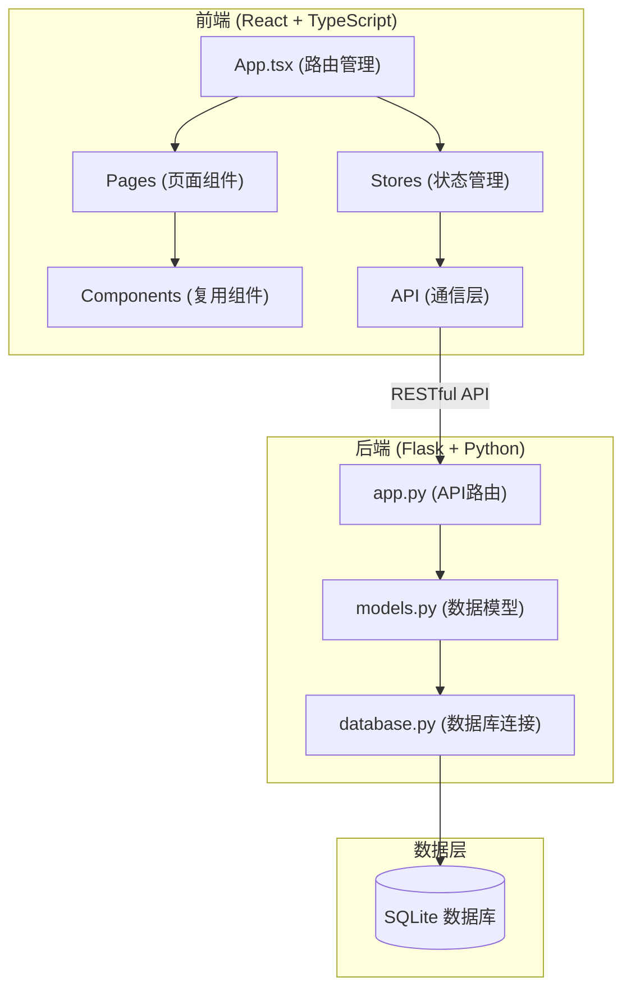
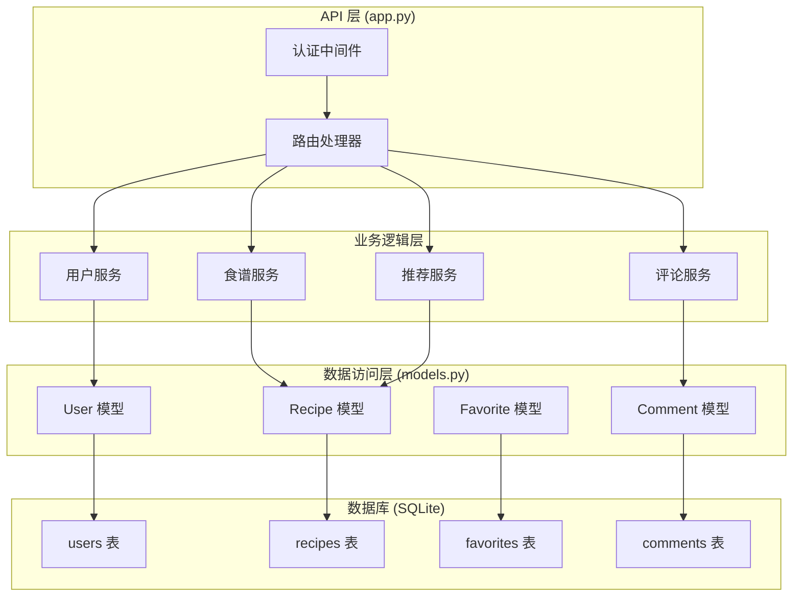
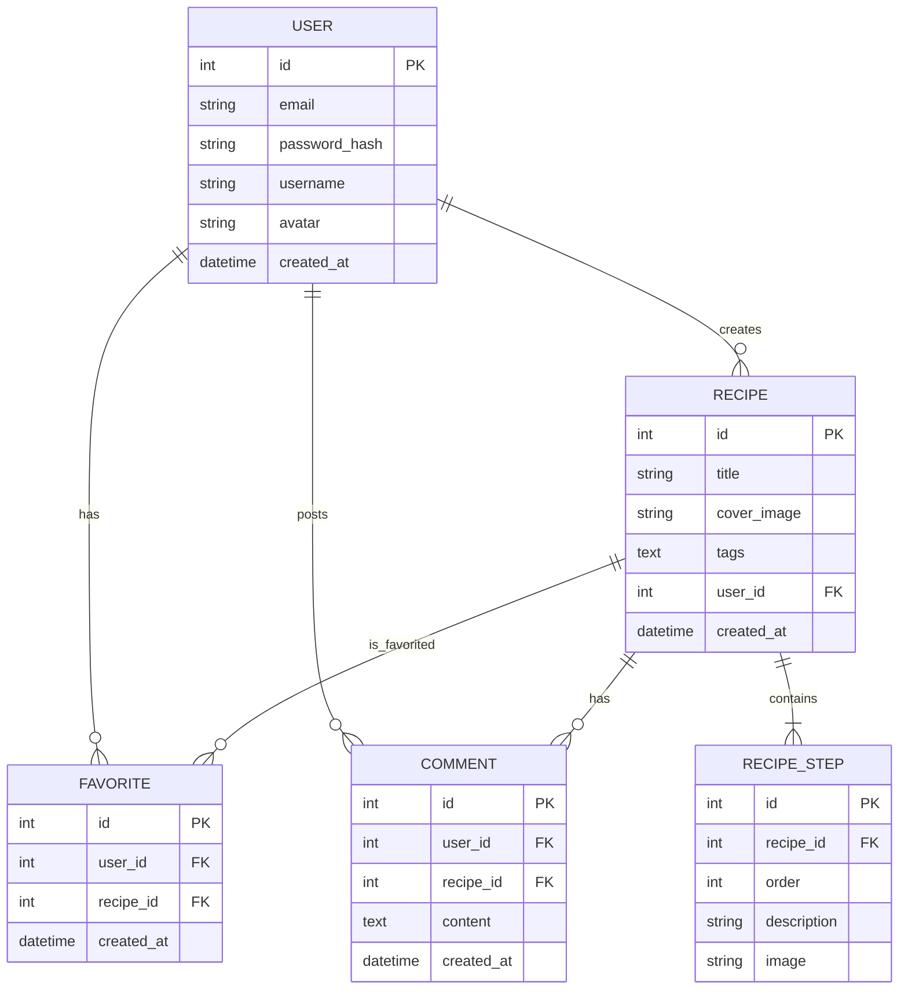

## 1. 架构设计



## 2. 技术描述

- **前端框架**：React 18 + TypeScript 5
- **状态管理**：Zustand
- **构建工具**：Vite 5
- **HTTP 客户端**：Axios
- **样式方案**：CSS Modules / SCSS
- **图标库**：Font Awesome Free
- **后端框架**：Flask 3
- **数据库**：SQLite（本地开发）
- **认证方式**：JWT Token（有效期24小时）
- **图片处理**：前端 Canvas 缩略（256x256px）
- **拖拽库**：@dnd-kit/core（步骤排序）

## 3. 路由定义

| 路由 | 页面 | 权限 | 描述 |
|------|------|------|------|
| / | HomePage | 公开 | 首页：猜你喜欢 + 最新食谱瀑布流 |
| /recipe/:id | RecipeDetailPage | 公开 | 食谱详情页 |
| /create | CreateRecipePage | 需要登录 | 创建食谱页 |
| /user/:id | UserPage | 公开 | 用户个人中心 |
| /login | LoginPage | 公开 | 登录页 |
| /register | RegisterPage | 公开 | 注册页 |

## 4. API 定义

### 4.1 TypeScript 类型定义

```typescript
interface User {
  id: number;
  email: string;
  username: string;
  avatar: string;
  created_at: string;
}

interface RecipeStep {
  id: number;
  order: number;
  description: string;
  image: string;
}

interface Recipe {
  id: number;
  title: string;
  cover_image: string;
  tags: string[];
  steps: RecipeStep[];
  user_id: number;
  user: User;
  is_favorited: boolean;
  favorite_count: number;
  comment_count: number;
  created_at: string;
}

interface Comment {
  id: number;
  content: string;
  user_id: number;
  user: User;
  recipe_id: number;
  created_at: string;
}

interface AuthResponse {
  token: string;
  user: User;
}
```

### 4.2 API 端点

| 方法 | 路径 | 描述 | 请求参数 | 响应 |
|------|------|------|----------|------|
| POST | /api/auth/register | 用户注册 | `{ email, password, username }` | `AuthResponse` |
| POST | /api/auth/login | 用户登录 | `{ email, password }` | `AuthResponse` |
| GET | /api/recipes | 获取食谱列表 | `?page=1&per_page=20&tag=xxx` | `{ data: Recipe[], total: number }` |
| POST | /api/recipes | 创建食谱 | `FormData: { title, cover_image, tags[], steps[] }` | `Recipe` |
| GET | /api/recipes/:id | 获取食谱详情 | - | `Recipe` |
| POST | /api/recipes/:id/favorite | 切换收藏 | - | `{ success: boolean, is_favorited: boolean }` |
| GET | /api/recipes/recommendations | 获取推荐食谱 | - | `{ data: Recipe[] }` |
| GET | /api/recipes/:id/comments | 获取评论列表 | `?page=1&per_page=20` | `{ data: Comment[], total: number }` |
| POST | /api/recipes/:id/comments | 发表评论 | `{ content }` | `Comment` |
| GET | /api/users/:id | 获取用户信息 | - | `User` |
| GET | /api/users/:id/recipes | 获取用户发布的食谱 | `?page=1&per_page=20` | `{ data: Recipe[], total: number }` |
| GET | /api/users/:id/favorites | 获取用户收藏的食谱 | `?page=1&per_page=20` | `{ data: Recipe[], total: number }` |

## 5. 服务器架构图



## 6. 数据模型

### 6.1 ER 图



### 6.2 DDL 语句

```sql
-- 用户表
CREATE TABLE users (
    id INTEGER PRIMARY KEY AUTOINCREMENT,
    email VARCHAR(255) UNIQUE NOT NULL,
    password_hash VARCHAR(255) NOT NULL,
    username VARCHAR(50) NOT NULL,
    avatar VARCHAR(500) DEFAULT '',
    created_at DATETIME DEFAULT CURRENT_TIMESTAMP
);

-- 食谱表
CREATE TABLE recipes (
    id INTEGER PRIMARY KEY AUTOINCREMENT,
    title VARCHAR(255) NOT NULL,
    cover_image VARCHAR(500) NOT NULL,
    tags TEXT NOT NULL,
    user_id INTEGER NOT NULL,
    created_at DATETIME DEFAULT CURRENT_TIMESTAMP,
    FOREIGN KEY (user_id) REFERENCES users (id)
);

-- 食谱步骤表
CREATE TABLE recipe_steps (
    id INTEGER PRIMARY KEY AUTOINCREMENT,
    recipe_id INTEGER NOT NULL,
    step_order INTEGER NOT NULL,
    description TEXT NOT NULL,
    image VARCHAR(500) DEFAULT '',
    FOREIGN KEY (recipe_id) REFERENCES recipes (id) ON DELETE CASCADE
);

-- 收藏表
CREATE TABLE favorites (
    id INTEGER PRIMARY KEY AUTOINCREMENT,
    user_id INTEGER NOT NULL,
    recipe_id INTEGER NOT NULL,
    created_at DATETIME DEFAULT CURRENT_TIMESTAMP,
    UNIQUE(user_id, recipe_id),
    FOREIGN KEY (user_id) REFERENCES users (id),
    FOREIGN KEY (recipe_id) REFERENCES recipes (id) ON DELETE CASCADE
);

-- 评论表
CREATE TABLE comments (
    id INTEGER PRIMARY KEY AUTOINCREMENT,
    user_id INTEGER NOT NULL,
    recipe_id INTEGER NOT NULL,
    content TEXT NOT NULL,
    created_at DATETIME DEFAULT CURRENT_TIMESTAMP,
    FOREIGN KEY (user_id) REFERENCES users (id),
    FOREIGN KEY (recipe_id) REFERENCES recipes (id) ON DELETE CASCADE
);

-- 索引
CREATE INDEX idx_recipes_user_id ON recipes(user_id);
CREATE INDEX idx_recipes_created_at ON recipes(created_at DESC);
CREATE INDEX idx_favorites_user_id ON favorites(user_id);
CREATE INDEX idx_favorites_recipe_id ON favorites(recipe_id);
CREATE INDEX idx_comments_recipe_id ON comments(recipe_id);
CREATE INDEX idx_comments_created_at ON comments(created_at DESC);
```

## 7. 推荐算法

### 7.1 标签权重计算

基于用户收藏记录计算标签权重：

1. 统计用户收藏的所有食谱的标签出现次数
2. 使用 Sigmoid 函数归一化权重：`weight = 1 / (1 + e^(-count/5))`
3. 按权重降序排列标签
4. 从每个高权重标签中选取最新食谱，组成8条推荐

### 7.2 数据流向


## 8. 项目文件结构

```
auto238/
├── frontend/
│   ├── src/
│   │   ├── App.tsx                 # 根组件，路由管理
│   │   ├── main.tsx                # 入口文件
│   │   ├── stores/
│   │   │   ├── authStore.ts        # 用户认证状态管理
│   │   │   └── recipeStore.ts      # 食谱数据状态管理
│   │   ├── components/
│   │   │   ├── RecipeCard.tsx      # 食谱卡片组件
│   │   │   ├── RecipeStep.tsx      # 步骤卡片组件
│   │   │   ├── CommentItem.tsx     # 评论项组件
│   │   │   ├── Navbar.tsx          # 导航栏组件
│   │   │   └── ImageUploader.tsx   # 图片上传组件
│   │   ├── pages/
│   │   │   ├── HomePage.tsx        # 首页
│   │   │   ├── RecipeDetailPage.tsx # 详情页
│   │   │   ├── CreateRecipePage.tsx # 创作页
│   │   │   ├── UserPage.tsx        # 用户中心
│   │   │   ├── LoginPage.tsx       # 登录页
│   │   │   └── RegisterPage.tsx    # 注册页
│   │   ├── services/
│   │   │   ├── api.ts              # API 配置
│   │   │   └── imageUtils.ts       # 图片处理工具
│   │   └── types/
│   │       └── index.ts            # TypeScript 类型定义
│   ├── index.html
│   ├── package.json
│   ├── tsconfig.json
│   └── vite.config.js
└── backend/
    ├── app.py                      # Flask 主应用
    ├── models.py                   # 数据模型
    ├── database.py                 # 数据库连接
    ├── requirements.txt            # Python 依赖
    └── instance/
        └── cooking_journal.db      # SQLite 数据库
```
