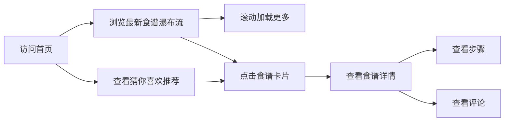
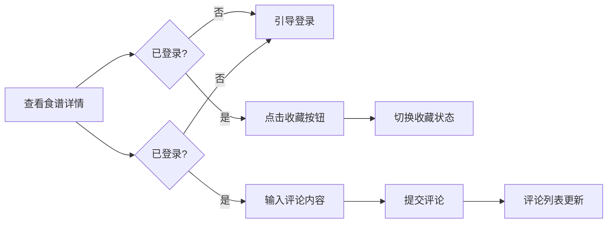

## 1. 产品概述

烹饪日志是一个社区食谱分享平台，解决用户上传烹饪步骤排版混乱、缺少互动反馈的问题，提升用户参与度。目标用户为美食爱好者、家庭主妇、烹饪新手等，用户可创建结构化图文食谱、收藏和评论他人作品，并基于标签获得智能推荐。

## 2. 核心功能

### 2.1 用户角色

| 角色 | 注册方式 | 核心权限 |
|------|----------|----------|
| 游客 | 无需注册 | 浏览食谱、查看评论 |
| 注册用户 | 邮箱+密码注册 | 浏览食谱、创建食谱、收藏食谱、评论食谱、查看个人中心 |

### 2.2 功能模块

1. **首页**：猜你喜欢轮播区、最新食谱瀑布流、导航栏
2. **食谱详情页**：完整步骤展示、收藏按钮、评论区
3. **创作页**：结构化食谱创建表单、预览功能
4. **用户个人中心**：用户发布的食谱、收藏的食谱
5. **用户认证**：注册、登录、登出

### 2.3 页面详情

| 页面名称 | 模块名称 | 功能描述 |
|----------|----------|----------|
| 首页 | 猜你喜欢轮播 | 基于用户收藏标签权重推荐8条食谱，毛玻璃风格卡片轮播 |
| 首页 | 最新食谱瀑布流 | 20条最新食谱，两列瀑布流，滚动加载更多 |
| 首页 | 导航栏 | Logo、登录按钮、用户头像，固定顶部磨砂玻璃效果 |
| 食谱详情页 | 步骤展示 | 每个步骤卡片：图片左640x360、10px圆角，文字居中，#333字体 |
| 食谱详情页 | 收藏按钮 | 红心按钮，未收藏#666，已收藏#FF4757，0.2s缩放弹性动画 |
| 食谱详情页 | 评论区 | 输入框80%宽度，圆角20px，边框#CED4DA，提交按钮#FF6B81白色文字，评论按时间倒序 |
| 创作页 | 食谱表单 | 标题、封面图上传（jpg/png，最大5MB）、标签（最多5个）、分步编写（文字+图片，拖拽排序） |
| 创作页 | 预览功能 | 提交前显示食谱预览效果 |
| 用户中心 | 我的发布 | 网格排列，卡片180x240px，封面图圆角8px，阴影4px #DDD |
| 用户中心 | 我的收藏 | 网格排列，卡片右上角显示红心图标 |

## 3. 核心流程

### 3.1 用户浏览食谱

### 3.2 用户创建食谱

### 3.3 用户互动流程

## 4. 用户界面设计

### 4.1 设计风格

- **主色调**：#FF6B81（珊瑚红）和 #F8B195（蜜桃色）渐变
- **背景色**：#FFFAF0（亚麻白）
- **导航栏**：固定顶部64px，微透明磨砂玻璃（rgba(255,250,240,0.85)，backdrop-filter: blur(10px)）
- **卡片风格**：圆角设计，柔和阴影，毛玻璃效果用于推荐区
- **字体**：标题使用衬线字体增强温暖感，正文使用清晰易读的无衬线字体
- **图标**：Font Awesome 免费图标库
- **动画**：卡片淡入效果（0.2s间隔，透明度0→1），收藏按钮弹性缩放动画

### 4.2 页面设计概览

| 页面名称 | 模块名称 | UI 元素 |
|----------|----------|----------|
| 首页 | 猜你喜欢轮播 | 毛玻璃卡片、渐变背景、左右切换按钮、自动轮播 |
| 首页 | 瀑布流列表 | 两列布局、16px间隔、卡片最小宽度280px、依次淡入动画 |
| 食谱详情页 | 步骤卡片 | 左图右文布局、图片640x360、10px圆角、文字居中 |
| 食谱详情页 | 收藏按钮 | 心形图标、颜色切换、scale弹性动画 |
| 创作页 | 表单组件 | 拖拽排序、图片上传预览、标签输入、实时预览 |
| 用户中心 | 网格布局 | 等宽卡片180x240px、圆角8px、阴影4px #DDD |

### 4.3 响应式设计

- **桌面端**：卡片列表三列布局，卡片最小宽度280px
- **平板端**：卡片列表两列布局
- **手机端**：卡片列表单列布局
- 采用桌面优先设计，媒体查询适配不同屏幕尺寸
- 触摸设备优化：增加点击区域，优化滚动体验

### 4.4 性能优化

- 封面图片前端缩略至256x256px，减少带宽消耗
- 瀑布流滚动加载，每次加载20条数据
- 本地测试环境请求响应时间低于800ms
- 滚动帧率稳定在55fps以上
