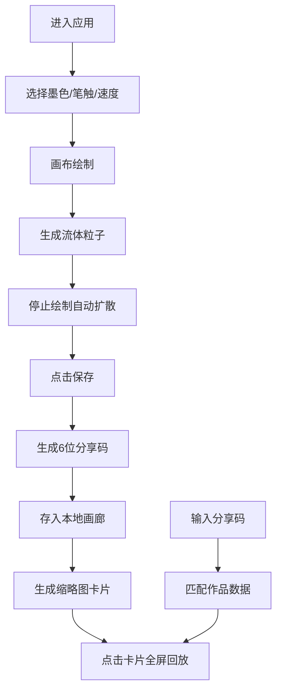

## 1. 产品概述

墨迹幻境是一款面向在线艺术社区的水墨流体动画创作应用，用户通过组合不同风格的笔触和动态颜料效果，创作出独一无二的水墨流体动画作品，并支持作品的本地保存、分享码分享与画廊浏览。

- 核心价值：将传统水墨艺术与现代流体物理模拟结合，提供沉浸式的数字水墨创作体验
- 目标用户：艺术爱好者、创意设计师、水墨文化传播者

## 2. 核心功能

### 2.1 用户角色
本应用无复杂用户角色区分，所有用户享有相同权限。

| 角色 | 注册方式 | 核心权限 |
|------|----------|----------|
| 普通用户 | 无需注册 | 创作、保存、分享、浏览作品 |

### 2.2 功能模块
1. **主创作界面**：画布区域、工具栏、画廊区域
2. **水墨流体绘制**：Canvas 2D实时渲染、粒子系统、笔触模拟
3. **动态扩散动画**：粒子弥散效果、透明度渐变、5秒晕染周期
4. **笔触样式系统**：轻柔波纹、激烈旋涡、随机飞溅三种模式
5. **作品保存分享**：Base64 PNG本地存储、6位随机分享码、作品复现
6. **画廊浏览**：横向滚动缩略图、全屏动画回放

### 2.3 页面详情
| 页面名称 | 模块名称 | 功能描述 |
|----------|----------|----------|
| 主创作页 | 画布模块 | Canvas 2D流体渲染，鼠标/触摸手势识别，粒子实时绘制 |
| 主创作页 | 工具栏模块 | 墨色选择、笔触样式切换、扩散速度调节、保存按钮 |
| 主创作页 | 画廊模块 | 横向滚动卡片列表，缩略图悬浮放大，点击全屏回放 |
| 分享加载弹窗 | 输入模块 | 6位分享码输入，校验并加载对应作品动画 |
| 全屏回放层 | 回放模块 | 按记录的绘制时序完整复现流体动画全过程 |

## 3. 核心流程

### 3.1 创作流程
用户进入应用 → 选择墨色和笔触样式 → 在画布上滑动绘制 → 粒子生成流体轨迹 → 停止绘制后粒子自动扩散晕染 → 点击保存按钮 → 生成缩略图+Base64数据+6位分享码 → 存入localStorage并加入画廊

### 3.2 分享加载流程
用户A获取分享码 → 用户B输入6位分享码 → 从localStorage匹配对应作品 → 加载画布数据与绘制时序 → 全屏播放完整动画

## 4. 用户界面设计

### 4.1 设计风格
- **主色调**：深色沉浸主题，背景为径向渐变(#0A0A0A → #1A1A2E，中心偏右上)
- **墨色色板**：焦墨#1A1A1A、浓墨#333333、重墨#4D4D4D、淡墨#808080、清墨#BFBFBF
- **按钮风格**：毛玻璃半透明(rgba(255,255,255,0.05))，backdrop-filter: blur(10px)，圆角设计
- **字体**：采用东方韵味的衬线字体，标题使用书法风格，正文使用现代无衬线体
- **布局**：画布居中(75%屏幕面积，四周20px安全边距)，工具栏固定底部(60px高)，画廊在工具栏下方(140px高)
- **动效风格**：水墨晕染、涟漪扩散、按钮微触反弹(scale 0.95→1.0)

### 4.2 页面设计概览
| 页面名称 | 模块名称 | UI元素 |
|----------|----------|--------|
| 主创作页 | 画布模块 | 全屏径向渐变背景，中央Canvas，20px内边距，边缘柔光效果 |
| 主创作页 | 工具栏模块 | 毛玻璃半透明背景，5色墨色选择圆点，3种笔触图标按钮，速度调节滑块，圆形保存按钮(48px)，16px间距，悬浮0.2s过渡 |
| 主创作页 | 画廊模块 | 横向滚动容器，200x150px卡片，12px圆角，2px#333333边框，悬浮放大1.08倍+12px白色内阴影，0.3s缓动 |
| 全屏回放层 | 回放模块 | 黑色遮罩，居中Canvas，关闭按钮，进度指示器 |

### 4.3 响应式设计
- **桌面端(≥768px)**：工具栏按钮正常尺寸，画廊横向滚动
- **移动端(<768px)**：工具栏图标缩小至32px，画廊卡片改为竖直堆叠显示，画布占比提升至90%
- **触摸优化**：所有可交互元素热区≥44px，支持触摸滑动绘制，手势事件防抖

### 4.4 Canvas渲染指南
- **渲染方式**：Canvas 2D API，requestAnimationFrame驱动
- **粒子系统**：数百至数千透明粒子，圆形渐变，叠加混合模式
- **扩散算法**：速度向量衰减+布朗运动+透明度线性衰减(5秒周期)
- **性能降级**：粒子>2000时最小尺寸从3px降为2px，目标帧率≥30FPS
