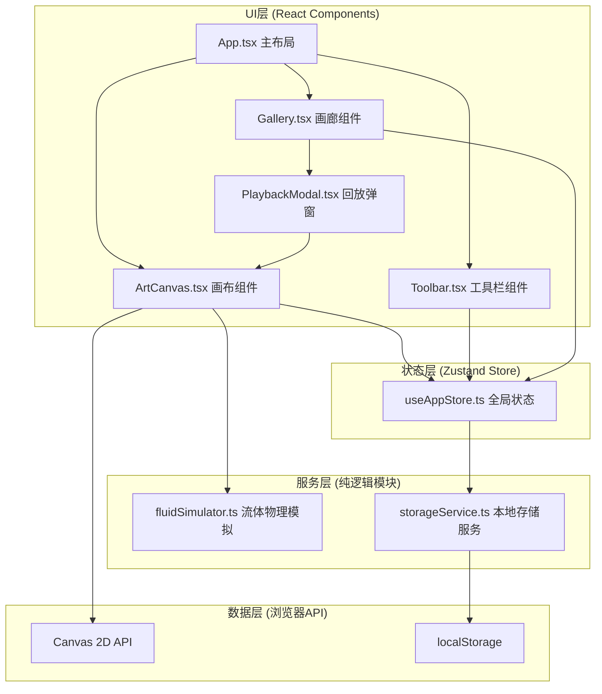

## 1. 架构设计

本应用为纯前端单页应用，采用分层架构设计，各层职责明确，数据单向流动。



**调用关系与数据流**：
1. Toolbar → Zustand Store：用户调节参数时更新画笔配置(brushStyle, inkColor, diffusionSpeed)
2. ArtCanvas → Zustand Store：订阅画笔配置变化，监听用户手势(mouse/touch)
3. ArtCanvas → fluidSimulator：传入绘制指令(坐标、速度、压力)，获取粒子更新数组
4. ArtCanvas → Canvas 2D API：渲染粒子帧
5. Toolbar保存按钮 → storageService：将作品数据(Base64 + 绘制时序 + 分享码)存入localStorage
6. Gallery → storageService：读取所有保存作品，渲染缩略图卡片
7. Gallery/PlaybackModal → Zustand Store：设置回放模式，传递作品时序数据给ArtCanvas

## 2. 技术描述

- **前端框架**：React@18 + TypeScript@5
- **构建工具**：Vite@5 + @vitejs/plugin-react
- **状态管理**：Zustand@4（轻量级，无Provider包裹）
- **渲染技术**：Canvas 2D API + requestAnimationFrame
- **数据存储**：localStorage（Base64 PNG + JSON时序数据）
- **CSS方案**：原生CSS + CSS变量，不引入Tailwind（保证毛玻璃/渐变等精细样式可控）
- **图标方案**：lucide-react（符合项目约束）

## 3. 目录结构定义

```
auto242/
├── package.json          # 项目依赖配置
├── vite.config.ts        # Vite构建配置(端口3000)
├── tsconfig.json         # TypeScript配置(严格模式, ES2020)
├── index.html            # 入口HTML(全屏容器)
└── src/
    ├── main.tsx          # React入口
    ├── App.tsx           # 主应用组件(布局+事件协调)
    ├── index.css         # 全局样式(CSS变量+重置)
    ├── components/
    │   ├── ArtCanvas.tsx     # 画布模块(Canvas渲染+手势)
    │   ├── Toolbar.tsx       # 工具栏模块(参数调节+保存)
    │   ├── Gallery.tsx       # 画廊模块(横向滚动卡片)
    │   └── PlaybackModal.tsx # 回放弹窗(全屏动画复现)
    ├── services/
    │   ├── fluidSimulator.ts # 流体物理模拟核心算法
    │   └── storageService.ts # localStorage读写封装
    ├── store/
    │   └── useAppStore.ts    # Zustand全局状态管理
    └── types/
        └── index.ts          # 全局类型定义
```

## 4. 核心数据模型

### 4.1 粒子数据结构
```typescript
interface Particle {
  id: number;          // 唯一标识
  x: number;           // 当前X坐标
  y: number;           // 当前Y坐标
  vx: number;          // X方向速度
  vy: number;          // Y方向速度
  size: number;        // 当前粒子大小
  baseSize: number;    // 初始大小(用于扩散计算)
  color: string;       // 墨色HEX值
  opacity: number;     // 当前透明度(0~1)
  life: number;        // 剩余生命周期(ms)
  maxLife: number;     // 最大生命周期(5000ms)
  angle: number;       // 当前角度(用于旋涡/波纹计算)
  phase: number;       // 相位(用于正弦波动)
  style: BrushStyle;   // 所属笔触样式
}
```

### 4.2 画笔配置
```typescript
type InkColor = '#1A1A1A' | '#333333' | '#4D4D4D' | '#808080' | '#BFBFBF';
type BrushStyle = 'ripple' | 'vortex' | 'splash';
type DiffusionSpeed = 0.5 | 1 | 2 | 4;

interface BrushConfig {
  inkColor: InkColor;
  brushStyle: BrushStyle;
  diffusionSpeed: DiffusionSpeed;
}
```

### 4.3 绘制时序点(用于回放)
```typescript
interface DrawPoint {
  x: number;           // 归一化X坐标(0~1)
  y: number;           // 归一化Y坐标(0~1)
  pressure: number;    // 压力/速度(0~1)
  timestamp: number;   // 相对起始时间(ms)
  brushConfig: BrushConfig; // 当时的画笔配置
}
```

### 4.4 作品数据
```typescript
interface Artwork {
  id: string;               // 唯一ID
  shareCode: string;        // 6位随机分享码
  thumbnail: string;        // Base64 PNG缩略图(200x150)
  fullImage: string;        // Base64 PNG完整画布
  drawSequence: DrawPoint[]; // 完整绘制时序
  createdAt: number;        // 创建时间戳
  duration: number;         // 绘制总时长(ms)
}
```

### 4.5 Zustand Store状态
```typescript
interface AppState {
  brushConfig: BrushConfig;
  artworks: Artwork[];
  isPlaying: boolean;       // 是否处于回放模式
  currentPlayback: Artwork | null;
  setBrushConfig: (config: Partial<BrushConfig>) => void;
  saveArtwork: (artwork: Omit<Artwork, 'id' | 'shareCode' | 'createdAt'>) => string;
  loadArtworkByCode: (code: string) => Artwork | undefined;
  startPlayback: (artwork: Artwork) => void;
  stopPlayback: () => void;
  initArtworks: () => void;
}
```

## 5. 性能优化策略

### 5.1 Canvas渲染优化
- **离屏Canvas**：粒子预渲染至离屏canvas，主画布只做合成
- **对象池**：Particle对象复用，避免频繁GC
- **批量绘制**：同色粒子批量调用arc/fill，减少状态切换
- **降采样**：粒子>2000时，最小粒子尺寸3px→2px，减少填充像素

### 5.2 物理模拟优化
- **空间分区**：网格法减少粒子间距离计算(如需碰撞)
- **固定时间步长**：物理更新与渲染帧率解耦
- **SIMD友好**：数组优先存储，避免对象属性频繁访问

### 5.3 存储优化
- **缩略图压缩**：canvas.toDataURL('image/png', 0.7)压缩
- **时序数据差值**：记录关键点而非每帧，回放时线性插值
- **LRU淘汰**：localStorage超过5MB时清理最早作品

## 6. 关键算法说明

### 6.1 笔触样式算法
- **轻柔波纹(ripple)**：粒子y方向叠加 sin(phase + t*frequency) * amplitude 小幅度波动
- **激烈旋涡(vortex)**：粒子绕绘制路径点做圆周运动，角速度随半径递减
- **随机飞溅(splash)**：沿绘制方向法线方向随机散射，初速度高斯分布

### 6.2 扩散与衰减
- 速度衰减：每帧 vx *= 0.98, vy *= 0.98（受diffusionSpeed系数影响）
- 布朗运动：每帧叠加 RandomGaussian() * 0.3 * diffusionSpeed
- 透明度：opacity = life / maxLife（线性衰减，5秒归零）
- 尺寸扩散：size = baseSize + (1 - life/maxLife) * baseSize * 0.5 * diffusionSpeed

### 6.3 压力(速度)映射
- 计算连续两帧鼠标距离：distance = sqrt(Δx² + Δy²)
- 归一化：pressure = clamp(distance / 60, 0, 1)（60px/帧为最大压力）
- 粒子大小：size = 3 + pressure * 9（范围3px~12px，降级时为2px~11px）
- 粒子密度：每帧生成 count = floor(5 + pressure * 15) 个粒子
