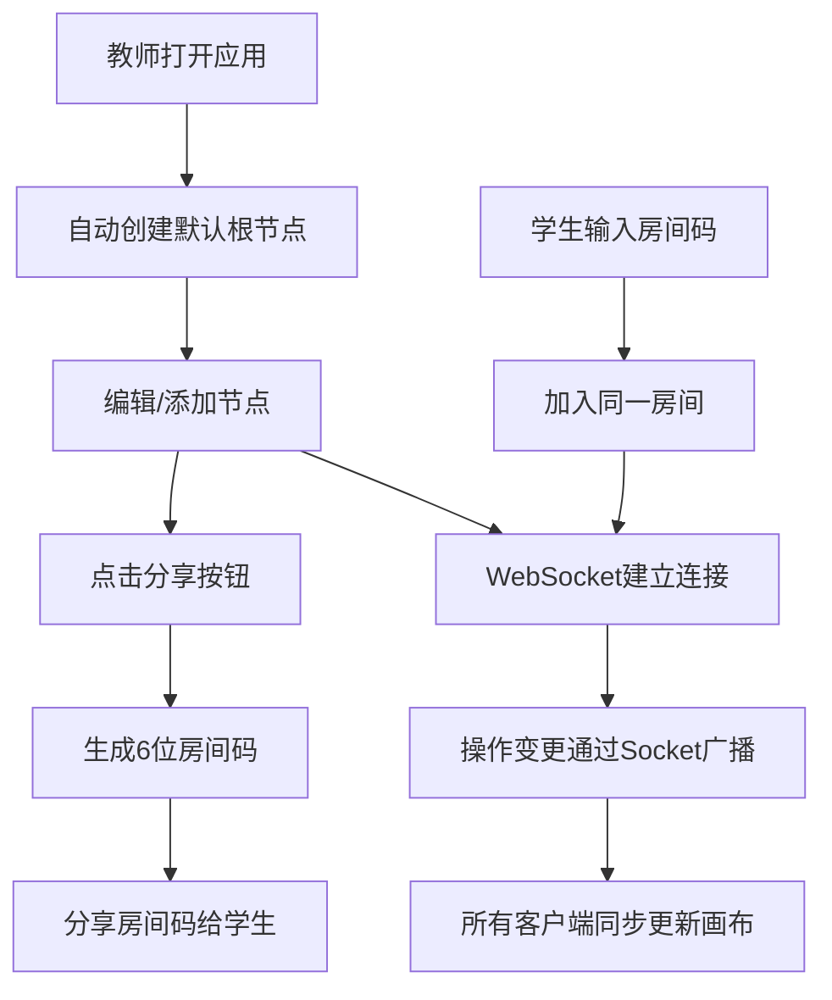

## 1. 产品概述

智图工坊是一款面向在线教育场景的互动式思维导图协作平台，旨在为课程教师和学生提供直观的教学辅助工具。教师可创建思维导图，学生在导图上进行协作编辑和实时批注，有效提升课堂参与度和学习效果。

- 核心价值：通过可视化思维结构与实时协作，降低师生沟通成本，增强课堂互动性
- 目标用户：K12及高等教育教师、学生，企业培训师与参训人员

## 2. 核心功能

### 2.1 用户角色

| 角色 | 注册方式 | 核心权限 |
|------|----------|----------|
| 教师（创建者） | 无需登录，创建房间即可 | 创建思维导图、生成房间码、所有编辑权限 |
| 学生（协作者） | 输入房间码加入 | 编辑节点、添加批注、撤销重做操作 |

### 2.2 功能模块

1. **主画布页**：思维导图渲染、节点编辑、拖拽缩放、协作同步
2. **侧边大纲栏**：节点树形列表、快速定位选中、缩进展示层级
3. **节点编辑面板**：颜色/形状/字号调整、子节点添加与删除
4. **顶部导航栏**：品牌标识、分享房间、用户状态

### 2.3 页面详情

| 页面名称 | 模块名称 | 功能描述 |
|-----------|-------------|---------------------|
| 主画布页 | 画布渲染区 | 使用react-d3-tree渲染贝塞尔曲线连接的节点树，支持拖拽平移、滚轮缩放（0.5x-2.0x）、双击编辑、Tab添加子节点 |
| 主画布页 | 节点交互 | 拖拽移动节点（带动画过渡0.3s ease-out）、选中高亮（2px深30%主色边框）、添加/删除弹性缩放动画（cubic-bezier 0.34,1.56,0.64,1） |
| 侧边大纲栏 | 节点树列表 | 240px宽灰底，缩进展示所有节点文本，点击选中并居中画布对应节点 |
| 节点编辑面板 | 属性编辑器 | 320px白底带阴影面板，8色调色板、形状切换（圆角矩形/圆形/菱形）、字号调节、添加/删除节点按钮 |
| 顶部导航栏 | 操作区 | 48px紫色渐变背景，品牌Logo、分享按钮（生成6位房间码）、用户头像 |

## 3. 核心流程

教师创建思维导图后点击分享按钮生成6位房间码，将房间码分享给学生；学生在加入弹窗输入房间码后进入同一画布；所有协作者对节点的增删改、移动、颜色修改、撤销操作均通过WebSocket实时广播至房间内所有客户端，各客户端在200ms内完成画布同步更新与动画过渡。

## 4. 用户界面设计

### 4.1 设计风格
- **主色调**：紫色渐变 `linear-gradient(135deg, #667eea, #764ba2)`
- **辅助色**：米白 `#FAFAFA`、浅灰 `#F5F5F5`、白色 `#FFFFFF`
- **节点色板**（8色）：`#FF6B6B, #4FC3F7, #81C784, #FFD54F, #CE93D8, #FF8A65, #A5D6A7, #90CAF9`
- **连接线条**：默认 `#BDBDBD` 2px，选中时变主色 `#667eea` 加粗至3px
- **字体**：Inter 400/600，品牌Logo为600粗体白字
- **按钮/面板**：左侧面板圆角8px，节点为圆角矩形（圆角8px），右侧面板左圆角8px配阴影 `-4px 0 12px rgba(0,0,0,0.06)`

### 4.2 页面设计概览

| 页面名称 | 模块名称 | UI元素 |
|-----------|-------------|-------------|
| 主画布页 | 三栏布局 | 左240px大纲 + 中央自适应画布 + 右320px编辑面板 + 顶部48px导航 |
| 主画布页 | 节点样式 | 圆角矩形8px，8色填充，选中外圈2px深30%描边，文本水平居中 |
| 主画布页 | 动画效果 | 新增节点 scale(0.8)→scale(1) 弹性动画0.3s，位置移动0.3s ease-out，撤销渐变0.2s |
| 主画布页 | 画布交互 | 滚轮缩放0.2s平滑过渡，右键拖拽平移，双击节点进入文本编辑（Ctrl+Enter确认） |
| 响应式页面 | 移动端适配 | <768px时侧边栏和编辑面板折叠为可拖动浮层，由左下/右下浮动按钮触发 |

### 4.3 响应式

桌面端优先（>768px）三栏并列布局；屏幕宽度小于768px时，左侧大纲栏和右侧编辑面板默认隐藏，通过屏幕左下和右下的浮动按钮触发弹出为可拖拽浮层面板，画布区域占满全屏。触摸拖拽、捏合缩放均做优化。

## 5. 性能与约束

- **节点规模**：200节点时拖拽和缩放帧率稳定≥30fps
- **同步延迟**：同一局域网内WebSocket消息广播延迟≤100ms，客户端画布更新≤200ms
- **撤销栈**：最多保存50步操作快照，每步为节点与连线数据的深拷贝
- **键盘快捷键**：Tab添加子节点，Ctrl+Z撤销，Ctrl+Shift+Z重做，Ctrl+Enter确认编辑
