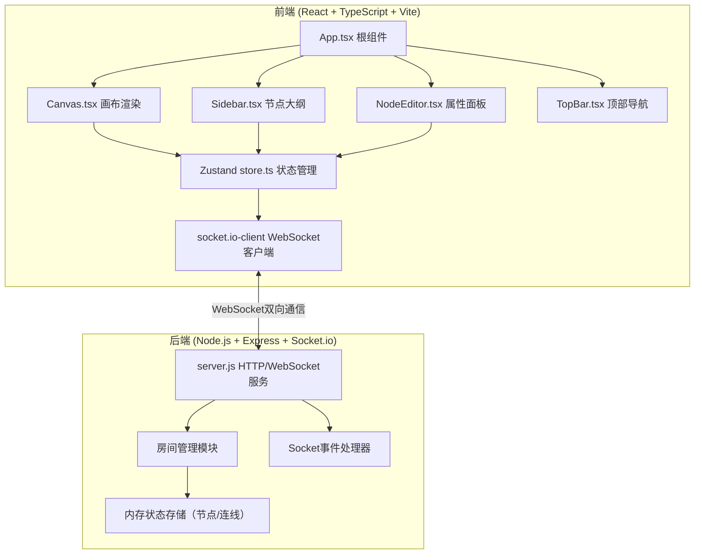
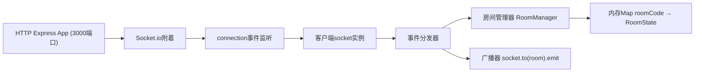

## 1. 架构设计



**数据流向说明**：
1. 用户在前端执行操作（添加/删除/移动/编辑节点）→ 触发store.ts中的action
2. Store更新本地状态并生成历史快照 → 通过socket.io-client发送对应事件到后端
3. 后端server.js接收事件，更新房间内存状态，调用socket.to(room).emit广播给房间内其他客户端
4. 其他客户端的Socket监听器接收变更，调用store的merge/replace方法合并远端状态，触发Canvas重绘

## 2. 技术选型说明

| 层级 | 技术栈 | 版本/说明 |
|------|--------|-----------|
| 前端框架 | React 18 + TypeScript | JSX使用react-jsx模式，严格模式，target ES2020 |
| 构建工具 | Vite 5.x + @vitejs/plugin-react | 配置/api和WebSocket代理到后端3000端口 |
| 状态管理 | Zustand 4.x | 集中管理节点、选中状态、连线、撤销历史栈 |
| 思维导图渲染 | react-d3-tree 3.x | 基于D3的树状图，支持贝塞尔曲线连线与自定义节点 |
| 实时通信 | socket.io-client 4.x | 与后端Socket.io服务双向通信 |
| 后端框架 | Express 4.x | 提供静态文件服务与API基础框架 |
| 实时服务 | Socket.io 4.x | 房间机制、事件广播、断线重连 |
| 工具库 | uuid 9.x、cors 2.x、concurrently 8.x | ID生成、跨域处理、前后端并发启动 |

## 3. 目录结构与模块职责

```
auto245/
├── package.json              # 前后端统一依赖与dev脚本
├── vite.config.js            # Vite + React + 代理配置
├── tsconfig.json             # TypeScript严格模式配置
├── index.html                # 应用入口，Inter字体引入
├── server.js                 # Express + Socket.io后端服务
└── src/
    ├── main.tsx              # React入口
    ├── App.tsx               # 根组件：布局组装、store初始化
    ├── store.ts              # Zustand store：节点/连线/历史/操作方法
    ├── Canvas.tsx            # 画布：react-d3-tree渲染、拖拽、缩放、平移
    ├── Sidebar.tsx           # 左侧节点大纲树列表
    ├── NodeEditor.tsx        # 右侧节点属性编辑面板
    ├── TopBar.tsx            # 顶部导航栏：品牌Logo、分享按钮
    ├── ShareModal.tsx        # 房间码生成/加入弹窗
    └── types.ts              # 共享TypeScript类型定义
```

**模块调用关系**：
- `App.tsx` → 组合 `TopBar` + `Sidebar` + `Canvas` + `NodeEditor` + `ShareModal`，注入store
- `store.ts` → 被所有组件订阅，内部通过 `socket` 单例与 `server.js` 通信
- `Canvas.tsx` → 订阅store节点数据并渲染，用户交互触发store action
- `NodeEditor.tsx` → 订阅store.selectedNode，提交修改到store
- `Sidebar.tsx` → 订阅store.nodes，点击节点触发store.selectNode和Canvas居中
- `TopBar.tsx` → 调用store生成/加入房间，显示ShareModal

## 4. WebSocket事件协议

| 事件名 | 方向 | 载荷类型 | 说明 |
|--------|------|----------|------|
| `join-room` | C→S | `{ roomCode: string, clientId: string }` | 客户端加入指定房间 |
| `room-joined` | S→C | `{ nodes: MindNode[], connections: Connection[] }` | 服务端返回房间当前全量状态 |
| `node-added` | C→S / S→C | `{ roomCode: string, node: MindNode, parentId: string }` | 新增节点 |
| `node-updated` | C→S / S→C | `{ roomCode: string, nodeId: string, changes: Partial<MindNode> }` | 节点属性/位置/文本更新 |
| `node-deleted` | C→S / S→C | `{ roomCode: string, nodeId: string }` | 删除节点（级联删除子节点） |
| `undo-performed` | C→S / S→C | `{ roomCode: string, snapshot: { nodes, connections } }` | 撤销操作快照广播 |
| `redo-performed` | C→S / S→C | `{ roomCode: string, snapshot: { nodes, connections } }` | 重做操作快照广播 |
| `client-presence` | S→C | `{ clientId: string, cursor?: {x,y}, color: string }` | 可选的协作光标状态（预留） |

## 5. 核心数据模型

### 5.1 类型定义（src/types.ts）

```typescript
export type NodeShape = 'rounded-rect' | 'circle' | 'diamond';

export interface MindNode {
  id: string;
  text: string;
  parentId: string | null;
  x: number;
  y: number;
  color: string;
  shape: NodeShape;
  fontSize: number;
  createdAt: number;
  updatedAt: number;
}

export interface Connection {
  id: string;
  from: string;      // 父节点ID
  to: string;        // 子节点ID
}

export interface HistorySnapshot {
  nodes: MindNode[];
  connections: Connection[];
  timestamp: number;
}

export interface RoomState {
  roomCode: string;
  nodes: MindNode[];
  connections: Connection[];
  clients: string[];
}
```

### 5.2 Zustand Store（src/store.ts）核心接口

```typescript
interface MindStore {
  // 状态
  nodes: MindNode[];
  connections: Connection[];
  selectedNodeId: string | null;
  undoStack: HistorySnapshot[];   // 最多50条
  redoStack: HistorySnapshot[];
  roomCode: string | null;
  clientId: string;
  socket: typeof io | null;

  // 操作
  addNode: (parentId: string, text?: string) => void;
  updateNode: (id: string, changes: Partial<MindNode>) => void;
  deleteNode: (id: string) => void;
  moveNode: (id: string, x: number, y: number) => void;
  selectNode: (id: string | null) => void;
  undo: () => void;
  redo: () => void;
  createRoom: () => string;
  joinRoom: (code: string) => void;
  pushHistory: () => void;  // 内部方法：操作前压栈
}
```

## 6. 后端服务架构



`server.js` 核心模块：
- **房间管理**：`rooms = new Map<string, RoomState>()`，支持create/join/getState/update/cleanup
- **事件处理器**：注册上述7类业务事件，校验房间权限后更新内存状态并广播
- **ID生成**：房间码使用 `crypto.randomBytes` 生成6位大写字母数字组合；节点ID使用 `uuid.v4`

## 7. 性能优化策略

1. **节点渲染虚拟化**：200节点场景下使用Canvas分层渲染连线，DOM只渲染视口内节点（可结合`react-window`思想）
2. **批量状态更新**：WebSocket合并50ms内连续变更为一次广播，减少消息数量
3. **动画优化**：使用CSS transform/opacity做节点过渡，避免layout thrash
4. **深拷贝优化**：历史快照采用结构化克隆 `structuredClone`，节点大时可采用Immer浅拷贝策略
5. **节流防抖**：拖拽移动30fps节流，缩放操作16ms防抖
