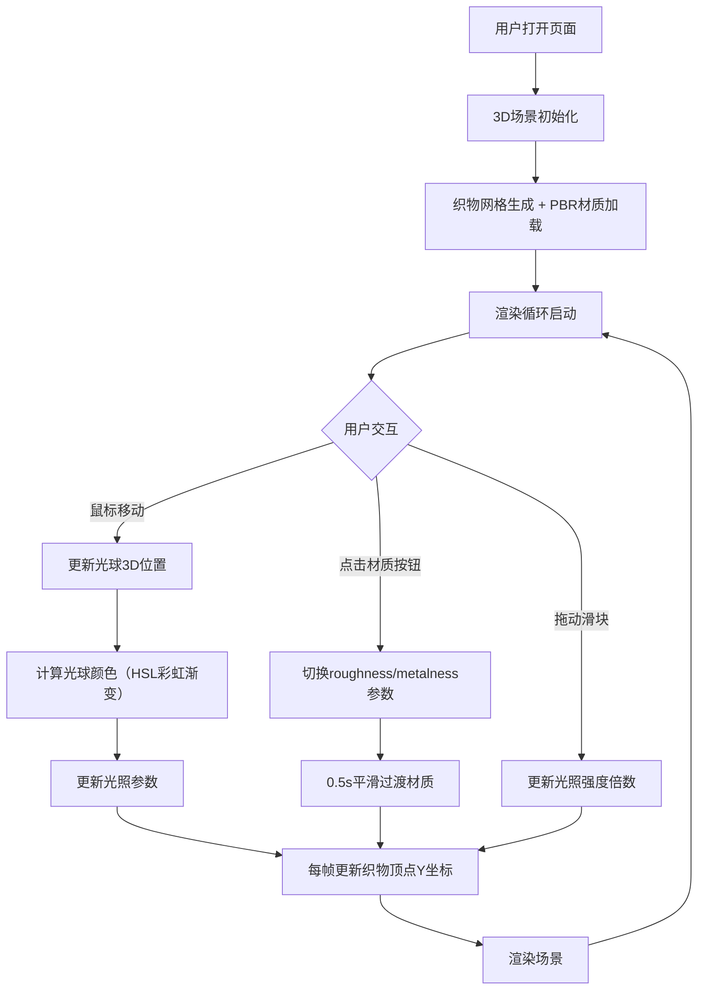

## 1. 产品概述

光影织毯是一个基于WebGL的3D交互艺术装置，模拟彩色光线投射到起伏织物表面的视觉效果。用户通过鼠标交互控制光线的方向与颜色，切换不同织物材质，沉浸式体验光与织物交织的美学。

- 核心价值：提供沉浸式的光与材质交互体验，展现物理渲染的视觉魅力
- 目标用户：设计师、艺术爱好者、对3D图形学感兴趣的开发者

## 2. 核心特性

### 2.1 用户角色
| 角色 | 登录方式 | 核心权限 |
|------|----------|----------|
| 访客用户 | 无需登录 | 体验全部交互功能、切换材质、调节光照 |

### 2.2 功能模块
1. **3D主场景**：透视视角的3D空间、悬浮织物网格、环境光照
2. **动态织物系统**：正弦波叠加的布料起伏动画、PBR材质渲染
3. **交互式光球**：鼠标跟随定位、彩虹色渐变、拖尾延迟效果
4. **控制面板**：材质切换按钮、光照强度调节滑块

### 2.3 页面详情
| 页面名称 | 模块名称 | 功能描述 |
|----------|----------|----------|
| 主页面 | 3D场景渲染 | 2x2米织物网格（64x64细分）、灰白色背景、PBR材质 |
| 主页面 | 织物动画系统 | 4个正弦波叠加、振幅0.02-0.08、主频0.5Hz、模拟微风效果 |
| 主页面 | 光球交互系统 | 鼠标映射到3D空间、直径0.15m光球、Y轴固定2.0m、HSL彩虹渐变 |
| 主页面 | 控制面板 | 毛玻璃效果面板、三种材质切换、光照强度滑块0.5-2.0倍 |

## 3. 核心流程

## 4. 用户界面设计

### 4.1 设计风格
- **主色调**：柔和灰白背景(#ECECEC)、织物默认色(#D4C5A9)、UI主色(#6C63FF)
- **辅助色**：中性灰(#333、#999)、材质选色（丝绸#F5DEB3、亚麻#C4A882、羊毛#E8E0D8）
- **按钮风格**：圆角6px，44x36px，选中时背景为材质配色
- **面板风格**：毛玻璃效果 rgba(255,255,255,0.15)，圆角12px，柔和阴影 0 4px 12px rgba(0,0,0,0.1)
- **字体**：无衬线字体 'Segoe UI', sans-serif
- **滑块**：宽度160px，滑块头直径16px，主题色#6C63FF

### 4.2 页面设计概览
| 页面名称 | 模块名称 | UI元素 |
|----------|----------|--------|
| 主页面 | 3D画布区域 | 全屏Canvas、透视相机、织物居中、光球悬浮 |
| 主页面 | 控制面板（左上） | 毛玻璃面板容器、三个材质按钮、光照强度滑块 + 数值标签 |

### 4.3 响应式设计
- Desktop优先设计，画布自适应窗口尺寸
- 控制面板固定定位，不随画布缩放影响
- 鼠标交互仅适用于桌面端，移动端预留触屏映射逻辑

### 4.4 3D场景指导
- **环境与氛围**：柔和灰白色背景，均匀环境光，营造干净的艺术空间感
- **光照设置**：环境光(0.5强度) + 方向光(0.3强度) + 交互式点光源（光球），点光源带漫反射和镜面高光
- **相机设置**：PerspectiveCamera，fov 50°，位置(0, 1.5, 3.5)，看向场景原点，轻微俯视角
- **构图与焦点**：织物位于画面中心，光球在织物上方悬浮形成视觉三角
- **交互与动画**：
  - 织物每帧更新顶点产生连续波动（4个正弦波叠加）
  - 光球位置带0.1s lerp延迟产生拖尾感
  - 材质参数切换带0.5s平滑插值
- **后处理效果**：可考虑Bloom发光效果增强光球视觉（如性能允许）
- **性能预算**：64x64细分目标60FPS，128x128细分不低于30FPS
