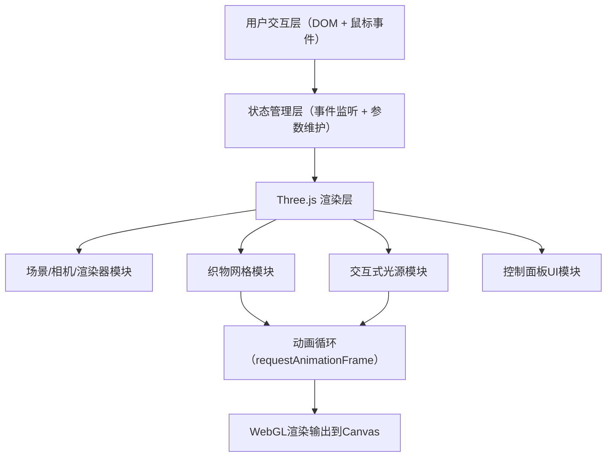

## 1. 架构设计



## 2. 技术说明

- **前端框架**：TypeScript + Three.js（原生，不使用React），保持轻量以确保性能
- **构建工具**：Vite（原生TS支持，HMR热更新）
- **3D渲染库**：three@0.160+，@types/three类型定义
- **无后端**：纯前端单页应用，无服务器依赖

## 3. 项目文件结构
| 文件路径 | 用途 |
|----------|------|
| `/package.json` | 依赖声明：three, @types/three, typescript, vite；启动脚本 npm run dev |
| `/vite.config.js` | Vite基础配置，无插件 |
| `/tsconfig.json` | TypeScript严格模式，target ES2020 |
| `/index.html` | 入口HTML，包含div#canvas-container全屏容器，背景#ECECEC |
| `/src/main.ts` | 主入口，统一初始化、组合模块、动画循环、事件监听、状态同步 |

> 注：用户明确要求代码分为5个文件，所有逻辑集中在src/main.ts中，不再额外拆分模块文件。

## 4. 核心数据结构与算法

### 4.1 织物顶点动画
```
对于每个顶点 (x, z)：
y = Σ Aᵢ · sin(ωᵢ·t + kᵢₓ·x + kᵢ_z·z + φᵢ)  (i = 1..4)
其中：
  Aᵢ ∈ [0.02, 0.08] — 振幅
  ω₁ = 2π·0.5       — 主频0.5Hz
  ω₂ = 2π·0.8       — 次频
  ω₃ = 2π·1.2       — 三次频
  ω₄ = 2π·1.7       — 四次频
  kᵢₓ, kᵢ_z         — 各波传播方向
  φᵢ                — 初始相位偏移
```

### 4.2 HSL彩虹渐变插值
```
移动距离比例 t = clamp(总位移 / 对角线长度, 0, 1)
色相 H = lerp(0°, 360°, t)  （红→橙→黄→绿→蓝→紫）
饱和度 S = 85%
亮度 L = lerp(96%, 65%, t)  （中心偏白→边缘饱满）
光球颜色 = HSL(H, S, L) → #RGB
```

### 4.3 平滑跟随（延迟拖尾）
```
每帧更新：
  currentPos.lerp(targetPos, 1 - exp(-dt / τ))
  τ = 0.1s  — 时间常数
  dt = 帧间隔时间
```

### 4.4 材质参数平滑过渡
```
切换材质时：
  targetRoughness = 新材质roughness
  targetMetalness = 新材质metalness
  每帧插值（0.5s过渡）：
    current.lerp(target, 1 - exp(-dt / 0.5))
```

### 4.5 织物材质预设
| 材质 | roughness | metalness | 选中色 |
|------|-----------|-----------|--------|
| 丝绸 | 0.25 | 0.35 | #F5DEB3 |
| 亚麻 | 0.85 | 0.0 | #C4A882 |
| 羊毛 | 0.95 | 0.0 | #E8E0D8 |

## 5. 性能优化策略

1. **顶点动画在JS侧计算后批量更新**：使用BufferGeometry，每帧仅修改position属性的Y分量，调用`needsUpdate = true`一次
2. **数学计算预分配**：避免每帧创建新的Vector3/Color对象，复用预分配的临时变量
3. **材质属性复用**：使用Three.js内置的材质uniform插值，避免频繁创建新材质
4. **光照限制**：场景中仅保留1个点光源（光球）+ 2个低强度环境/方向光，减少着色器计算量
5. **像素比限制**：`renderer.setPixelRatio(Math.min(window.devicePixelRatio, 2))`避免高DPI设备过度渲染
6. **尺寸监听节流**：window resize使用RAF节流防抖
