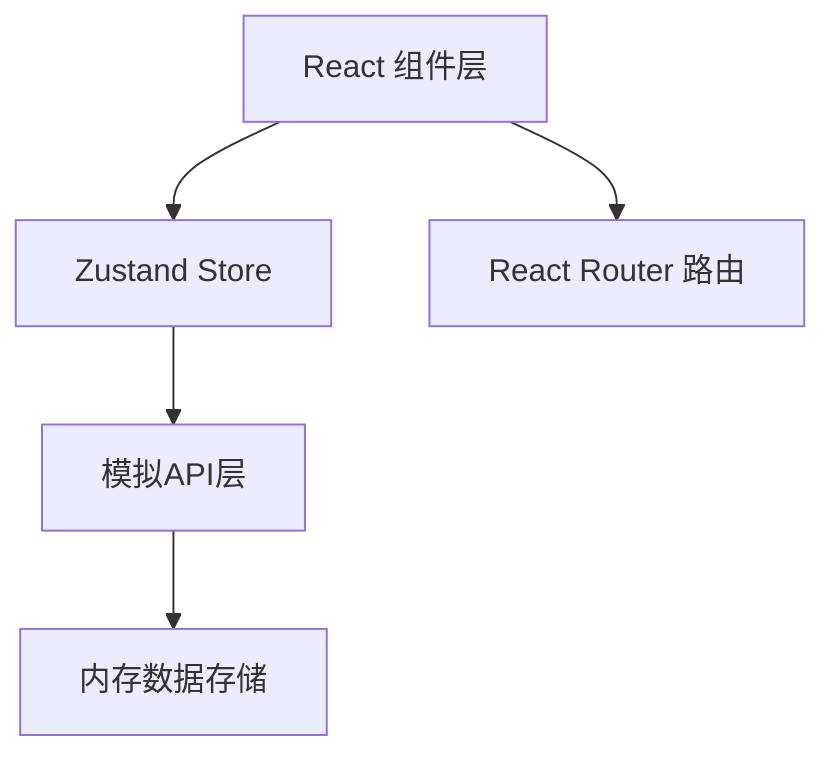

## 1. 架构设计



## 2. 技术说明

- 前端：React@18 + TypeScript@5 + Vite@5
- 状态管理：Zustand
- 路由：React Router DOM
- 工具库：uuid
- 构建工具：Vite
- 数据：模拟API，内存数组存储

## 3. 路由定义
| 路由 | 用途 |
|-----|------|
| / | 首页，食谱时间线卡片网格 |
| /recipe/:id | 食谱详情页 |
| /create | 食谱发布页 |

## 4. 数据模型

### 4.1 食谱 Recipe
```typescript
interface Recipe {
  id: string;
  name: string;
  author: string;
  rating: number;
  imageUrl: string;
  ingredients: string[];
  steps: string[];
  createdAt: Date;
  comments: Comment[];
}
```

### 4.2 评论 Comment
```typescript
interface Comment {
  id: string;
  recipeId: string;
  user: string;
  avatar: string;
  content: string;
  createdAt: Date;
  likes: number;
  liked: boolean;
  replies: Comment[];
}
```

## 5. 文件结构
```
src/
├── api/
│   └── recipes.ts          # 模拟API模块
├── store/
│   └── recipeStore.ts      # Zustand状态管理
├── components/
│   ├── recipeCard.tsx      # 食谱卡片组件
│   └── commentSection.tsx  # 评论区组件
├── pages/
│   ├── homePage.tsx        # 首页
│   ├── detailPage.tsx      # 详情页
│   └── createPage.tsx      # 发布页
├── app.tsx                 # 根组件
└── main.tsx                # 入口
```
