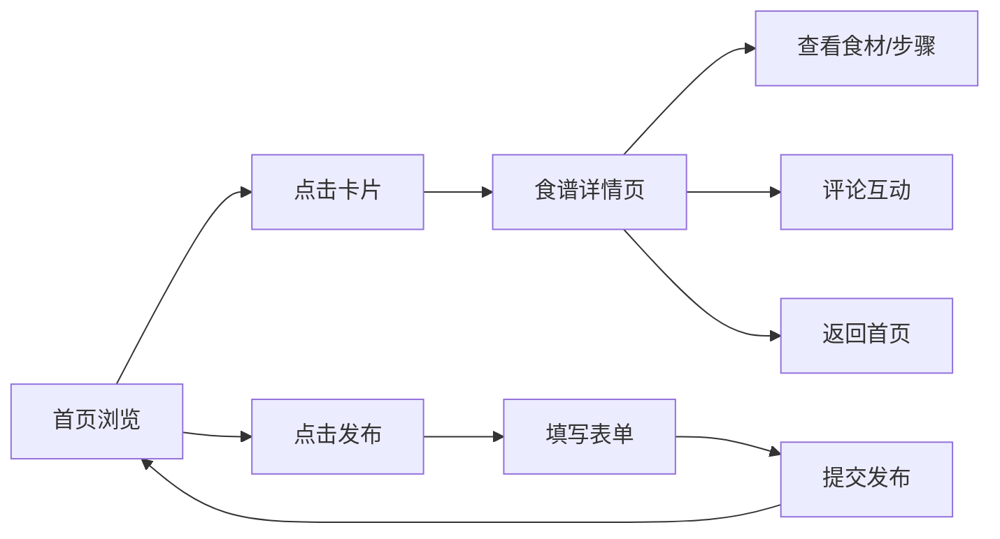

## 1. 产品概述

巷陌食单是一个社区食谱交换平台，让用户浏览、发布和搜索家常菜谱。平台以温暖复古的色调营造家的氛围，通过时间线卡片形式呈现每道食谱，支持食谱详情浏览、评论互动和新食谱发布。

- 核心价值：打造家常菜谱分享社区，连接热爱烹饪的用户
- 目标用户：家庭主妇、烹饪爱好者、美食探索者

## 2. 核心功能

### 2.1 功能模块
1. **首页**：食谱时间线卡片网格、搜索筛选、导航栏
2. **食谱详情页**：食材清单、分步指导、评论区互动
3. **食谱发布页**：表单校验、图片上传预览、食谱创建

### 2.2 页面详情
| 页面名称 | 模块名称 | 功能描述 |
|---------|---------|---------|
| 首页 | 导航栏 | 网站名称、搜索框、发布按钮 |
| 首页 | 卡片网格 | 自适应CSS Grid布局，食谱卡片3:2比例 |
| 首页 | 食谱卡片 | 缩略图、标题、评分星星、作者头像、发布时间 |
| 详情页 | 返回导航 | 圆形返回按钮 |
| 详情页 | 菜谱内容 | 大图、食材列表、分步指导 |
| 详情页 | 评论区 | 评论列表、点赞、回复 |
| 发布页 | 表单 | 名称、食材、步骤、图片上传 |
| 发布页 | 校验 | 必填校验、长度校验、图片格式大小校验 |

## 3. 核心流程

用户访问首页浏览食谱卡片 → 点击卡片进入详情页查看完整内容 → 在评论区互动或返回首页 → 点击发布按钮创建新食谱 → 填写表单并上传图片 → 提交后返回首页查看新发布的食谱

## 4. 用户界面设计

### 4.1 设计风格
- 主色调：胭脂红 #C0392B
- 辅色调：深褐 #2C1810
- 背景色：米白 #FBF8F0
- 文字色：深棕 #3E2F20
- 按钮风格：圆角8-16px，悬停过渡动画
- 布局风格：卡片式布局、顶部固定导航栏
- 动画：悬停阴影、渐入动画、点击反馈

### 4.2 页面设计概述
| 页面名称 | 模块名称 | UI元素 |
|---------|---------|-------|
| 首页 | 导航栏 | 深褐背景、胭脂红发布按钮、搜索框 |
| 首页 | 卡片网格 | 白色卡片、圆角16px、柔和阴影、悬停上浮 |
| 详情页 | 内容区 | 大图、编号步骤、圆点食材列表 |
| 详情页 | 评论区 | 米色背景、聊天气泡、心形点赞 |
| 发布页 | 表单区 | 圆角输入框、虚线上传区、全宽提交按钮 |

### 4.3 响应式
- Desktop-first设计，移动端自适应
- 卡片网格：>=1200px 4列，>=768px 3列，>=480px 2列，<480px 1列
- 详情页：>=768px左右布局，<768px上下布局
- 触摸友好，点击反馈动画
