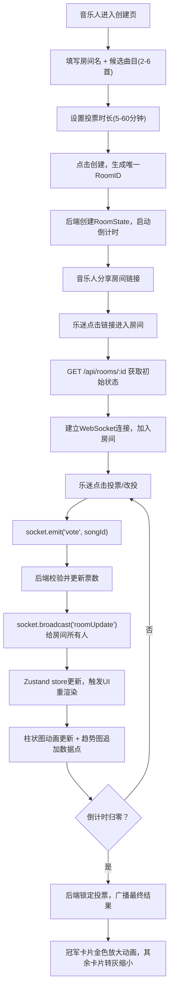

## 1. 产品概述

声浪决选是一个面向独立音乐人社区的实时互动投票平台。乐迷能够半匿名地留言、投票决定音乐人下一首翻唱曲目，音乐人可实时看到热度变化并控制投票开关。

- 主要用途：为独立音乐人提供与粉丝互动的投票工具，让粉丝参与决定翻唱曲目
- 解决问题：传统投票方式缺乏实时性、互动性弱、结果展示枯燥
- 目标用户：独立音乐人及其粉丝群体
- 产品价值：增强音乐人-粉丝互动粘性，提升社区活跃度，创造独特的粉丝参与感

## 2. 核心功能

### 2.1 用户角色

| 角色 | 进入方式 | 核心权限 |
|------|----------|----------|
| 音乐人 | 创建房间时作为房间所有者 | 创建/关闭投票房间、查看实时热度、开启/关闭投票 |
| 乐迷 | 通过房间链接进入 | 浏览候选曲目、投票（每人1票，可改投）、查看实时结果和热度趋势 |

### 2.2 功能模块

1. **创建投票房间页**：房间信息填写、候选曲目管理（2-6首）、时长设置、房间创建与链接分享
2. **投票房间页**：房间信息展示、倒计时、投票卡列表、实时票数柱状图、热度趋势折线图、结果解锁动画
3. **WebSocket实时通信层**：投票事件广播、房间状态同步、倒计时同步

### 2.3 页面详情

| 页面名称 | 模块名称 | 功能描述 |
|----------|----------|----------|
| 创建投票房间页 | 房间名称输入 | 音乐人输入投票房间名称，显示字符限制 |
| 创建投票房间页 | 候选曲目列表 | 动态添加/删除候选曲目，限制2-6首，每首必填曲名 |
| 创建投票房间页 | 时长选择器 | 滑块或数字输入选择5-60分钟投票时长 |
| 创建投票房间页 | 创建按钮 | 校验表单后创建房间，生成唯一ID并展示分享链接 |
| 投票房间页 | 房间头部 | 显示房间名称、创建者标识、倒计时数字（mm:ss格式） |
| 投票房间页 | 投票卡列表 | 网格布局展示所有候选曲目卡片，显示曲名、票数、柱状图、投票按钮 |
| 投票房间页 | 单张投票卡 | 点击投票/改投，柱状图0.3s动画更新，投票状态高亮 |
| 投票房间页 | 热度趋势图 | Canvas绘制折线图，每分钟采集数据点，多曲目不同颜色区分 |
| 投票房间页 | 结果解锁区 | 倒计时结束后，冠军卡片放大变金色，其余卡片转灰缩小 |

## 3. 核心流程

音乐人在创建页填写房间信息和候选曲目，提交后生成房间链接并分享给乐迷。乐迷通过链接进入房间，实时浏览曲目并投票。WebSocket将投票事件广播给所有在线用户，UI实时更新票数、柱状图和趋势图。倒计时归零后自动锁定投票，展示最终结果动画。

## 4. 用户界面设计

### 4.1 设计风格

- **主色调**：深色渐变背景（#1A1A2E → #16213E径向渐变），营造沉浸音乐氛围
- **强调色**：渐变紫蓝按钮（#6C63FF → #4834D4），金色冠军高亮（#FFD700）
- **状态色**：倒计时>60%绿色#2ECC71，60%~30%黄色#F1C40F，<30%红色#E74C3C
- **卡片风格**：圆角16px毛玻璃效果，背景rgba(255,255,255,0.08)，backdrop-filter: blur(12px)
- **按钮风格**：渐变紫蓝圆角按钮，hover时translateY(-3px) + 加深阴影，0.2s过渡
- **字体**：标题用现代无衬线字体，倒计时数字用等宽字体monospace加粗
- **动效**：柱状图宽度0.3s过渡，冠军卡片0.5s放大变金，倒计时0.5s脉冲缩放

### 4.2 页面设计概览

| 页面名称 | 模块名称 | UI元素细节 |
|----------|----------|------------|
| 创建房间页 | 表单区域 | 居中卡片布局，输入框下划线动画，曲目列表可拖拽排序感 |
| 创建房间页 | 曲目条目 | 每首曲目左侧序号圆点，右侧删除按钮，添加按钮带+号悬浮动效 |
| 创建房间页 | 时长滑块 | 自定义滑块轨道渐变，滑块圆形带光晕 |
| 创建房间页 | 创建成功弹窗 | 链接卡片带一键复制按钮，二维码占位图标 |
| 投票房间页 | 头部区域 | 房间名大号白色，倒计时独立框monospace数字+脉冲动画，时间条背景 |
| 投票房间页 | 投票卡网格 | 桌面端2~3列网格，卡片hover轻微上浮，边框微透明发光 |
| 投票房间页 | 投票卡内部 | 曲名居上，票数数字+柱状图（高度动画）在中，投票按钮在底 |
| 投票房间页 | 柱状图 | 背景深色条，前景渐变条（#6C63FF→#4834D4），0.3s宽度transition |
| 投票房间页 | 热度趋势图 | 圆角12px半透明白色背景，Canvas折线带平滑过渡，图例圆点对应颜色 |
| 投票房间页 | 冠军解锁动画 | 卡片scale(1.2)，背景从原色渐变到#FFD700，0.5s ease-out，撒金粉效果 |
| 投票房间页 | 落败卡片 | scale(0.8)，grayscale(100%)，opacity(0.6)，0.5s过渡 |

### 4.3 响应式设计

- **桌面端**（≥1024px）：3列投票卡网格，趋势图宽度占满容器，左右内边距统一
- **平板端**（768px~1023px）：2列投票卡网格
- **移动端**（<768px）：单列纵向布局，每卡占满宽度，柱状图改为水平条形在卡片内横向延伸，头部倒计时缩小字号
- **触摸优化**：按钮最小点击区域48×48px，投票按钮增加底部padding防误触

### 4.4 动效规范

- **入场动画**：页面加载时卡片依次staggered fade-in + translateY(20px)，每张延迟50ms
- **投票反馈**：点击投票按钮瞬间scale(0.95)→scale(1)回弹，柱状图宽度0.3s cubic-bezier(0.4,0,0.2,1)
- **倒计时脉冲**：每整秒触发一次scale(1→1.1→1)，0.5s ease-in-out
- **趋势图过渡**：新数据点追加时，整条折线通过requestAnimationFrame在0.3s内平滑过渡
- **结果动画**：倒计时最后10s开始背景呼吸光效，归零瞬间全屏闪光→冠军卡片放大高亮
