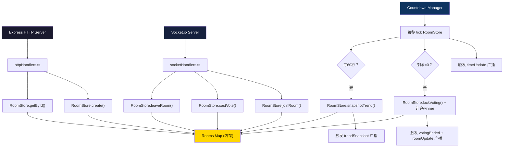

## 1. 架构设计

```mermaid
flowchart LR
    subgraph 前端层
        A["React 18 + TypeScript"]
        B["Zustand 状态管理"]
        C["Socket.io-client"]
        D["Canvas 2D 折线图"]
        E["Vite 构建工具"]
    end

    subgraph 通信层
        F["WebSocket (Socket.io)"]
        G["HTTP REST /api/*"]
    end

    subgraph 后端层
        H["Node.js + Express 4"]
        I["Socket.io Server"]
        J["内存状态存储 (Rooms Map)"]
        K["UUID 房间ID生成"]
        L["定时器管理 (倒计时)"]
    end

    A --> B
    A --> D
    B --> C
    C --> F
    E --> A

    F --> I
    G --> H
    H --> J
    I --> J
    I --> L
    J --> K
    L --> J

    style 前端层 fill:#1A1A2E,stroke:#6C63FF,stroke-width:2px
    style 通信层 fill:#16213E,stroke:#4834D4,stroke-width:2px
    style 后端层 fill:#0F3460,stroke:#FFD700,stroke-width:2px
```



## 2. 技术选型说明

- **前端框架**：React@18 + TypeScript@5（严格模式），Vite@5 作为构建工具，@vitejs/plugin-react 提供JSX/HMR支持
- **状态管理**：Zustand@4，轻量级且支持选择器订阅，避免不必要的重渲染
- **实时通信**：Socket.io-client@4，自动重连、房间机制、事件广播成熟稳定
- **图表渲染**：原生 Canvas 2D API，无第三方图表库依赖，精确控制性能（FPS≤30）
- **样式方案**：原生 CSS Modules + CSS Variables，无Tailwind依赖，精确控制毛玻璃、渐变、动画
- **后端框架**：Express@4 + Socket.io@4，cors@2 跨域中间件，uuid@9 生成唯一房间ID
- **启动方式**：concurrently@8 并行启动前端Vite(dev server)和后端Node(ts-node)
- **路由**：HashRouter（react-router-dom@6），无需后端配置history fallback

## 3. 目录结构与文件职责

```
声浪决选/
├── package.json              # 前后端统一依赖和启动脚本
├── vite.config.js            # Vite配置，React插件，/api代理到3001
├── tsconfig.json             # TS严格模式配置
├── index.html                # 入口HTML，挂载#root，加载主组件
├── src/
│   ├── main.tsx              # React入口，渲染<App/>
│   ├── App.tsx               # 路由配置（HashRouter），页间切换
│   ├── types.ts              # 全局类型定义：SongOption/VoteEvent/RoomState
│   ├── socket/
│   │   └── index.ts          # Socket.io单例，连接/断开/事件监听封装
│   ├── store/
│   │   └── useVoteStore.ts   # Zustand store，管理roomState和用户投票状态
│   ├── hooks/
│   │   ├── useCountdown.ts   # 倒计时逻辑Hook，mm:ss格式化
│   │   └── useTrendData.ts   # 趋势图数据采集与平滑Hook
│   ├── components/
│   │   ├── CreateRoomForm.tsx  # 创建房间表单组件
│   │   ├── VoteCard.tsx        # 单首曲目投票卡片
│   │   ├── CountdownTimer.tsx  # 倒计时显示组件（脉冲+颜色）
│   │   ├── TrendChart.tsx      # Canvas热度趋势折线图
│   │   └── RoomLinkModal.tsx   # 房间链接分享弹窗
│   ├── pages/
│   │   ├── CreateRoomPage.tsx  # 创建房间页面
│   │   └── VoteRoomPage.tsx    # 投票房间主页面
│   └── styles/
│       ├── variables.css       # 全局CSS变量（颜色、圆角、阴影）
│       └── global.css          # 全局样式重置和基础布局
└── server/
    ├── index.ts              # Express+Socket.io服务端入口
    ├── types.ts              # 服务端类型（与前端共享可复用部分）
    ├── store/
    │   └── RoomStore.ts      # 房间内存存储：Rooms Map CRUD操作
    ├── handlers/
    │   ├── httpHandlers.ts   # REST端点：GET /api/rooms/:id, POST /api/rooms
    │   └── socketHandlers.ts # WS事件：joinRoom, vote, disconnect
    └── utils/
        └── countdown.ts      # 倒计时定时器管理，每秒广播剩余时间
```

**文件调用关系与数据流向**：

1. **初始化阶段**
   - `main.tsx` → `App.tsx` → 路由匹配 → `CreateRoomPage.tsx` 或 `VoteRoomPage.tsx`
   - `VoteRoomPage.tsx` 挂载 → `socket/index.ts` 建立连接 → `useVoteStore.ts` 注册监听
   - `VoteRoomPage.tsx` 首先 `GET /api/rooms/:id` 获取初始状态 → `useVoteStore.setState()`

2. **投票数据流**
   - 用户点击 `VoteCard.tsx` 按钮 → `socket.emit('vote', { roomId, songId, userId })`
   - 服务端 `socketHandlers.ts` 接收 → `RoomStore.ts` 更新票数 → `socket.broadcast('roomUpdate', roomState)`
   - 所有客户端 `socket/index.ts` 监听 → `useVoteStore.updateRoomState()` → 订阅组件重渲染
   - `VoteCard.tsx` 从store读取新票数 → CSS transition 0.3s 更新柱状图宽度

3. **趋势图数据流**
   - 服务端 `countdown.ts` 每60s触发 → `RoomStore.ts` 记录各曲目当前票数快照 → `socket.broadcast('trendSnapshot')`
   - 客户端 `useTrendData.ts` 接收 → 追加到数据数组 → `TrendChart.tsx` Canvas重绘（<30FPS）

4. **倒计时与结果流**
   - 服务端 `countdown.ts` 每秒tick → `socket.broadcast('timeUpdate', { remaining })`
   - 客户端 `useCountdown.ts` 接收 → `useVoteStore.setRemainingTime()` → `CountdownTimer.tsx` 刷新+脉冲
   - 倒计时归零 → `RoomStore.lockVoting()` → `socket.broadcast('votingEnded', winnerSongId)`
   - 客户端store标记votingLocked=true → `VoteCard.tsx` 禁用按钮 → 冠军卡片播放解锁动画

## 4. API 与 Socket 事件定义

### 4.1 REST API

| 方法 | 路径 | 请求体 | 响应 | 说明 |
|------|------|--------|------|------|
| POST | /api/rooms | `{ name: string, songs: string[], durationMinutes: number }` | `{ roomId: string, shareUrl: string }` | 创建新投票房间 |
| GET | /api/rooms/:id | - | `RoomState` (JSON) | 获取房间当前完整状态（首次进入用） |

### 4.2 WebSocket 事件

| 方向 | 事件名 | Payload | 说明 |
|------|--------|---------|------|
| Client→Server | `joinRoom` | `{ roomId: string, userId: string }` | 客户端加入指定房间 |
| Client→Server | `vote` | `{ roomId: string, songId: string, userId: string }` | 用户投票或改投 |
| Server→Client | `roomUpdate` | `RoomState` | 房间状态变更（投票/解锁）广播 |
| Server→Client | `timeUpdate` | `{ remainingSeconds: number }` | 每秒倒计时广播 |
| Server→Client | `trendSnapshot` | `{ timestamp: number, votes: { songId:string, count:number }[] }` | 每分钟趋势数据点 |
| Server→Client | `error` | `{ message: string }` | 业务错误提示 |

### 4.3 TypeScript 核心类型

```typescript
// src/types.ts
export interface SongOption {
  id: string;
  title: string;
  voteCount: number;
  color: string;
}

export interface VoteEvent {
  roomId: string;
  songId: string;
  userId: string;
  timestamp: number;
}

export interface RoomState {
  id: string;
  name: string;
  songs: SongOption[];
  durationSeconds: number;
  remainingSeconds: number;
  votingLocked: boolean;
  winnerSongId: string | null;
  createdAt: number;
  userVotes: Record<string, string>; // userId -> songId
  totalVoters: number;
}

export interface TrendDataPoint {
  timestamp: number;
  votes: Record<string, number>; // songId -> count at this point
}
```

## 5. 服务端内部架构



## 6. 数据模型（内存存储）

### 6.1 数据结构定义

```
Rooms Map (全局单例)
└── key: roomId (string, UUID v4)
    └── value: RoomState (同前端结构，增加内部字段)
        ├── _intervalTimer: NodeJS.Timeout  (倒计时句柄)
        ├── _snapshotCounter: number       (趋势快照计数)
        └── _io: SocketIO.Server           (引用，用于房间广播)
```

### 6.2 RoomStore 核心方法

| 方法 | 入参 | 返回 | 副作用 |
|------|------|------|--------|
| `create(name, songs, durationMin)` | 房间名、曲目数组、分钟数 | `RoomState` | 启动_countdownTimer，写入Rooms Map |
| `getById(roomId)` | roomId | `RoomState \| null` | 无 |
| `joinRoom(roomId, userId, socketId)` | 房间+用户+连接ID | `RoomState` | socket.join(roomId)，初始化userVotes条目 |
| `castVote(roomId, songId, userId)` | 投票三元组 | `{ updated: boolean, room: RoomState }` | 更新userVotes和song.voteCount，返回是否实际变更 |
| `lockVoting(roomId)` | roomId | `RoomState` | 设votingLocked=true，计算winnerSongId（票数最多，并列取首） |
| `snapshotTrend(roomId)` | roomId | `TrendDataPoint` | 记录此刻各曲目票数快照返回 |
| `cleanup(roomId)` | roomId | void | 清除定时器，从Rooms Map删除 |

## 7. 性能与约束实现要点

| 约束 | 实现方案 |
|------|----------|
| WebSocket广播延迟≤200ms | 后端直接内存操作+同步广播，禁用任何IO等待；`socket.to(room).emit()` 原生房间广播 |
| Canvas折线图重绘≤30FPS | `requestAnimationFrame` + `lastFrameTime` 节流，每帧间隔≥33ms；数据点变化时才触发重绘 |
| 前端包体积≤80KB（不含依赖） | 无图表库/UI库依赖，纯原生Canvas+CSS；Zustand(~1KB) + socket.io-client(~15KB) 为仅外部状态/通信库；Tree-shaking + Vite生产构建压缩 |
| 柱状图0.3s动画 | CSS `transition: width 0.3s cubic-bezier(0.4,0,0.2,1)`，JS只改width |
| 冠军卡片0.5s解锁动画 | CSS类切换触发：`.winner { transform: scale(1.2); background: linear-gradient(..., #FFD700); transition: all 0.5s ease-out; }` |
| 移动端响应式 | `@media (max-width: 767px)` 断点，grid改单列，柱状图由height变width（水平条形） |
| 每人1票可改投 | 后端 `userVotes[userId]` 记录当前投的songId，新vote时先从旧song.voteCount--再新song++，保证原子性 |

## 8. package.json 依赖清单（版本号固定主版本）

```json
{
  "dependencies": {
    "react": "^18.2.0",
    "react-dom": "^18.2.0",
    "react-router-dom": "^6.22.0",
    "socket.io-client": "^4.7.0",
    "zustand": "^4.5.0",
    "express": "^4.18.0",
    "socket.io": "^4.7.0",
    "uuid": "^9.0.0",
    "cors": "^2.8.5"
  },
  "devDependencies": {
    "typescript": "^5.3.0",
    "vite": "^5.1.0",
    "@vitejs/plugin-react": "^4.2.0",
    "@types/express": "^4.17.0",
    "@types/node": "^20.11.0",
    "@types/uuid": "^9.0.0",
    "@types/cors": "^2.8.0",
    "concurrently": "^8.2.0",
    "ts-node": "^10.9.0"
  },
  "scripts": {
    "dev": "concurrently \"npm run dev:front\" \"npm run dev:back\"",
    "dev:front": "vite",
    "dev:back": "ts-node server/index.ts",
    "build": "tsc && vite build",
    "check": "tsc --noEmit"
  }
}
```
