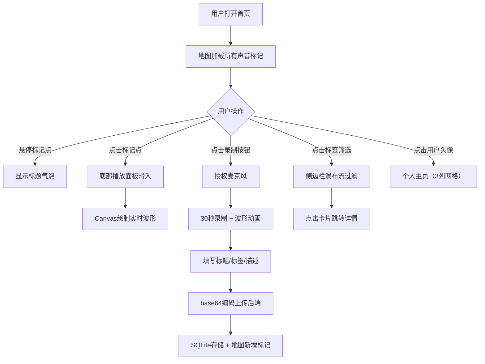

## 1. 产品概述
「声旅」是一款帮助旅行者记录和分享沿途环境声音的应用，解决旅行中雨声、街市叫卖、林间鸟鸣等声音难以被文字和照片完整传达的问题。用户可录制30秒声音片段并标注地理位置，以地图形式浏览全球旅行者分享的声音记忆。

- 核心价值：声音是比照片和文字更具沉浸感的旅行记忆载体，让听者身临其境
- 目标用户：热爱旅行、注重感官体验、乐于分享故事的中青年群体

## 2. 核心功能

### 2.1 用户角色
| 角色 | 注册方式 | 核心权限 |
|------|----------|----------|
| 普通用户 | 默认游客身份（无需注册） | 浏览声音、录制上传、点赞评论、查看个人主页 |

### 2.2 功能模块
1. **首页地图视图**：Leaflet瓦片地图、脉冲标记点、悬停气泡、底部播放面板
2. **声音录制**：麦克风录制（最长30秒）、实时波形动画、标题/标签/描述编辑
3. **标签筛选**：顶部胶囊标签栏、瀑布流声音卡片列表、排序功能
4. **互动功能**：点赞、评论、关注发布者
5. **个人主页**：3列网格布局、时间/热度排序、声音片段展示

### 2.3 页面详情
| 页面名称 | 模块名称 | 功能描述 |
|----------|----------|----------|
| 首页 | 地图区域（70%） | Leaflet瓦片地图，中国中部为中心，脉冲圆点标记，悬停气泡，点击弹出播放面板 |
| 首页 | 侧边栏（30%） | 标签胶囊筛选栏，瀑布流声音卡片列表，声波缩略图，播放次数展示 |
| 播放面板 | 控制面板 | 播放/暂停按钮，实时Canvas波形，进度时间，标题标签，评论列表 |
| 录制弹窗 | 录制模块 | 实时波形动画（64采样/秒），30秒倒计时，base64编码上传，表单编辑 |
| 个人主页 | 用户展示 | 3列网格布局（最大280px），时间/热度排序切换，所有已发布声音 |
| 声音详情页 | 详情展示 | 完整信息、评论区、点赞关注按钮、地理位置展示 |

## 3. 核心流程

## 4. 用户界面设计

### 4.1 设计风格
- **设计方向**：深色沉浸风 + 青色科技感，营造聆听声音的专注氛围
- **主色调**：青色系 `#00BFA5` → `#1DE9B6`（渐变、按钮、选中态）
- **点缀色**：暖橙 `#FF9800`（欢快情感）、粉红 `#E91E63`（点赞）、靛蓝 `#3F51B5`（忧郁）、深橙 `#FF5722`（激昂）
- **背景层次**：最暗 `#121212`（页面） →  `#1E1E2E`（侧边栏/卡片） →  `#2A2A3A`（内层卡片）
- **文字系统**：主文字 `#E0E0E0`，次级 `#999`，链接 `#80CBC4`
- **字体选择**：展示字体 - Space Grotesk（独特几何感），正文字体 - Inter（高可读性）
- **动画规范**：统一 `cubic-bezier(0.4,0,0.2,1)` 缓动，0.3s过渡；点赞 0.2s 1.1倍缩放回弹

### 4.2 页面设计概览
| 页面名称 | 模块名称 | UI 元素细节 |
|----------|----------|-------------|
| 首页 | 地图标记 | 20px脉冲圆点，情感色编码，悬停32px放大，毛玻璃气泡 `rgba(255,255,255,0.2)` / 圆角12px / 阴影8px模糊 |
| 首页 | 播放面板 | 底部固定200px高度，左滑入 0.3s 动画，圆形渐变播放按钮48px |
| 首页 | 侧边栏 | 320px宽度深色背景，标签胶囊20px圆角，选中 `#00BFA5` 白字，0.2s ease过渡 |
| 首页 | 声音卡片 | 圆角12px，背景 `#2A2A3A`，16px内边距，阴影 `0 2px 8px rgba(0,0,0,0.3)`，悬停上移3px扩大阴影 |
| 录制弹窗 | 波形区 | 64采样点/秒，`#00BFA5→#1DE9B6` 渐变填充，高度随音量变化，30fps动画 |
| 互动 | 点赞按钮 | 默认 `#666` 灰，点赞后 `#E91E63` 粉红 |
| 互动 | 评论框 | 圆角8px，背景 `#333`，1px `#444` 边框，焦点 `#00BFA5` 边框 |
| 互动 | 关注按钮 | 240×40px 圆角20px，渐变 `#FF6B6B→#FF8E8E`，关注后灰色 |
| 个人主页 | 卡片网格 | 3列，单卡最大280px，间隙20px |

### 4.3 响应式设计
- **桌面端**（≥1024px）：左侧地图70% / 侧边栏30%（最小300px），地图最小高度600px
- **平板端**（768-1023px）：保留双栏，侧边栏缩至280px
- **移动端**（<768px）：地图全宽，侧边栏改为底部抽屉式面板，卡片改为单列

### 4.4 性能要求
- 地图标记超过100个时帧率维持 ≥ 50fps
- 录制波形更新延迟 < 100ms
- Canvas波形绘制帧率 30fps
