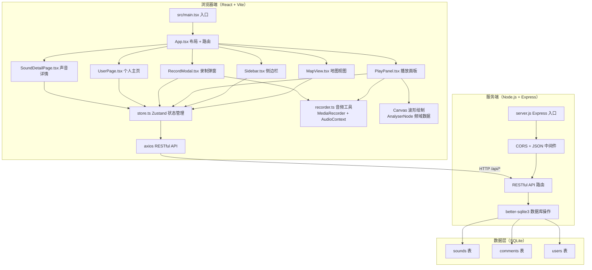
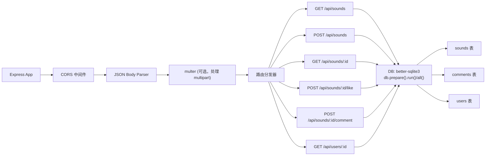
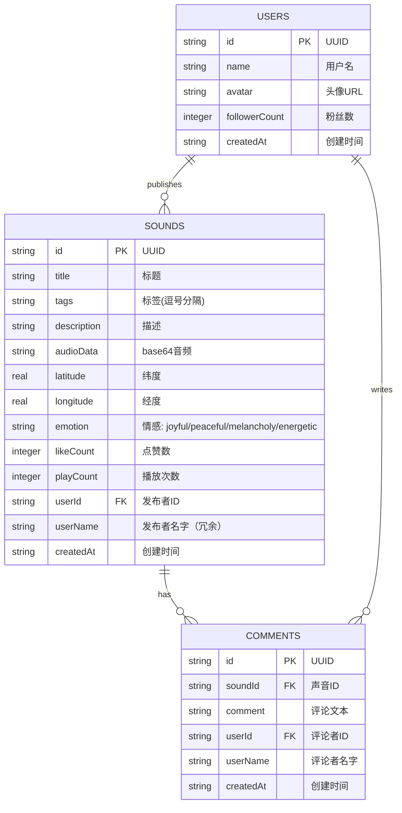

## 1. 架构设计



## 2. 技术说明

- **前端框架**：React 18 + TypeScript 5 + Vite 5
- **构建工具**：Vite 5（带 `@vitejs/plugin-react`，代理 `/api` 到后端 4000 端口）
- **状态管理**：Zustand 4（全局状态：声音列表、选中标签、播放状态、用户信息）
- **路由**：React Router v6（BrowserRouter）
- **地图**：Leaflet 1.9 + react-leaflet 4（瓦片地图，divIcon 自定义脉冲圆点）
- **HTTP 客户端**：axios 1.x
- **音频处理**：MediaRecorder API（录制） + Web Audio API（AudioContext + AnalyserNode 获取频域数据）
- **样式方案**：原生 CSS + CSS Variables（深色主题变量统一管理）
- **后端框架**：Express 4
- **数据库**：better-sqlite3（同步 SQLite 驱动）
- **文件上传处理**：multer（处理 base64 音频字段）
- **ID 生成**：uuid

## 3. 路由定义

| 路由（前端） | 页面组件 | 用途 |
|--------------|----------|------|
| `/` | Home（MapView + Sidebar） | 首页：地图 + 侧边栏 + 播放面板 |
| `/sound/:id` | SoundDetailPage | 声音详情页：完整信息 + 评论区 |
| `/user/:id` | UserPage | 个人主页：网格布局展示发布声音 |

| 路由（后端 API） | 方法 | 请求参数 | 响应 | 用途 |
|------------------|------|----------|------|------|
| `/api/sounds` | GET | Query: `tag?` (string) | `Sound[]` | 获取声音列表（可选按标签筛选） |
| `/api/sounds` | POST | Body: `{ title, tags[], description, audioData(base64), latitude, longitude, emotion, userId }` | `Sound` | 上传新声音片段 |
| `/api/sounds/:id` | GET | Param: `id` | `Sound & { comments: Comment[] }` | 获取单条声音详情含评论 |
| `/api/sounds/:id/like` | POST | Param: `id` | `{ likeCount: number }` | 点赞声音（计数+1） |
| `/api/sounds/:id/comment` | POST | Body: `{ comment, userId }` | `Comment` | 添加评论 |
| `/api/users/:id` | GET | Param: `id` | `User & { sounds: Sound[] }` | 获取用户主页数据 |

## 4. API 类型定义

```typescript
// 情感分析结果类型
type Emotion = 'joyful' | 'peaceful' | 'melancholy' | 'energetic';

// 声音数据模型
interface Sound {
  id: string;
  title: string;
  tags: string[];
  description: string;
  audioData: string;       // base64 编码的音频数据
  latitude: number;
  longitude: number;
  emotion: Emotion;
  likeCount: number;
  playCount: number;
  userId: string;
  userName: string;
  createdAt: string;       // ISO 时间戳
}

// 评论数据模型
interface Comment {
  id: string;
  soundId: string;
  comment: string;
  userId: string;
  userName: string;
  createdAt: string;
}

// 用户数据模型
interface User {
  id: string;
  name: string;
  avatar: string;
  followerCount: number;
  soundCount: number;
}

// Zustand Store 接口
interface SoundStore {
  sounds: Sound[];
  selectedTag: string | null;
  currentSound: Sound | null;
  isPlaying: boolean;
  currentUser: User;
  fetchSounds: (tag?: string) => Promise<void>;
  uploadSound: (data: Omit<Sound, 'id' | 'likeCount' | 'playCount' | 'createdAt'>) => Promise<void>;
  selectTag: (tag: string | null) => void;
  setCurrentSound: (sound: Sound | null) => void;
  togglePlay: () => void;
  likeSound: (id: string) => Promise<void>;
  addComment: (id: string, text: string) => Promise<void>;
}
```

## 5. 服务端架构图



## 6. 数据模型

### 6.1 实体关系图



### 6.2 数据库 DDL（better-sqlite3）

```sql
CREATE TABLE IF NOT EXISTS users (
  id TEXT PRIMARY KEY,
  name TEXT NOT NULL,
  avatar TEXT DEFAULT '',
  followerCount INTEGER DEFAULT 0,
  createdAt TEXT NOT NULL
);

CREATE TABLE IF NOT EXISTS sounds (
  id TEXT PRIMARY KEY,
  title TEXT NOT NULL,
  tags TEXT NOT NULL DEFAULT '',
  description TEXT NOT NULL DEFAULT '',
  audioData TEXT NOT NULL,
  latitude REAL NOT NULL,
  longitude REAL NOT NULL,
  emotion TEXT NOT NULL DEFAULT 'peaceful',
  likeCount INTEGER NOT NULL DEFAULT 0,
  playCount INTEGER NOT NULL DEFAULT 0,
  userId TEXT NOT NULL,
  userName TEXT NOT NULL,
  createdAt TEXT NOT NULL,
  FOREIGN KEY (userId) REFERENCES users(id)
);

CREATE INDEX IF NOT EXISTS idx_sounds_userId ON sounds(userId);
CREATE INDEX IF NOT EXISTS idx_sounds_createdAt ON sounds(createdAt DESC);

CREATE TABLE IF NOT EXISTS comments (
  id TEXT PRIMARY KEY,
  soundId TEXT NOT NULL,
  comment TEXT NOT NULL,
  userId TEXT NOT NULL,
  userName TEXT NOT NULL,
  createdAt TEXT NOT NULL,
  FOREIGN KEY (soundId) REFERENCES sounds(id),
  FOREIGN KEY (userId) REFERENCES users(id)
);

CREATE INDEX IF NOT EXISTS idx_comments_soundId ON comments(soundId);
```

## 7. 项目文件结构

```
auto253/
├── .trae/documents/
│   ├── PRD.md
│   └── TECH.md
├── package.json              # 前端依赖 + 脚本
├── vite.config.js            # Vite 配置 + API 代理
├── tsconfig.json             # TS 配置（严格模式 + react-jsx）
├── index.html                # 入口 HTML + Leaflet CSS
├── server/
│   ├── package.json          # 后端依赖（express, better-sqlite3 等）
│   └── server.js             # Express 主入口 + API 路由 + SQLite
└── src/
    ├── main.tsx              # React 入口 + StrictMode + BrowserRouter
    ├── App.tsx               # 主布局 + 路由配置
    ├── store.ts              # Zustand 全局状态
    ├── global.css            # 全局样式 + CSS 变量 + 深色主题
    ├── components/
    │   ├── MapView.tsx       # react-leaflet 地图 + 脉冲标记点
    │   ├── Sidebar.tsx       # 标签栏 + 瀑布流卡片
    │   ├── PlayPanel.tsx     # 底部播放面板 + Canvas波形
    │   ├── RecordModal.tsx   # 录制弹窗（非路由组件）
    │   ├── SoundCard.tsx     # 声音卡片（复用）
    │   ├── TagFilter.tsx     # 标签筛选胶囊
    │   ├── WaveformCanvas.tsx # 波形绘制组件（复用）
    │   └── CommentSection.tsx # 评论区组件
    ├── pages/
    │   ├── HomePage.tsx      # 首页（组合 MapView + Sidebar）
    │   ├── SoundDetailPage.tsx # 声音详情页
    │   └── UserPage.tsx      # 个人主页
    └── utils/
        ├── recorder.ts       # MediaRecorder 封装 + 波形数据
        └── emotionColors.ts  # 情感颜色映射常量
```
