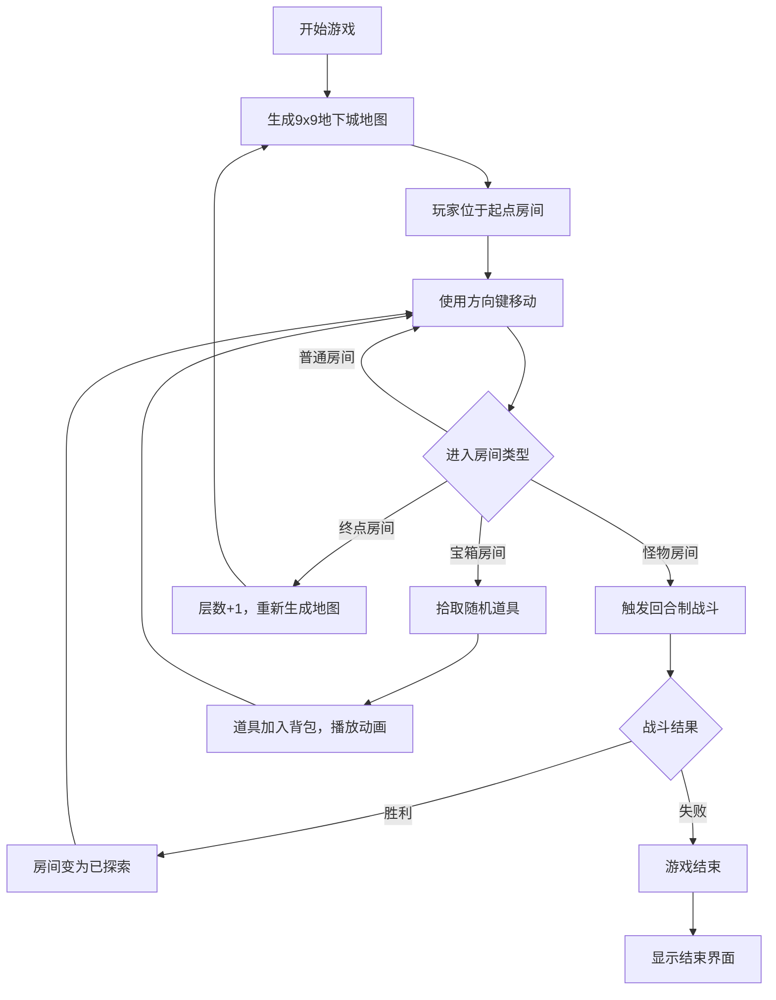

## 1. 产品概述

轻量级浏览器Rogue-like地下城探索游戏，通过程序化生成9x9网格地图，结合回合制战斗与道具拾取系统，为玩家提供每次开局截然不同的地牢探索体验。
- 核心价值：随机性带来的重玩价值，简单直观的操作，即时反馈的战斗爽感
- 目标用户：休闲游戏玩家，Rogue-like爱好者，浏览器游戏体验者

## 2. 核心功能

### 2.1 功能模块
1. **地图生成系统**：9x9网格程序化生成，包含起点、终点、普通房间、宝箱房间、怪物房间，走廊自动连接确保连通性
2. **角色移动系统**：键盘方向键控制，0.2s平滑位移，角色绿色三角箭头带发光效果
3. **回合制战斗系统**：双生命条显示，三技能按钮（普通攻击/防御/特殊技），能量条管理，命中屏幕抖动，受击红色晕影
4. **道具拾取系统**：回血药水、能量药剂、攻击强化道具，拾取光晕动画，道具栏展示
5. **HUD信息系统**：层数显示、已拾取物品数量统计

### 2.2 页面详情

| 页面名称 | 模块名称 | 功能描述 |
|-----------|-------------|---------------------|
| 游戏主界面 | 9x9网格地图 | 渲染所有房间类型、玩家角色、怪物、宝箱，响应键盘输入移动 |
| 游戏主界面 | 战斗UI面板 | 战斗时覆盖显示，含玩家/怪物生命条、能量条、技能按钮 |
| 游戏主界面 | HUD信息栏 | 右上角显示当前层数（白色黑阴影）和拾取物品数量（金色） |
| 游戏主界面 | 道具栏 | 展示已拾取道具图标，拾取时有放大动画 |

## 3. 核心流程

玩家进入游戏 → 系统生成9x9随机地下城 → 玩家通过方向键探索地图 → 进入怪物房间触发回合制战斗 → 战斗胜利后继续探索 → 进入宝箱房间拾取道具 → 到达终点进入下一层（重新生成地图）

## 4. 用户界面设计

### 4.1 设计风格
- 主色调：深色主题 #0D1117 背景
- 辅助色：
  - 房间地板 #2D2D2D，墙壁 #4A4A4A，走廊 #3A3A3A
  - 玩家角色 #27AE60（绿色柔和发光）
  - 怪物标识 #E74C3C（红色）
  - 起点蓝色光圈，终点金色传送门
  - 宝箱房间金色闪光点缀，怪物房间红色脉冲边框
- 生命条：玩家红色渐变 #E74C3C→#C0392B，怪物紫色渐变 #8E44AD→#9B59B6
- 能量条：金色 #F1C40F
- 字体：深色背景上的白色/金色文字，带阴影增强可读性
- 动画风格：即时反馈型（移动0.2s，攻击抖动0.1s，拾取光晕0.5s，技能缩放0.3s）

### 4.2 页面设计概览

| 页面名称 | 模块名称 | UI元素 |
|-----------|-------------|-------------|
| 游戏主界面 | 网格地图 | 9x9方格，各房间类型颜色区分，玩家绿色三角箭头移动动画 |
| 游戏主界面 | 战斗UI | 顶部双生命条（玩家左/怪物右），能量条，底部三技能按钮带缩放反馈 |
| 游戏主界面 | HUD | 右上角绝对定位，层数白字黑阴影，物品数金字 |
| 游戏主界面 | 道具栏 | 底部或侧部图标网格，拾取时放大恢复动画 |

### 4.3 响应式
- 桌面端优先设计，中央游戏区域约70vh宽，四周留白
- 键盘操作主要在桌面端体验，确保窗口尺寸适配

### 4.4 动画与反馈
- 角色移动：0.2s平滑位移过渡
- 技能按钮：点击后0.3s缩放动画
- 怪物攻击：红色闪烁0.3s
- 玩家受击：屏幕边缘红色晕影0.2s
- 拾取道具：光晕扩展动画0.5s，图标放大再恢复
- 攻击命中：屏幕抖动0.1s
